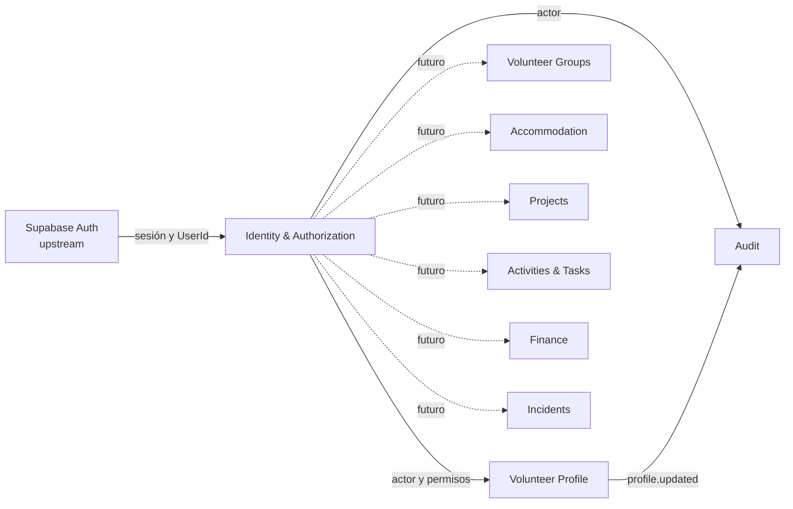
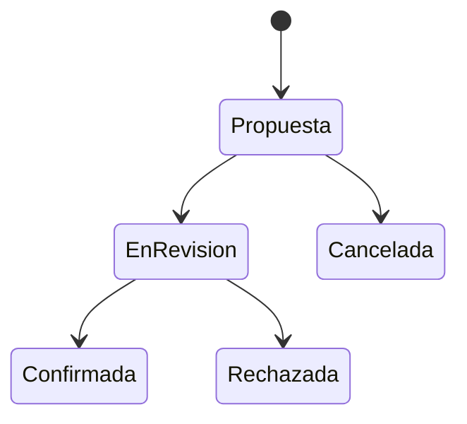

# Mapa de contextos

Supabase Auth es la fuente de credenciales. Identity posee roles, permisos y asignaciones. Volunteer Profile no conoce tablas internas de autorización; recibe el actor y depende de un puerto propio. Audit observa cambios sensibles y no gobierna el perfil.

## Flujo futuro de aprobación

El siguiente flujo es conceptual, no implementado ni definitivo:

Quedan pendientes responsables, transiciones, caducidad, concurrencia y permisos por alcance. No se crearán tablas hasta resolverlos.
