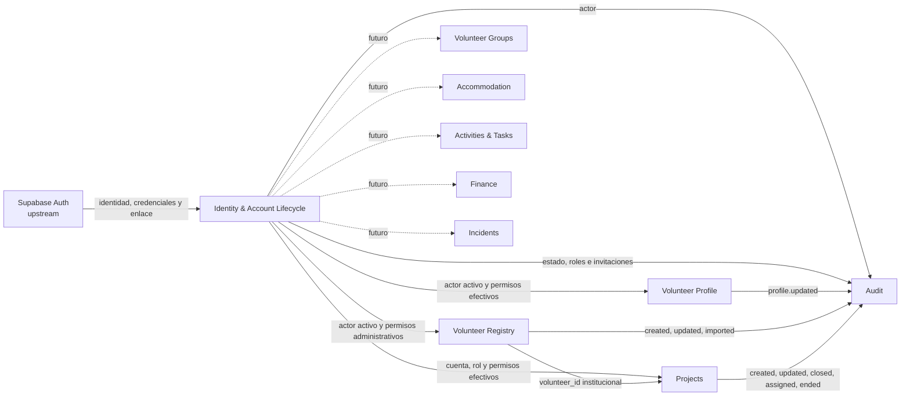
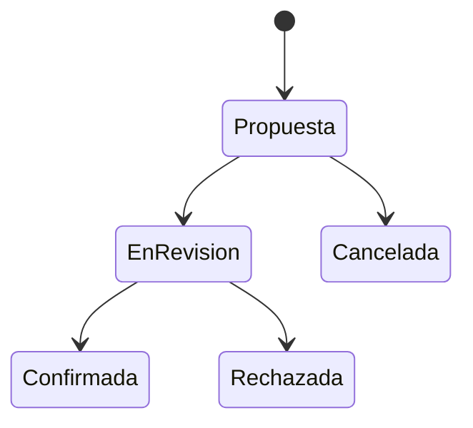

# Mapa de contextos

Supabase Auth es la fuente de credenciales, sesiones y enlaces de correo. Identity posee la cuenta de aplicación, invitaciones, roles, permisos, policies y transiciones. `accounts.auth_user_id` enlaza ambas fuentes; no se duplican credenciales ni tokens. Volunteer Profile no conoce tablas internas de autorización; recibe el actor mediante su puerto. Volunteer Registry recibe únicamente autoridad administrativa: sus registros no enlazan con Auth, cuentas ni perfiles y no provocan invitaciones u onboarding. Projects referencia esos registros institucionales por `volunteer_id` y posee tanto las participaciones como la relación histórica entre `accounts` y proyectos para managers. Su aplicación recibe capacidades por un puerto; PostgreSQL revalida cuenta, rol, permiso y scope sin que Projects importe internals de Identity. Audit recibe escrituras privilegiadas controladas y no gobierna el dominio.

El alcance de coordinator es provisionalmente “origen propio”: solo observa cuentas e invitaciones cuyo `origin_invited_by` corresponde al actor. Los scopes organizacionales requieren otro hito y nuevas reglas.

## Flujo futuro de aprobación

El siguiente flujo sigue siendo conceptual, no implementado ni definitivo. Projects V1 asigna directamente y no usa este flujo:

Quedan pendientes responsables, transiciones, caducidad, concurrencia y permisos por alcance. No se crearán tablas hasta resolverlos.
