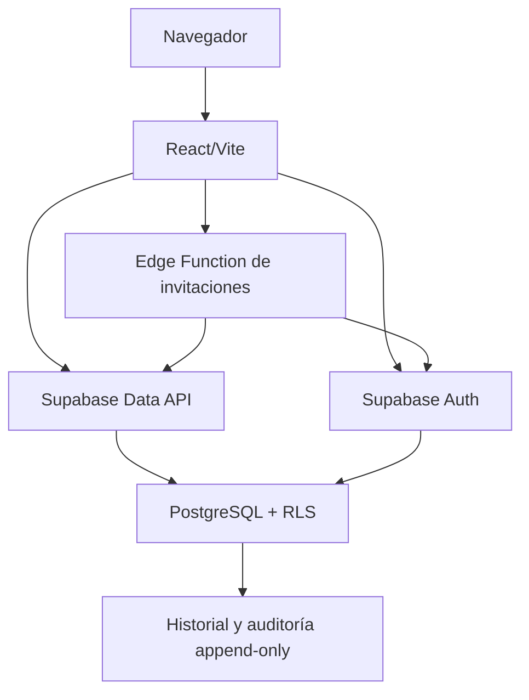

# Arquitectura

Sistema-Voluntariado es un monolito modular: una SPA desplegable como unidad y una base PostgreSQL/Supabase, con límites de dominio dentro del repositorio. No hay microservicios ni comunicación distribuida.

## Módulos implementados

- `identity`: sesión, contexto de cuenta, invitaciones, onboarding, estados, administración de roles y cuentas.
- `volunteer-profile`: perfil, consulta propia y actualización de campos permitidos.
- `volunteers`: padrón administrativo de personas voluntarias actuales e históricas, independiente de cuentas y Auth.
- `projects`: proyectos administrativos y participaciones históricas de registros del padrón, sin vínculo con Auth, cuentas o perfiles.

## Capas

- Dominio: tipos y reglas puras.
- Aplicación: casos de uso y puertos.
- Infraestructura: SDK Supabase y traducción de errores externos.
- Presentación: React, formularios y estados visuales.

La composición ocurre en `apps/web/src/app/composition`. Los componentes reciben servicios de aplicación y nunca crean clientes Supabase. `packages/shared-kernel` contiene resultados/errores tipados y `packages/ui` controles accesibles.

PostgreSQL es la frontera autoritativa para estado, permisos, transiciones, concesiones y el invariante del último administrador. La Edge Function es un adaptador seguro para Supabase Auth Admin: valida actor y reserva en la base antes de usar `service_role`. La separación Auth/PostgreSQL y su reconciliación se registran en ADR 0012.
