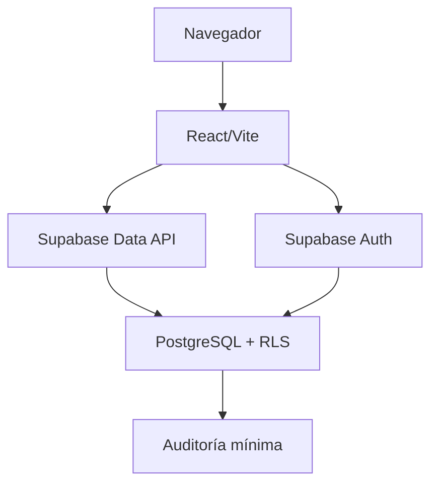

# Arquitectura

Sistema-Voluntariado es un monolito modular: una SPA desplegable como unidad y una base PostgreSQL/Supabase, con límites de dominio dentro del repositorio. No hay microservicios ni comunicación distribuida.

## Módulos implementados

- `identity`: sesión, acceso y cierre mediante un puerto de autenticación.
- `volunteer-profile`: perfil, consulta propia y actualización de campos permitidos.

## Capas

- Dominio: tipos y reglas puras.
- Aplicación: casos de uso y puertos.
- Infraestructura: SDK Supabase y traducción de errores externos.
- Presentación: React, formularios y estados visuales.

La composición ocurre en `apps/web/src/app/composition`. `packages/shared-kernel` contiene resultado/errores tipados y `packages/ui` controles accesibles usados por ambas pantallas.
