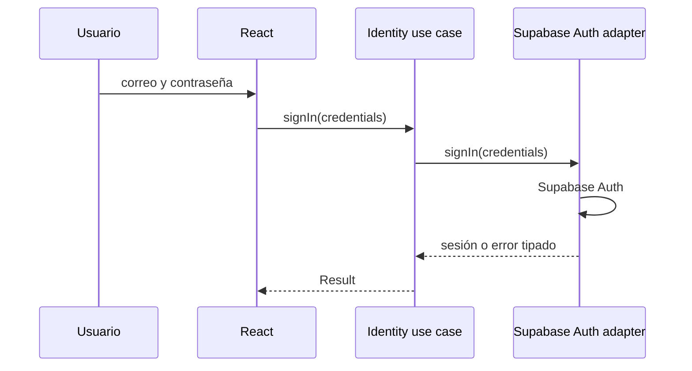
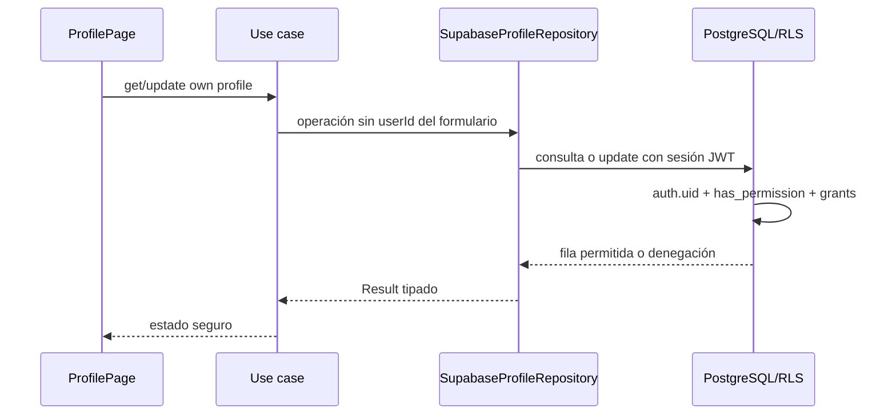
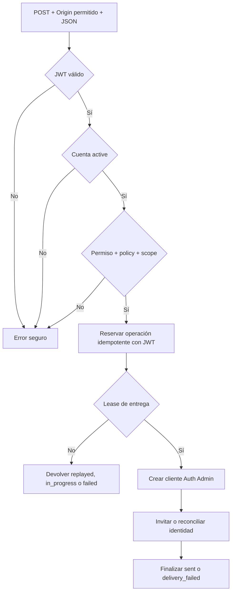
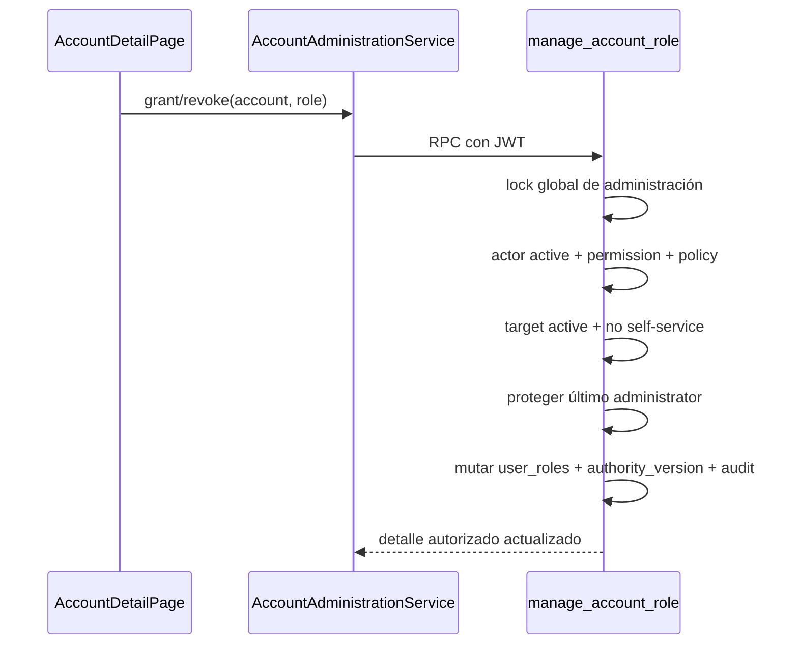
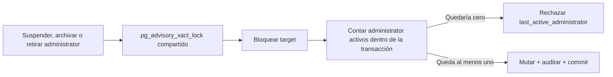
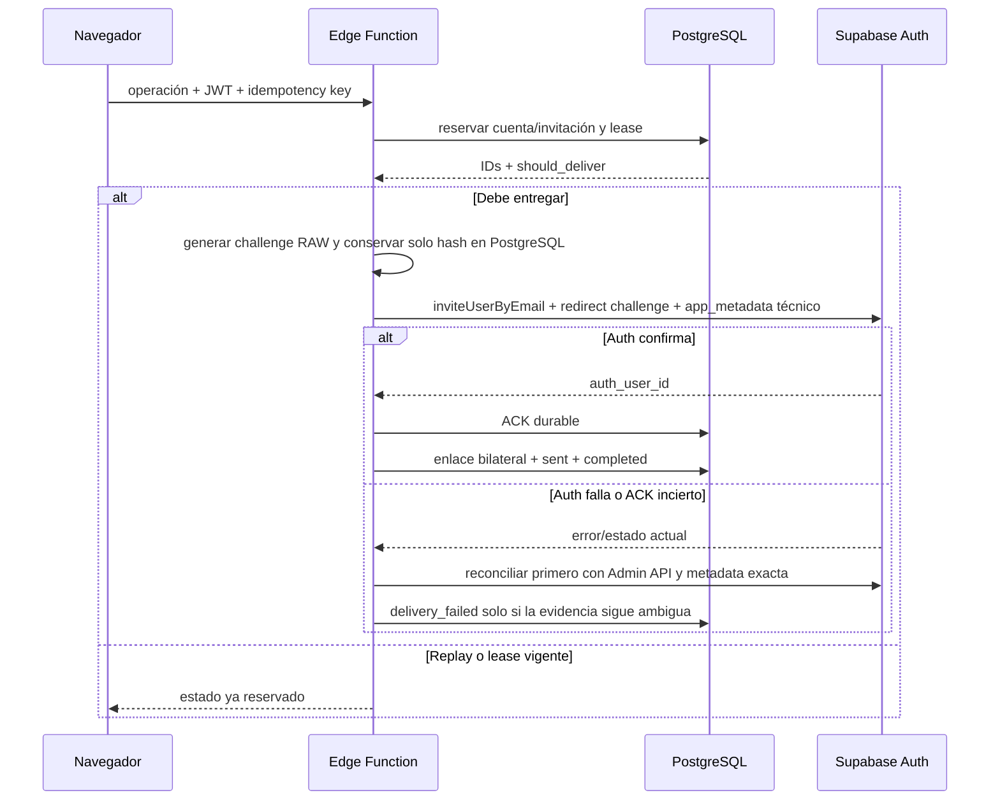
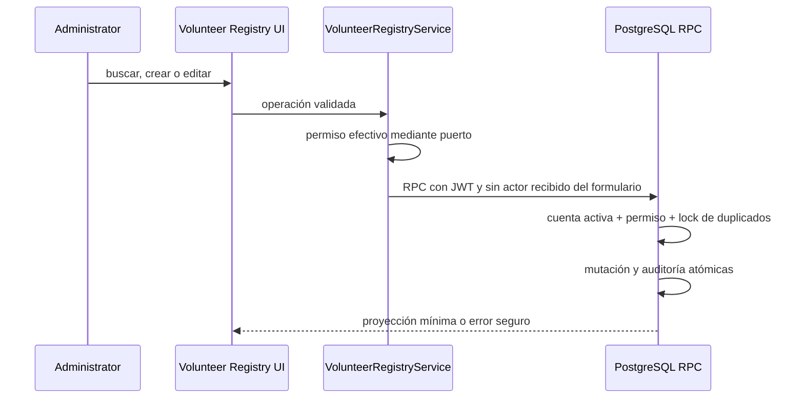
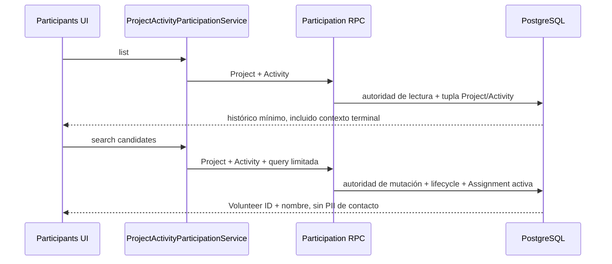

# Vista de ejecución

## Autenticación



## Perfil propio



TanStack Query usa una clave que incluye `user.id` y `authorityVersion`; así dos sesiones o versiones de autoridad consecutivas no comparten datos personales en memoria. Al cambiar usuario/autoridad o cerrar sesión, `PersonalDataCacheGuard` cancela consultas, elimina toda caché sensible y las mutaciones descartan respuestas de una versión anterior.

El guard ahora limpia toda caché sensible si cambia el actor o la tupla `accountId:authorityVersion:status`. `IdentityProvider` vuelve a obtener contexto en cambios Auth, al recuperar foco/visibilidad y cada 30 segundos mientras hay sesión; RLS niega de inmediato aunque la UI aún no haya refrescado.

## Autorización de la Edge Function



El gateway local usa `--no-verify-jwt` solo para que el handler controle la respuesta de desarrollo; el propio handler siempre valida el JWT con Auth. En despliegue se conserva además la verificación del gateway.

## Asignación de roles



## Protección del último administrador



Todas las rutas relevantes toman la misma clave antes del lock de fila, lo que evita carreras `revoke/revoke`, `suspend/suspend` y combinadas. El E2E ejecuta `suspend/suspend`, `revoke/revoke` y `revoke/archive` desde sesiones distintas; exige exactamente un éxito y un rechazo seguro, nunca 500.

## Consistencia entre Auth y PostgreSQL



No existe transacción distribuida. La idempotencia, el lease exclusivo con actor/
correlación, el ACK Auth durable, el snapshot bilateral de `auth_user_id`,
constraints diferidos y la generación/challenge en `app_metadata` limitan
divergencias. Un retry con ACK incierto reconcilia Auth antes de marcar
`delivery_outcome_unknown`; si demuestra aplicación, persiste el ACK sin reenviar.
El callback transporta el challenge en memoria efímera y la aceptación lo consume
una sola vez server-side. Auth/proveedor aceptando la operación no equivale a
entrega física en la bandeja. Nunca se eliminan usuarios automáticamente.

En FASE B, el callback procesa errores Auth con una allowlist, limpia query y
fragmento y solo entrega el challenge a aceptación cuando el contexto durable es
`invited` o `pending_profile`. Un actor activo o distinto se cierra y vuelve a
login. `recover` exige ownership Auth–Account–Invitation, rota la generación y
envía un correo Auth de recuperación; la cuenta permanece `invited` hasta aceptar
y completar onboarding, con idempotencia por actor/clave y auditoría sin PII.

## Padrón administrativo de voluntarios



Listado, búsqueda, orden y exportación se ejecutan paginados en PostgreSQL. En importación, el navegador acepta un `.xlsx` de hasta 5 MiB y 1.000 filas. Antes del parser principal, `zip.js` lee el ZIP en modo estricto: rechaza nombres duplicados o inseguros, diferencias entre directorio central y header local, entradas solapadas, cifrado, symlinks, directorios, ZIP64 y métodos distintos de STORE/DEFLATE. La V1 admite como máximo 100 entries del directorio central, 20 MiB expandidos en total, 10 MiB por entry, 5 MiB para la worksheet y ratio 250:1 para entries de al menos 64 KiB. Cada entry se descomprime secuencialmente hacia un stream que cuenta bytes realmente emitidos y aborta al superar los límites; solo conserva `workbook.xml`, `xl/_rels/workbook.xml.rels` y la única worksheet, con 1 MiB para workbook/relationships. `DOMParser` valida XML por namespace URI y nombre local, exige una hoja lógica, una sola relationship interna de tipo worksheet y una única worksheet correspondiente dentro de `xl/worksheets`; luego limita las coordenadas a 16 columnas y a la fila efectiva 1.001. Tras el parser principal, aplicación limita el conjunto a 1.000 filas de datos. Estructuras ambiguas o variantes no soportadas se rechazan antes de `read-excel-file`. Finalmente la UI muestra errores y coincidencias y envía solo las filas elegidas. La RPC vuelve a validar datos y duplicados bajo un advisory lock; todo el lote se confirma o revierte. El archivo no se persiste y ninguna operación toca Supabase Auth, `accounts`, invitaciones o perfiles.

## Project Activities

```mermaid
sequenceDiagram
  participant UI as Project Activities UI
  participant UC as ProjectActivityService
  participant RPC as Activity RPC
  participant P as Project row
  participant A as Activity row
  UI->>UC: create/update/complete/cancel
  UC->>RPC: campos editables + Project/Activity IDs
  RPC->>RPC: auth.uid + autoridad global/contextual
  RPC->>P: FOR UPDATE; releer active
  opt Activity existente
    RPC->>A: FOR UPDATE; releer scheduled
  end
  RPC->>A: mutación + auditoría atómica
  RPC-->>UI: proyección validada o error tipado
```

Para manager contextual el prefijo de locks es `account FOR SHARE → active scope FOR SHARE`; administrator comienza en Project. Create mantiene Project bloqueado hasta insertar. Cerrar toma el mismo Project y el trigger rechaza primero Project Volunteer Assignments activos y después Activities `scheduled`. Complete/cancel toman Project antes de Activity, por lo que una sola transición terminal gana. La revocación de scope usa `scope FOR UPDATE` y serializa frente al lock compartido de toda mutación contextual.

## Activity Participation



List no toma locks de mutación ni exige lifecycle abierto. Candidate search valida
Project activo, Activity programada y Assignment activa en el snapshot de la
consulta; no sustituye la revalidación transaccional del add.

```mermaid
sequenceDiagram
  participant UI as Participants UI
  participant UC as ProjectActivityParticipationService
  participant RPC as Participation mutation RPC
  participant P as Project row
  participant PA as Project Assignment row
  participant A as Activity row
  participant AP as Participation row
  UI->>UC: add/finish
  UC->>RPC: Project + Activity + Volunteer/Participation IDs
  RPC->>RPC: auth.uid + autoridad global/contextual
  RPC->>P: FOR UPDATE; releer active
  opt Add
    RPC->>PA: FOR SHARE; releer Assignment activa
  end
  RPC->>A: FOR UPDATE; releer scheduled
  opt Finish
    RPC->>AP: FOR UPDATE; releer ended_at IS NULL
  end
  RPC->>AP: insert/update + auditoría atómica
  RPC-->>UI: proyección mínima o error tipado
```

En mutaciones, manager antepone `account FOR SHARE → active scope FOR SHARE`; administrator comienza en Project. El orden global es `account → scope → Project → Project Assignment → Activity → Participation`, omitiendo solo filas innecesarias. Add y finish Assignment comparten Project/Assignment y releen elegibilidad; add y complete/cancel comparten Project/Activity. Una Activity terminal o Project cerrado convierte el histórico en read-only sin cambiar `ended_at`.
