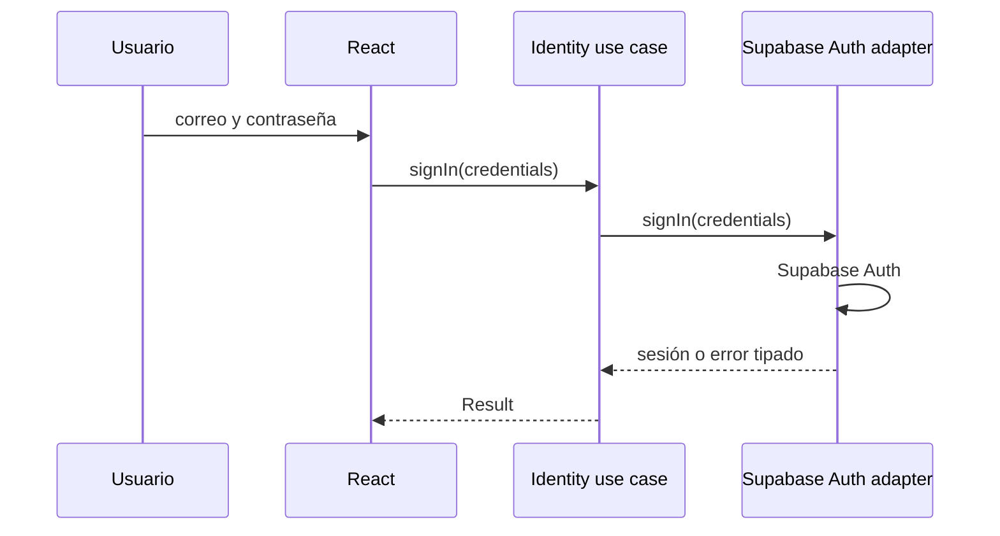
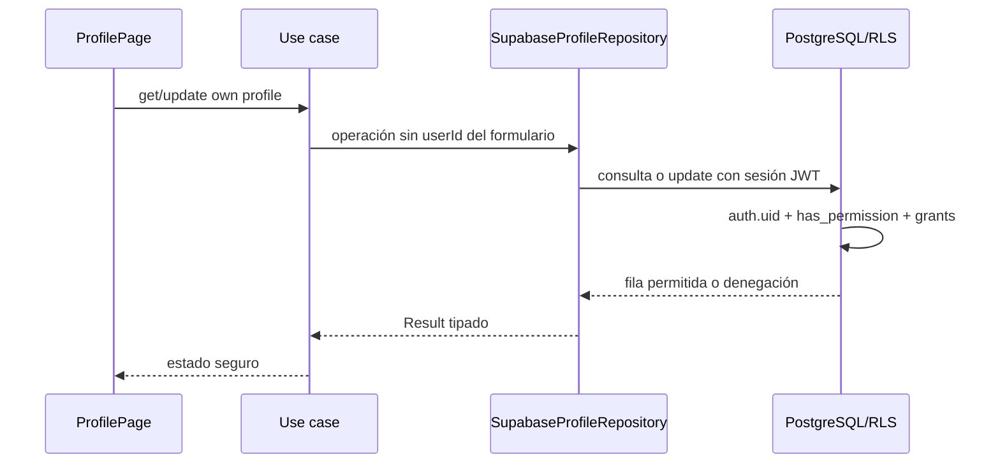

# Vista de ejecución

## Autenticación

## Perfil propio

TanStack Query usa una clave que incluye el `user.id`; así dos sesiones consecutivas no comparten datos personales en memoria. Al cambiar de usuario o cerrar sesión, `PersonalDataCacheGuard` elimina la consulta del actor anterior. La caché se actualiza con la respuesta confirmada por PostgreSQL y no contiene autorización ni reglas de perfil.
