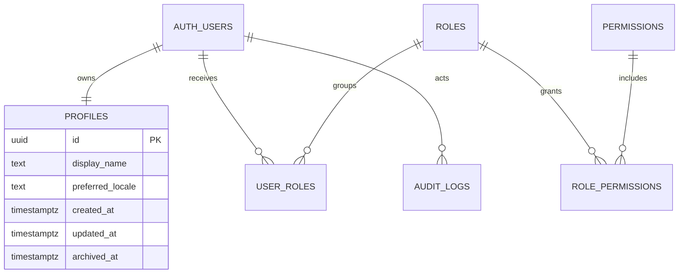

# Modelo de datos inicial

`profiles.id` coincide con `auth.users.id`; no se duplica correo. Las cuentas pueden reunir varios roles y los permisos efectivos son aditivos.

## Reglas

- Una cuenta tiene como máximo un perfil.
- `display_name` comienza en `null`; al actualizar, exige 1–100 caracteres tras normalizar espacios.
- `preferred_locale` es `es` o `en`.
- Cuenta archivada: sin lectura/actualización propia ni permisos RBAC efectivos.
- RBAC y auditoría no aceptan escrituras desde clientes autenticados.
- Auditoría guarda actor, acción, entidad y nombres de campos; nunca valores personales.

## Entidades futuras no implementadas

`volunteer_groups`, `group_members`, `houses`, `rooms`, `host_families`, `accommodation_rates`, `accommodation_assignments`, `projects`, `project_schedules`, `project_assignments`, `events`, `event_participants`, `tasks`, `task_assignments`, `assignment_requests`, `assignment_approvals`, `notifications`, `incidents`, `charges` y `payments`.

No se fijan todavía sus columnas, cardinalidades ni estados.

## Concurrencia futura

- Perfil: inicialmente last-write-wins; agregar precondición `updated_at` si aparecen ediciones concurrentes reales.
- Alojamiento futuro: usar rangos temporales, restricciones de exclusión y bloqueo transaccional para evitar solapamientos.
- Capacidades futuras: serializar asignación relevante y validar capacidad dentro de la misma transacción.
- Aprobaciones futuras: transiciones condicionales por versión/estado para impedir doble confirmación.
