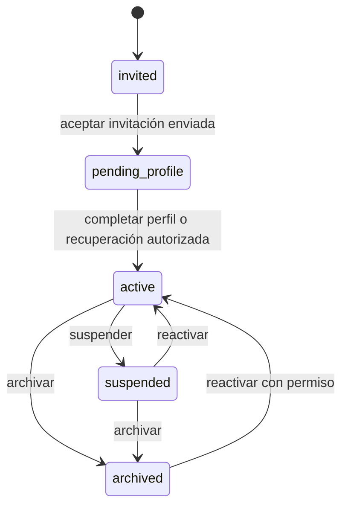

# Modelo de datos inicial

```mermaid
erDiagram
  AUTH_USERS ||--|| PROFILES : owns
  AUTH_USERS o|--o| ACCOUNTS : links
  ACCOUNTS ||--o{ INVITATIONS : receives
  INVITATIONS o|--o| INVITATIONS : supersedes
  ACCOUNTS ||--o{ ACCOUNT_STATUS_HISTORY : records
  AUTH_USERS ||--o{ USER_ROLES : receives
  ROLES ||--o{ USER_ROLES : groups
  ROLES ||--o{ ROLE_PERMISSIONS : grants
  PERMISSIONS ||--o{ ROLE_PERMISSIONS : includes
  ROLES ||--o{ ROLE_GRANT_POLICIES : actor
  ROLES ||--o{ ROLE_GRANT_POLICIES : target
  AUTH_USERS ||--o{ AUDIT_LOGS : acts
  PROJECTS ||--o{ PROJECT_VOLUNTEER_ASSIGNMENTS : contains
  VOLUNTEERS ||--o{ PROJECT_VOLUNTEER_ASSIGNMENTS : participates
  PROJECTS ||--o{ PROJECT_MANAGER_ASSIGNMENTS : scopes
  ACCOUNTS ||--o{ PROJECT_MANAGER_ASSIGNMENTS : manages

  ACCOUNTS {
    uuid id PK
    uuid auth_user_id UK
    text status
    uuid origin_invited_by
    bigint authority_version
  }
  INVITATIONS {
    uuid id PK
    uuid account_id FK
    text normalized_email
    uuid requested_initial_role_id FK
    text status
    uuid idempotency_key
    uuid auth_user_id
  }
  PROFILES {
    uuid id PK
    text display_name
    text preferred_locale
    timestamptz created_at
    timestamptz updated_at
    timestamptz archived_at
  }
  VOLUNTEERS {
    uuid id PK
    text full_name
    text email
    text phone
    text phone_match_key GENERATED
    timestamptz created_at
    timestamptz updated_at
  }
  PROJECTS {
    uuid id PK
    text name
    text description
    text status
    timestamptz created_at
    timestamptz updated_at
  }
  PROJECT_VOLUNTEER_ASSIGNMENTS {
    uuid id PK
    uuid project_id FK
    uuid volunteer_id FK
    timestamptz started_at
    timestamptz ended_at
    timestamptz created_at
    timestamptz updated_at
  }
  PROJECT_MANAGER_ASSIGNMENTS {
    uuid id PK
    uuid project_id FK
    uuid manager_account_id FK
    timestamptz started_at
    timestamptz ended_at
    timestamptz created_at
    timestamptz updated_at
  }
```

`profiles.id` coincide con `auth.users.id`; la cuenta no duplica correo. Una cuenta `invited` puede preceder a Auth y por eso `accounts.auth_user_id` es inicialmente anulable. La invitación conserva correo canónico y un snapshot inmutable del enlace Auth; constraints diferidos exigen consistencia bilateral al commit.

`volunteers` es un padrón institucional independiente: no tiene FK ni trigger de integración con `auth.users`, `accounts` o `profiles`. Sus únicos triggers mantienen `updated_at` y escriben auditoría. `created_at` significa fecha de registro en el sistema, no fecha histórica de incorporación.

`project_volunteer_assignments` referencia exclusivamente `projects` y `volunteers` con borrado restringido. No enlaza Auth, cuentas o perfiles. Inicio y finalización se fijan por PostgreSQL; `ended_at is null` es la única definición de participación activa.

`project_manager_assignments` pertenece a Projects y enlaza `projects` con `accounts` mediante borrado restringido. Solo se concede sobre proyectos activos a cuentas activas con rol/permisos vigentes. `ended_at is null` define el scope activo; el cierre del proyecto no lo finaliza ni invalida por sí mismo.

## Ciclo de vida



No se admite otra transición. `authority_version` aumenta cuando cambia estado o rol para invalidar autoridad cliente. La cuenta activa puede no tener roles; en ese caso tiene cero permisos.

## Reglas

- Una cuenta tiene como máximo un perfil.
- `display_name` comienza en `null`; al actualizar, exige 1–100 caracteres tras normalizar espacios.
- `preferred_locale` es `es` o `en`.
- Cuenta suspendida o archivada: sin permisos RBAC efectivos; conserva roles e historial.
- `profiles.archived_at` queda como compatibilidad histórica, pero `accounts.status` es la autoridad del ciclo de vida.
- RBAC y auditoría no aceptan escrituras desde clientes autenticados.
- Auditoría guarda actor/target, acción, entidad, correlación, estados técnicos y nombres de campos; metadata solo admite códigos seguros.
- Un voluntario exige nombre; correo y celular son opcionales. Correo se almacena canónico en minúsculas y celular como texto visible, preservando `+`, ceros y separadores.
- Correo exacto canónico o teléfono comparado solo por dígitos producen una advertencia, nunca unicidad. Nombre por sí solo no implica duplicado.
- Un proyecto nace `active`, solo puede pasar a `closed` y no se reabre. El cierre falla mientras exista una participación activa.
- Un voluntario puede participar en varios proyectos, pero un índice único parcial impide dos participaciones activas del mismo par. Una finalizada permite una nueva ocurrencia histórica.
- Una cuenta manager puede tener varios proyectos y un proyecto varios managers. Solo existe un scope activo por par; el histórico finalizado permite una nueva asignación cuando el proyecto siga activo.
- Un scope activo solo concede autoridad junto con cuenta activa, rol `project_manager` y permiso contextual vigente. El corte de cualquiera de esas condiciones es inmediato y no modifica el histórico.

## Invariantes de invitación

- Una sola invitación abierta por cuenta y correo canónico; una sola aceptada por cuenta.
- Estados: `pending`, `sent`, `accepted`, `revoked`, `expired`, `delivery_failed`, `superseded`.
- `accepted`, `revoked`, `expired` y `superseded` son terminales.
- Reemplazo crea una sucesora en la misma cuenta: una fila abierta pasa a `superseded`; una fila `revoked`/`expired` conserva su estado terminal y enlaza `superseded_by`. Nunca bifurca otra cuenta y falla cerrado si Auth ya confirmó la identidad.
- Idempotencia de creación por actor/clave y de resend/replace mediante `invitation_operation_requests`.
- Un lease de entrega evita doble llamada Auth; no se almacena token o digest de enlace.
- `expires_at` usa una hora local, alineada con `auth.email.otp_expiry`.

## Entidades futuras no implementadas

`volunteer_groups`, `group_members`, `houses`, `rooms`, `host_families`, `accommodation_rates`, `accommodation_assignments`, `project_schedules`, `events`, `event_participants`, `tasks`, `task_assignments`, `assignment_requests`, `assignment_approvals`, `notifications`, `incidents`, `charges` y `payments`.

No se fijan todavía sus columnas, cardinalidades ni estados.

## Concurrencia

- Perfil: inicialmente last-write-wins; agregar precondición `updated_at` si aparecen ediciones concurrentes reales.
- Administración de roles/estados: advisory lock común y locks de fila protegen el último administrador activo.
- Invitaciones: advisory lock por correo, índices parciales, fingerprint y lease serializan duplicados/reintentos.
- Padrón: alta, edición e importación comparten un advisory lock y recalculan coincidencias dentro de la transacción; la importación es atómica.
- Proyectos: asignar voluntarios y cerrar bloquean la misma fila de proyecto; un índice único parcial protege el duplicado activo y la finalización es monotónica.
- Scope manager: alta y cierre bloquean la misma fila de proyecto. Si el alta gana, el cierre conserva el scope activo; si el cierre gana, el alta relee `closed` y falla. Revocación y mutación contextual serializan la fila del scope.
- Alojamiento futuro: usar rangos temporales, restricciones de exclusión y bloqueo transaccional para evitar solapamientos.
- Capacidades futuras: serializar asignación relevante y validar capacidad dentro de la misma transacción.
- Aprobaciones futuras: transiciones condicionales por versión/estado para impedir doble confirmación.
