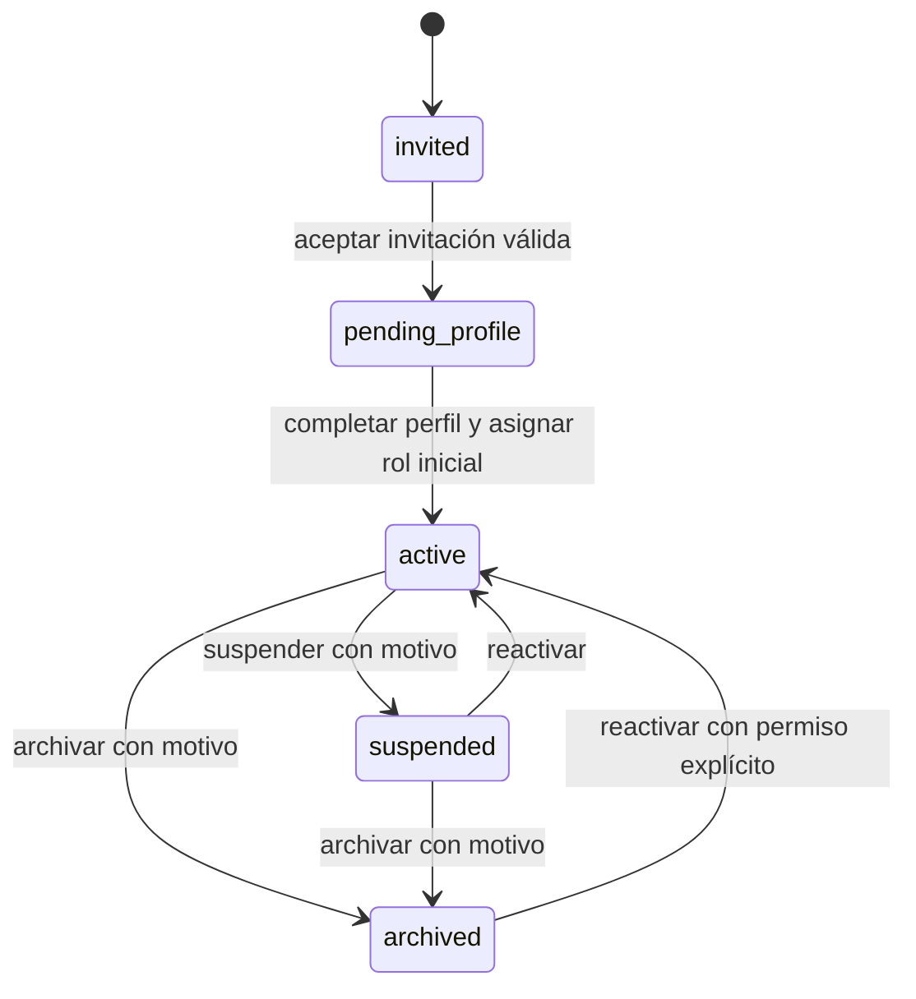
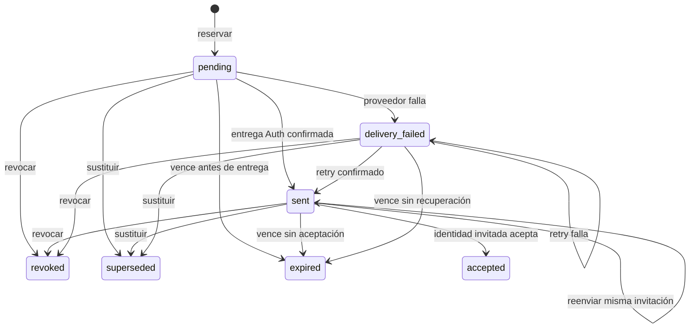
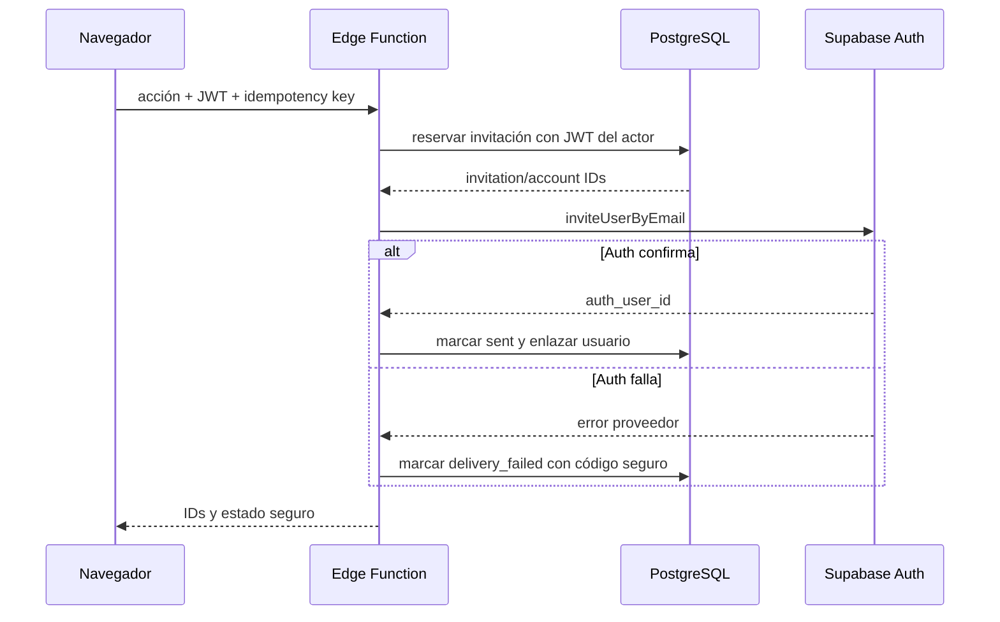

# ExecPlan 0002: Invitaciones y ciclo de vida de cuentas

- Estado: hito y corrección de regresión completados
- Inicio: 2026-07-24
- Cierre: 2026-07-25
- Responsable: agente principal de Codex, con revisión humana obligatoria
- Rama autorizada: `feat/account-lifecycle`
- Commit base: `6a47d1f3d5c2c3fdfdb33a8f94193adea5774e29`
- Prompt: `docs/ai/prompts/0002-account-lifecycle.md`

## Objetivo

Implementar un recorrido local, seguro y verificable para invitar personas, aceptar una invitación, completar el perfil mínimo, activar la cuenta, administrar asignaciones de roles y cambiar el estado de una cuenta entre activa, suspendida y archivada. Las decisiones críticas se aplicarán en PostgreSQL o en una Supabase Edge Function; React solo presentará capacidades ya autorizadas.

El resultado debe conservar el monolito modular, el historial existente y la fundación de perfil propio. No se conectará Supabase a un proyecto remoto, no se desplegará y no se realizará `git push`.

## Contexto

El hito 0001 implementó dos módulos: `identity` para sesión y `volunteer-profile` para consulta/actualización del perfil propio. PostgreSQL contiene `profiles`, RBAC aditivo y `audit_logs`. `profiles.archived_at` niega hoy permisos, pero no expresa invitación, perfil pendiente, suspensión ni el historial de transiciones.

El prompt 0002 aprueba reglas antes abiertas: alta exclusivamente por invitación, cinco estados, matriz de transiciones, autoridad inicial de administrator/coordinator, permisos administrativos mínimos, política explícita de concesión, protección transaccional del último administrador y auditoría de operaciones sensibles.

## Estado inicial verificado

- Directorio: `C:\Users\grove\Desktop\PROYECTOS\Sistema-VOLUNTARIADO`.
- Rama: `feat/account-lifecycle`; no se cambiará durante el hito.
- `HEAD`, `main` y merge-base inicial: `6a47d1f3d5c2c3fdfdb33a8f94193adea5774e29`.
- Remoto `origin` presente; no se hará push ni se modificará.
- Árbol limpio antes de la planificación.
- No existe enlace local de Supabase a proyecto remoto.
- Node.js `22.18.0`, pnpm `11.9.0`, Docker `29.6.2` y Docker Compose `5.3.1` disponibles.
- Código inicial: autenticación por contraseña, perfil propio, caché particionada por actor, RBAC/RLS y auditoría de cambios de perfil.
- Ausente: invitaciones, estado explícito de cuenta, concesión administrativa, Edge Functions, panel administrativo y onboarding.

## Línea base ejecutada

| Comprobación                                                  | Resultado observado                                                                                        |
| ------------------------------------------------------------- | ---------------------------------------------------------------------------------------------------------- |
| `node --version`                                              | aprobada: `v22.18.0`                                                                                       |
| `pnpm --version`                                              | aprobada: `11.9.0`                                                                                         |
| `corepack pnpm install --frozen-lockfile`                     | aprobada; workspace actualizado, lockfile sin cambios                                                      |
| `corepack pnpm verify`                                        | aprobada; formato, lint, límites, 4 probes arquitectónicos, typecheck, 11 unitarias, 2 integración y build |
| `corepack pnpm db:start`                                      | aprobada contra Supabase local ya iniciado                                                                 |
| `corepack pnpm db:reset`                                      | aprobada; migración fundacional y seed reproducidos                                                        |
| `corepack pnpm exec supabase db lint --local --level warning` | aprobada; cero hallazgos                                                                                   |
| `corepack pnpm db:test`                                       | aprobada; 27/27 pgTAP                                                                                      |
| `corepack pnpm test:e2e`                                      | aprobada; 2/2 con Auth y PostgreSQL locales                                                                |
| `git diff --check` y estado                                   | aprobados; árbol limpio después de la línea base                                                           |

La ejecución E2E recibió URL y clave pública local solo mediante variables del proceso. No se escribieron ni registraron tokens, claves administrativas o enlaces de invitación.

El `qa_reviewer` observó además un fallo preexistente no funcional: `corepack pnpm exec turbo run test:unit --force` agotó una vez 60 segundos al iniciar workers y ejecutó cero aserciones; inmediatamente `corepack pnpm --filter @sistema-voluntariado/web test:unit` y una ejecución serial aprobaron 11/11. La línea base oficial `pnpm verify` aprobó, aunque Turbo reprodujo logs cacheados de tareas internas. El riesgo de flake se mantendrá visible y los gates finales se repetirán con ejecución fresca cuando corresponda.

## Alcance

1. Invitaciones administrativas: listar, consultar, crear, revocar, reenviar y sustituir.
2. Aceptación única de invitación y rechazo de estados vencido, revocado, utilizado o sustituido.
3. Cuenta de aplicación con estado `invited`, `pending_profile`, `active`, `suspended` o `archived`.
4. Perfil mínimo: `display_name` y `preferred_locale`; la contraseña sigue perteneciendo exclusivamente a Supabase Auth.
5. Asignación del rol inicial protegido al activar la cuenta.
6. Administración autorizada de cuentas, historial, roles concedibles y auditoría.
7. Matriz explícita de concesión/revocación de roles.
8. Protección transaccional y concurrente del último administrador activo.
9. Edge Function local `manage-account-invitation` para operaciones que requieren Auth Admin.
10. UI responsive, accesible, traducible en español e inglés.
11. Pruebas de dominio, aplicación, infraestructura, Edge Function, UI, pgTAP y dos recorridos E2E reales.
12. Documentación operativa, arquitectónica, de datos, seguridad y gobierno de IA.

## Fuera de alcance

- Registro público libre, OAuth, MFA y proveedores SMTP externos.
- Eliminación física o anonimización definitiva de cuentas.
- Edición administrativa de `role_permissions` o `role_grant_policies`.
- Scopes por casa, proyecto, región o periodo; el alcance del coordinador en este hito se limita a cuentas e invitaciones creadas por ese coordinador.
- Casas, habitaciones, familias anfitrionas, alojamiento, proyectos, actividades, tareas, reuniones, incidencias, pagos, costos, documentos, datos médicos, WhatsApp y aplicación móvil nativa.
- Despliegue, secretos remotos, enlace a Supabase remoto, tags, push, rebase o reescritura de historial.

## Lenguaje ubicuo y decisiones de dominio

- **Identidad Auth**: registro de Supabase que posee correo, credenciales, verificación y sesiones.
- **Cuenta de aplicación**: entidad de Identity que posee el estado de ciclo de vida; no se deriva de roles ni de que exista un perfil.
- **Invitación**: intención temporal y auditable que precede a la activación y conserva el rol inicial solicitado.
- **Perfil**: datos mínimos de presentación. No posee el ciclo de vida global.
- **Asignación de rol**: relación vigente entre una cuenta Auth y un rol.
- **Política de concesión**: relación explícita entre rol del actor, rol objetivo y operaciones grant/revoke permitidas.
- **Administrador activo**: cuenta en estado `active` con asignación directa del rol `administrator`, cuyo rol no está archivado.
- **Invitación aceptada/utilizada**: invitación consumida una sola vez por su `auth_user_id`; ambos términos son sinónimos. Su cuenta ya está en `pending_profile` y puede reintentar la finalización sin volver a consumir la invitación.

La cuenta existirá antes del usuario Auth con `auth_user_id` anulable y estado `invited`. En este estado el onboarding todavía no fue aceptado; no implica que exista en todo momento una invitación vigente. Una invitación referencia esa cuenta. Después de que Auth cree al usuario, la Edge Function enlazará el identificador Auth; la aceptación autenticada moverá cuenta e invitación en la misma transacción.

`profiles` continuará siendo el perfil universal mínimo ligado a `auth.users`. `profiles.archived_at` se conservará por compatibilidad histórica, pero dejará de ser la autoridad del ciclo de vida; `accounts.status` será la única fuente para permisos efectivos.

### Estados y transiciones

Toda transición no enumerada se rechazará en dominio y PostgreSQL. Suspender o archivar conserva roles e historial, pero `has_permission` solo considera cuentas `active`. Reactivar recupera los roles vigentes. No habrá transición de vuelta a `invited` ni eliminación física.

### Estados de invitación

- `accepted`, `revoked`, `expired` y `superseded` son terminales.
- `expired` se deriva de `expires_at` al leer y se materializa dentro de la siguiente RPC que observe la invitación; no se necesita cron.
- `created_at`/`updated_at` son de servidor; `sent_at`, `accepted_at`, `revoked_at`, `expired_at` y `superseded_at` se fijan solo al entrar en su estado. `delivery_error_code` usa una allowlist segura y se limpia al volver a `sent`; `revoked_by`/motivo solo existen para revocación y `superseded_by` apunta a la nueva fila.
- Reenviar reutiliza la misma fila/cuenta/rol y actualiza `sent_at`, `expires_at` y auditoría cuando Auth confirma. Si falla un reenvío de una invitación ya `sent`, conserva `sent` y el enlace anterior, registra `invitation.resend_failed` y un código seguro de intento; `delivery_failed` solo representa una invitación que nunca alcanzó `sent`.
- Sustituir marca la fila anterior `superseded` y crea una nueva fila `pending` para la misma cuenta, correo canónico, usuario Auth si existe y rol inicial; ambas acciones son atómicas en PostgreSQL.
- Revocar o expirar no cambia `accounts.status = 'invited'`; ambos estados son terminales y nunca se reabren. Administrator puede crear una sucesora `pending` en la misma cuenta y enlazarla mediante `superseded_by`; una invitación abierta, en cambio, pasa a `superseded`. Si Auth ya confirmó la identidad, PostgreSQL rechaza el reemplazo antes de mutar porque GoTrue local responde 422 al reinvitarla. Retry aplica a `delivery_failed`; resend reutiliza la fila.
- Solo puede existir una invitación abierta (`pending`, `sent` o `delivery_failed`) por cuenta y por correo normalizado. Se conserva cualquier cantidad de filas terminales como historial.
- Una solicitud para correo ya enlazado a otra cuenta o usuario Auth provisionado se rechaza con conflicto genérico. Nunca se enlaza automáticamente un usuario preexistente distinto.
- Cualquier invitación histórica, incluso terminal, reserva el correo para su cuenta original. La recuperación normal crea una sucesora en esa cuenta. Si Auth ya confirmó una invitación revocada/vencida sin aceptación PostgreSQL, se requiere un runbook humano futuro; este hito no elimina identidades Auth ni crea agregados paralelos.

### Normalización, unicidad e idempotencia

- Correo canónico: `lower(btrim(email))`; no se eliminan puntos, aliases `+` ni caracteres internos. TypeScript usa `trim().toLowerCase()` y PostgreSQL vuelve a validar la representación canónica y longitud máxima 254.
- La serialización por correo usa un advisory lock derivado del correo canónico antes de comprobar usuario Auth/cuenta/invitación y reservar.
- La clave idempotente se acota por `actor + operación + idempotency_key` y guarda un fingerprint SHA-256 del payload canónico (correo, nombre opcional, idioma, rol y objetivo cuando aplique).
- Misma clave y fingerprint devuelve el mismo identificador/estado; misma clave con payload diferente devuelve conflicto seguro.
- La reserva devuelve un lease de entrega solo al primer intento. Reintentos concurrentes no llaman Auth mientras el lease esté vigente.
- Un lease vencido obliga primero a reconciliar por `auth_user_id` almacenado o por coincidencia exacta y no ambigua con Auth. Solo si no existe usuario se repite `inviteUserByEmail`.
- `accounts.auth_user_id` es la fuente única del enlace Auth. `invitations.auth_user_id`, requerido por el modelo del prompt, es un snapshot. Una única RPC interna enlaza ambos bajo locks de fila; constraint triggers diferidos sobre las dos tablas rechazan al commit cualquier snapshot no null distinto del account, y no existen grants de actualización directa. Así también se detecta una escritura privilegiada unilateral.

### Invitación y activación

1. La Edge Function reserva idempotentemente cuenta e invitación en PostgreSQL con el JWT del actor.
2. Solo después crea el cliente Auth Admin y solicita `inviteUserByEmail`.
3. Enlaza `auth_user_id` y marca `sent`, o marca `delivery_failed` con un código seguro.
4. Auth valida el enlace y establece una sesión.
5. Una RPC especial, disponible únicamente para la identidad invitada, cambia atómicamente `sent -> accepted` y `invited -> pending_profile`.
6. El usuario establece contraseña mediante Supabase Auth como paso UX y completa nombre/idioma. PostgreSQL no intenta inferir ni verificar la contraseña.
7. Una RPC atómica actualiza el perfil, asigna el rol protegido de la invitación, pasa a `active`, registra historial y auditoría.

Si Auth actualiza la contraseña y la RPC de perfil falla, la cuenta permanece `pending_profile` y puede reintentar la finalización sin volver a aceptar ni cambiar obligatoriamente la contraseña. La autorización del rol inicial se captura al crear la invitación. Después de `accepted` no depende de que el creador conserve autoridad; PostgreSQL solo revalida que el rol siga activo y que el snapshot protegido no haya cambiado. Revocar o sustituir antes de aceptar invalida la concesión; después de aceptar, la activación idempotente honra la concesión ya emitida.

No se almacenará token ni digest propio de token: Supabase Auth será la única autoridad del enlace. PostgreSQL enlazará la invitación mediante `auth_user_id`, estado y expiración. Un enlace Auth técnicamente válido para una invitación revocada/sustituida/vencida no podrá obtener permisos ni completar el onboarding; la aplicación mostrará estado seguro y cerrará la sesión.

### Autoridad, alcance y permisos

- `administrator` recibe todos los permisos nuevos enumerados y políticas explícitas para conceder/retirar los seis roles existentes.
- `coordinator` recibe únicamente lectura/creación de invitaciones con rol inicial `volunteer`, lectura de cuentas y lectura de roles dentro del alcance propio. No recibe revoke/resend ni `role_assignment.manage` en este hito.
- El alcance propio es una decisión conservadora de este hito: la cuenta conserva `origin_invited_by`; un coordinator ve únicamente cuentas originadas por sus invitaciones. Solo administrator revoca, reenvía o sustituye.
- Los demás roles no reciben capacidades administrativas en este hito; coordinator tampoco recibe políticas ejecutables de grant/revoke.
- Ningún actor puede asignarse o retirarse roles a sí mismo; esta prohibición total de autorretiro es una decisión de menor privilegio del hito para impedir bypass indirecto.
- El navegador nunca elige autoridad por nombre: el rol objetivo se resuelve desde el catálogo y la matriz protegida.

| Permiso                  | Operación                                     | Administrator                      | Coordinator      | Enforcement        |
| ------------------------ | --------------------------------------------- | ---------------------------------- | ---------------- | ------------------ |
| `invitation.read`        | listar/detallar                               | global                             | origen propio    | RPC proyectada     |
| `invitation.create`      | crear                                         | cualquier rol permitido por policy | solo `volunteer` | Edge + RPC         |
| `invitation.revoke`      | revocar                                       | global                             | no               | Edge + RPC         |
| `invitation.resend`      | reenviar/sustituir                            | global                             | no               | Edge + RPC         |
| `account.read`           | listar/detallar                               | global                             | origen propio    | RPC proyectada     |
| `account.activate`       | recuperación de `pending_profile` ya completo | sí                                 | no               | RPC administrativa |
| `account.suspend`        | `active -> suspended`                         | sí                                 | no               | RPC transaccional  |
| `account.archive`        | active/suspended a archived                   | sí                                 | no               | RPC transaccional  |
| `account.reactivate`     | suspended/archived a active                   | sí                                 | no               | RPC transaccional  |
| `role_assignment.read`   | ver roles/policies aplicables                 | global                             | origen propio    | RPC proyectada     |
| `role_assignment.manage` | grant/revoke                                  | según policy                       | no               | RPC transaccional  |
| `audit.read`             | auditoría segura                              | global                             | no               | RPC proyectada/RLS |

La autoactivación de onboarding es una RPC especial por pertenencia y estado, no usa `account.activate`. Esta última solo permite a administrator recuperar una cuenta `pending_profile` cuyo perfil mínimo ya está completo, cuya invitación fue `accepted` por esa identidad y cuyo rol sigue activo; nunca sustituye una invitación aceptada ni permite omitir el perfil.

Para administrator, permiso y policy son requisitos acumulativos. Al menos uno de sus roles activos debe tener una policy activa para la operación/rol objetivo. Actor, target, rol y policy deben estar activos; grant/revoke solo se permite sobre target `active`. Coordinator no recibe policies ejecutables en este hito. Roles de cuentas suspendidas/archivadas quedan congelados y reactivación restaura exactamente el conjunto previo. Una cuenta `active` puede quedar sin roles y por tanto sin capacidades, excepto que nunca puede retirarse el último rol `administrator` de los administradores activos.

Un administrator puede suspenderse o archivarse a sí mismo únicamente si queda otro administrator activo dentro de la misma transacción; después no podrá autorreactivarse porque ya no tendrá permisos. Coordinator nunca puede cambiar estados de administrator. Todas las transiciones guardan motivo: códigos de sistema para aceptación/activación y texto obligatorio para acciones administrativas.

## Arquitectura de código

Las responsabilidades nuevas permanecen en `identity`, como recomendó la revisión arquitectónica y como establece el context map vigente. No se creará `account-administration` porque dividiría el mismo contexto de identidad/autorización.

Dentro de `identity` se separarán comportamientos reales:

- `domain`: estados, transiciones, invitaciones, normalización de correo y reglas puras.
- `application`: servicios de onboarding y administración, más puertos específicos.
- `infrastructure`: adaptadores Supabase Data API, RPC y Auth requeridos por cada servicio.
- `presentation`: aceptación, perfil pendiente, listas y detalle administrativo.
- `app/composition`: creación de adaptadores/servicios con un único cliente público Supabase.
- `app/router`: rutas y gates de estado/permiso mediante API pública del módulo.

El `IdentityService` actual conservará sesión. Los nuevos servicios no se mezclarán en una clase monolítica. `volunteer-profile` conservará el perfil propio activo y no conocerá tablas internas de Identity.

Contratos previstos:

- `IdentityService`: sesión Auth exclusivamente.
- `AccountContextService`: estado, permisos y versión de autoridad del actor.
- `OnboardingService`: aceptación y finalización.
- `OnboardingGateway.completeProfileAndActivate`: puerto propio de Identity implementado en `identity/infrastructure` mediante una RPC transaccional; no importa `ProfileService` ni internos de `volunteer-profile`.
- `InvitationAdministrationService`: listar/detallar y llamar la Edge Function para crear/revocar/reenviar/sustituir.
- `AccountAdministrationService`: listar/detallar cuentas, estados, roles y auditoría.
- `ProtectedRoute`: solo sesión Auth.
- `AccountStateGate`: invited/pending/active/bloqueada/no provisionada.
- `PermissionGate`: UX de rutas administrativas; el servidor revalida.

El correo autorizado de cuentas, incluidas las migradas, no se duplica en `accounts`: una RPC `SECURITY DEFINER` proyecta `auth.users.email` solo después de validar `account.read` y alcance. Las tablas con correo, motivos, errores de entrega o historial no reciben SELECT directo de roles cliente; todas las listas/detalles salen por RPC con columnas mínimas.

## Decisiones de seguridad

1. RLS activa y denegación por defecto en cada tabla nueva.
2. Revocar privilegios de `public`, `anon` y `authenticated` antes de conceder el mínimo necesario.
3. Toda función `SECURITY DEFINER` fijará `search_path = ''`, usará nombres cualificados, derivará el actor con `auth.uid()` cuando sea cliente y tendrá `EXECUTE` mínimo.
4. Las funciones internas para service role no se concederán a `anon` ni `authenticated`. No aceptarán `actor_id` como autoridad: verificarán la reserva persistida, su actor original, lease/fingerprint y transición exacta; el actor recibido solo puede usarse para correlación después de coincidir con la reserva.
5. `has_permission` exigirá cuenta `active`; una sesión Auth válida de cuenta invitada, pendiente, suspendida, archivada o no provisionada no tendrá permisos ordinarios.
6. Las RPC especiales de onboarding validarán identidad, estado y pertenencia; no reutilizarán permisos ordinarios.
7. `user_roles`, `role_permissions`, `role_grant_policies` y `audit_logs` no aceptarán INSERT/UPDATE/DELETE directos del frontend.
8. Las operaciones de roles se harán mediante RPC transaccional y política de concesión explícita.
9. Toda RPC soportada que cambie estado o roles adquiere primero `pg_advisory_xact_lock(20260724, 1)`, luego revalida actor/permiso/policy/target, cuenta administradores y finalmente muta. Esto cubre revoke de `administrator`, suspend y archive, incluso carreras cruzadas. No existe operación del hito para archivar roles/permisos/policies.
10. Auditoría guardará identificadores internos, acción, correlación y estados/campos; nunca contraseña, correo completo, token, enlace, clave, stack trace ni payload Auth.
11. La Edge Function validará método, Content-Type, origen permitido, JSON estricto, JWT, cuenta activa, permiso y política antes de construir el cliente administrativo.
12. Las respuestas serán tipadas y seguras; no incluirán stack traces, secretos ni detalles internos.
13. Redirects se limitarán a rutas locales exactas aprobadas; no se aceptará destino arbitrario del navegador.
14. Las claves TanStack Query sensibles incluyen actor y, cuando ya se conoce, `authority_version`. La consulta especial que obtiene `get_my_account_context` usa únicamente `user_id`, porque es la fuente de `authority_version`; esta excepción sustituye la regla anterior para esa clave. Al cambiar actor se cancelan y eliminan las consultas del actor anterior sin borrar la nueva clave; al cambiar autoridad se conserva/refetchea solo la consulta de contexto, se eliminan las demás consultas sensibles y las mutaciones capturan la versión para descartar respuestas obsoletas.
15. Motivos administrativos se normalizan y exigen 3–500 caracteres para suspender, archivar y reactivar. Aceptación y activación registran códigos de sistema `invitation.accepted` y `profile.completed`.
16. Las acciones de auditoría conservarán el formato con punto del constraint actual (`invitation.created`, `account.suspended`, `role.assigned`, etc.). `changed_fields` tendrá una allowlist no vacía; metadata JSON, si se añade, tendrá claves tipadas (`reason_code`, `provider_error_code`) y nunca texto libre, correo o valores personales.

## Modelo de amenazas específico

| Amenaza                                      | Control previsto                                                               | Prueba                            |
| -------------------------------------------- | ------------------------------------------------------------------------------ | --------------------------------- |
| Registro público o invitación forjada        | signup global bloqueado; Edge valida JWT/permiso/política                      | config + función + E2E manipulado |
| Rol enviado por navegador                    | rol resuelto y validado en DB contra `role_grant_policies`                     | dominio, RPC y pgTAP              |
| Doble clic/reintento                         | scope + fingerprint + lease de entrega y serialización por correo              | función, aplicación y DB          |
| Aceptación doble                             | transición condicional `sent -> accepted` dentro de transacción                | pgTAP y E2E                       |
| Invitación vencida/revocada/sustituida       | estado/expiración verificados después de Auth y antes de privilegios           | dominio, RPC y UI                 |
| Sesión de cuenta bloqueada                   | `has_permission` exige `active`; gate cliente refresca contexto y limpia caché | pgTAP, UI y E2E                   |
| Escalamiento de coordinador                  | permisos concretos + policy solo hacia `volunteer`                             | Edge, RPC, pgTAP y E2E manipulado |
| Autoasignación                               | actor derivado y rechazo `actor = target`                                      | dominio y pgTAP                   |
| Pérdida del último administrador             | advisory lock transaccional compartido + conteo dentro del lock                | pgTAP con dos conexiones          |
| Escritura directa de RBAC/policies/auditoría | sin grants ni políticas de escritura cliente                                   | pgTAP                             |
| Token o PII en logs                          | payloads minimizados y pruebas de respuesta/log                                | tests de función y scans          |
| Open redirect                                | redirect configurado por servidor y allowlist exacta                           | unitarias/E2E                     |
| Falla parcial Auth/DB                        | estados `pending`/`delivery_failed`, correlación y reintento seguro            | función e integración             |
| Caché administrativa obsoleta                | cancelación/clear al cambiar actor/autoridad y refetch de contexto             | unitarias/UI                      |

## Dependencias

No se prevé añadir bibliotecas. Se reutilizarán React, Router, TanStack Query, React Hook Form, Zod, i18next, Supabase JS, Vitest, MSW, Playwright y pgTAP ya instalados. La Edge Function usará la versión compatible de `@supabase/supabase-js` mediante el runtime Deno local.

Precondiciones locales:

- Docker y Supabase local para DB/Auth/Mailpit/Edge Runtime.
- Chromium de Playwright para E2E.
- Mailpit en la URL informada por `supabase status`; no se guardan correos ni enlaces.
- Variables públicas locales solo en entorno de proceso o `.env.local` ignorado.

## Suposiciones conservadoras

- `profiles` representa el perfil mínimo de toda cuenta Auth; no una ficha ampliada de voluntario.
- Una invitación solicita exactamente un rol inicial.
- Completar nombre e idioma activa automáticamente la cuenta y asigna el rol inicial; el cambio de contraseña Auth es un paso UX previo no verificable por PostgreSQL.
- Suspensión/archivo conservan roles; el estado corta efectividad.
- El último administrador se define por rol directo y cuenta activa, no por un permiso derivado accidental.
- Coordinator solo crea invitaciones `volunteer` y consulta cuentas originadas por sus propias invitaciones; no muta invitaciones existentes, estados ni roles.
- Los motivos administrativos se conservan en historial de estado, pero la auditoría general solo guarda metadata minimizada.
- Expiración efectiva local: 3.600 segundos tanto en Auth como en PostgreSQL. Cualquier configuración futura usa el menor TTL y nunca excede el `otp_expiry` de Auth.
- Los cambios de correo, recuperación de contraseña, eliminación física, retención definitiva y scopes organizacionales quedan fuera de alcance.

## Preguntas abiertas no bloqueantes

1. Plazo productivo de expiración y cuota/rate limit de invitaciones.
2. Política productiva de retención/anonimización de invitaciones y auditoría.
3. Procedimiento humano de recuperación si solo queda un administrador activo comprometido.
4. Scopes futuros por organización, casa, proyecto o región.
5. Si reactivar desde archivo debe exigir una segunda aprobación en producción.
6. Si el correo autorizado debe mostrarse completo a coordinadores fuera del alcance propio; en este hito no se muestra.
7. Estrategia productiva de invalidación global de refresh tokens; RLS permanece como control inmediato.

## Riesgos y mitigaciones

| Riesgo                                                     | Mitigación                                                                                           |
| ---------------------------------------------------------- | ---------------------------------------------------------------------------------------------------- |
| Supabase Auth y PostgreSQL divergen                        | reserva previa, estados de entrega, correlación, retry idempotente y reparación documentada          |
| Reenvío a usuario Auth ya creado difiere por versión local | prueba real con Auth/Mailpit y fallback documentado; no asumir éxito                                 |
| Rate limit local de dos correos rompe E2E                  | aumentar solo el límite local de fixture y aislar bandeja/identidades                                |
| Redirect 5173/4173 impide E2E                              | allowlist exacta para ambos puertos locales y URL de servidor configurable                           |
| Polling de estado deja ventana visual                      | DB niega inmediatamente; UI refresca al foco, navegación y periodo acotado                           |
| `profiles.archived_at` y nuevo estado divergen             | backfill inicial y retirar su uso de autorización; conservar columna sin escribirla en flujos nuevos |
| RPC privilegiada demasiado amplia                          | contratos mínimos, grants explícitos, revisión DB independiente y pgTAP negativo                     |
| Auditoría expone PII                                       | metadata allowlist, sin correo y scan de fixtures/logs                                               |
| Suite de funciones sin Deno host                           | handler puro inyectable probado con Vitest y prueba HTTP contra Edge Runtime local                   |
| Flake de Vitest por workers Windows                        | repetir gate exacto, registrar incidencia y limitar workers solo si se reproduce de forma estable    |

## Estrategia de migración

1. Crear una migración nueva; no alterar `202607230001_foundation.sql`.
2. Añadir tipos/constraints y tablas `accounts`, `invitations`, `account_status_history`, `role_grant_policies`.
3. Ampliar `audit_logs` con objetivo, correlación, estados y metadata segura sin romper filas existentes.
4. Activar RLS y revocar todos los privilegios sobre entidades nuevas antes de exponer funciones.
5. Backfill determinista de cuentas existentes según esta matriz; la migración aborta si el resultado no contiene al menos un administrator activo:

   | Identidad existente                          | Resultado                                                                              |
   | -------------------------------------------- | -------------------------------------------------------------------------------------- |
   | perfil no archivado + uno o más roles        | crear cuenta `active`                                                                  |
   | perfil archivado, con o sin roles            | crear cuenta `archived`, luego limpiar `profiles.archived_at` tras preservar el estado |
   | perfil no archivado + cero roles             | no crear cuenta; identidad Auth no provisionada y denegada                             |
   | sin perfil                                   | abortar si tiene roles; sin roles permanece sin cuenta y denegada                      |
   | fixtures administrator/coordinator/volunteer | roles explícitos + cuenta `active`                                                     |
   | fixture de invitación                        | cuenta/invitación creadas explícitamente por seed, nunca por backfill implícito        |

6. Reemplazar `has_permission` para exigir `accounts.status = 'active'` y sustituir las políticas `profiles_read_own`/`profiles_update_own` para retirar todo predicado sobre `profiles.archived_at`. pgTAP probará `archived -> active -> lectura/edición propia`.
7. Crear helpers internos, RPC de contexto/onboarding/administración y políticas/grants mínimos.
8. Sembrar permisos, grants de administrator/coordinator, políticas de concesión solo ejecutables por administrator y fixtures locales.
9. Añadir pgTAP antes de integrar UI.

Cada paso se verificará mediante `db:reset`, linter y pgTAP contra PostgreSQL local real.

## Estrategia de rollback

- Durante `db:reset` o una migración transaccional fallida, PostgreSQL revierte el cambio completo.
- Después de recibir escrituras, no se eliminarán tablas, historial o auditoría. Se revocarán grants/EXECUTE o se deshabilitará la ruta y se publicará una migración correctiva hacia delante.
- La aplicación conservará compatibilidad temporal con cuentas no backfilled mostrándolas como no provisionadas y sin permisos.
- Auth Admin no participa en una transacción PostgreSQL. Una invitación creada en Auth y no finalizada solo se reconcilia si el lease/reserva exactos no tienen `auth_user_id`, la coincidencia Auth por correo es única, el usuario todavía no está enlazado a otra cuenta y la identidad no está provisionada. Cualquier caso ambiguo queda `delivery_failed` para revisión; no se enlaza ni borra automáticamente.
- No se intentará un rollback destructivo de usuarios Auth, credenciales o mensajes Mailpit.

## Consistencia entre Auth y PostgreSQL

No se afirmará atomicidad distribuida. La clave de idempotencia evita reservas duplicadas; el estado de entrega permite reintento; el `auth_user_id` y el correo normalizado permiten reconciliar una creación Auth cuyo ACK no alcanzó PostgreSQL. Cada paso comparte `correlation_id` sin registrar tokens ni correo completo.

## Estrategia de pruebas

### Dominio y aplicación

- Tabla completa de transiciones válidas/inválidas.
- Estados de invitación, expiración, normalización, idempotencia y grant policy.
- Servicios: crear/revocar/reenviar/sustituir/aceptar/completar/listar/detallar/roles/estado.
- Autoridad insuficiente, autoasignación, escalamiento, último administrador y fallos Auth.

### Edge Function

- Método, Content-Type, CORS, JWT, body estricto, cuenta bloqueada, permiso y policy.
- Duplicado, idempotencia, Auth exitoso/fallido, `delivery_failed`, reintento y respuesta sin secretos.
- Handler puro con dependencias inyectadas más prueba HTTP contra Edge Runtime local.
- Script previsto `corepack pnpm test:functions`; el handler no depende de un binario Deno host y la prueba HTTP usa el Edge Runtime de Supabase local.

### PostgreSQL/RLS

- Matriz anon/volunteer/coordinator/administrator.
- Lectura horizontal, grants directos, policies protegidas, auditoría append-only.
- Estados y transiciones, aceptación única y expiración/revocación/sustitución.
- Bloqueo de suspended/archived/pending_profile.
- Último administrador: revoke de rol, suspensión y archivo secuenciales, más carreras revoke/revoke, suspend/suspend y revoke/archive con dos conexiones `dblink` o sesiones `psql` coordinadas. Todas deben usar la misma clave de lock.
- `search_path`, privilegios y payload de auditoría.
- Motivos ausentes, menores de 3, mayores de 500 y válidos para suspend/archive/reactivate.
- Signup directo rechazado y conteos sin cambios en `auth.users`, `accounts` y `profiles`.

### UI/integración/E2E

- Estados loading/empty/error/success, formularios, confirmaciones, i18n y gates.
- Limpieza de caché y pérdida de autoridad durante sesión.
- E2E administrador: invitación Mailpit, aceptación, perfil, rol, suspensión, reactivación, archivo y auditoría.
- E2E coordinador: solo volunteer y rechazo servidor de escalamiento manipulado.
- Cero skips silenciosos: la configuración falla si faltan las variables locales requeridas y el reporter se comprueba sin `skipped` para los recorridos 0002.
- Los recorridos que usan Mailpit viven en un `describe`/proyecto serial con un worker. La bandeja se prepara una sola vez antes de esa suite y cada caso filtra por correo `.invalid` único; ningún test paralelo borra mensajes y nunca se guarda cuerpo/enlace en Git.
- Script compuesto previsto `corepack pnpm account-lifecycle:test`: funciones, reset/lint/pgTAP y E2E con Supabase local ya iniciado.

## Fases y validaciones incrementales

1. **Inspección y planificación**: entorno, gobernanza, implementación, línea base, revisores iniciales, prompt, este ExecPlan y spike local Auth/Mailpit de create/resend/reconcile por ACK descartado.
2. **Dominio/aplicación**: estados, invitación, políticas y servicios; ejecutar unitarias, lint, límites y typecheck.
3. **PostgreSQL**: migración, seed, tipos y pgTAP; ejecutar reset, lint y DB tests.
4. **Edge Function**: handler, adaptador Auth, scripts y pruebas; probar Edge Runtime/Mailpit local y completar el gate de expiración efectiva con configuración/clock controlados.
5. **Sesión/onboarding**: contexto de cuenta, callback, aceptación y perfil pendiente; probar caché y gates.
6. **Administración UI**: invitaciones, cuentas, detalle, roles y estados; probar componentes/integración.
7. **E2E**: dos recorridos completos contra Auth/PostgreSQL/Mailpit locales.
8. **Documentación y revisiones**: arquitectura, producto, datos, seguridad, operaciones, gobierno IA; revisores especializados.
9. **Cierre**: release-readiness, scans, diff completo, ExecPlan final y commits convencionales sin push.

## Criterios de aceptación verificables

- Signup público se rechaza y no crea fila en `auth.users`, `accounts` ni `profiles`.
- Administrator crea invitación y coordinator solo puede solicitar `volunteer`.
- Mailpit recibe el correo local y el enlace se consume una vez.
- Invitaciones vencidas, revocadas o sustituidas no activan cuenta; un segundo consumo de una aceptada se rechaza, mientras la misma cuenta `pending_profile` puede reintentar finalización idempotentemente.
- El rol inicial procede de la invitación protegida.
- Perfil completo activa cuenta y una activa obtiene solo permisos actuales.
- Suspended/archived pierden permisos en PostgreSQL aun con JWT válido.
- Reactivación requiere permiso explícito.
- Grant/revoke usa policy, niega self-service y escalamiento.
- El último administrator puede cambiar su propio estado solo si, dentro del lock, queda otro administrator activo. Revoke, suspend y archive secuenciales o concurrentes nunca dejan cero.
- Suspender, archivar y reactivar exigen confirmación y motivo normalizado de 3–500 caracteres.
- Operaciones sensibles generan historial/auditoría sin secretos ni correo completo.
- UI español/inglés es accesible y limpia caché al cambiar identidad/autoridad.
- Unitarias, integración, funciones, build, pgTAP y E2E pasan realmente.
- `test:functions` y `account-lifecycle:test` existen, Mailpit se aísla y los recorridos 0002 terminan con cero skips.
- Documentación y scripts coinciden con la implementación.
- Revisores no dejan hallazgos bloqueantes.
- Commits son nuevos/convencionales, árbol final limpio, sin push ni despliegue.

## Registro de progreso

| Fecha      | Fase                 | Estado     | Evidencia                                                                                                         |
| ---------- | -------------------- | ---------- | ----------------------------------------------------------------------------------------------------------------- |
| 2026-07-24 | Confirmación         | completada | rama, base, remoto y árbol limpio verificados                                                                     |
| 2026-07-24 | Lectura              | completada | AGENTS, PLANS, raíz, 11 ADRs, docs obligatorios, código, SQL, tests, scripts, CI, agentes y skills inspeccionados |
| 2026-07-24 | Línea base           | completada | verify, reset, DB lint, 27 pgTAP y 2 E2E aprobados                                                                |
| 2026-07-24 | Revisiones iniciales | completada | architect, domain_modeler, database_security_reviewer y qa_reviewer entregaron evidencia                          |
| 2026-07-24 | Planificación        | completada | prompt íntegro y ExecPlan aprobados antes del código/SQL/UI                                                       |
| 2026-07-24 | Revisión del plan    | completada | cuatro NO-GO iniciales corregidos; architect/domain/database/QA emitieron GO explícito                            |
| 2026-07-24 | Spike Auth/Mailpit   | parcial    | create/resend/reconcile ACK: dos correos y una identidad; expiry pasa al gate de Edge Function                    |
| 2026-07-25 | Dominio/aplicación   | completada | 73 unitarias, typecheck estricto, aislamiento de autoridad/caché y gates de permisos                              |
| 2026-07-25 | PostgreSQL           | completada | migración incremental, seed, RLS/RPC y 119/119 pgTAP; linter DB sin hallazgos                                     |
| 2026-07-25 | Edge Function        | completada | handler inyectable, reconciliación ACK y 21/21 pruebas de contrato                                                |
| 2026-07-24 | Onboarding/sesión    | completada | callback, aceptación, perfil pendiente, contexto de cuenta, guards y limpieza de caché                            |
| 2026-07-25 | Administración UI    | completada | lista/detalle de invitaciones, cuentas, roles, estados, historial y auditoría en español/inglés                   |
| 2026-07-25 | E2E                  | completada | 5/5: signup cerrado, dos recorridos 0002, perfil público/autenticado y carreras reales del último administrador   |
| 2026-07-24 | Documentación        | completada | producto, arquitectura, ADR 0012, datos, seguridad, operación, riesgos/deuda e IA actualizados                    |
| 2026-07-25 | Revisión final       | completada | architect, domain_modeler, database_security_reviewer, qa_reviewer y docs_governor emitieron GO                   |

## Descubrimientos

- `IdentityProvider` solo representa sesión Auth; no conoce estado ni permisos de cuenta.
- `ProtectedRoute` permite cualquier sesión y `profiles.archived_at` solo bloquea al llegar a RLS.
- La limpieza de Query actual elimina únicamente el perfil del actor anterior; no escala a datos administrativos.
- La configuración Auth permite redirect 5173, mientras Playwright usa 4173.
- El rate limit local de correo es dos por hora, insuficiente para reenvíos y dos recorridos.
- Edge Runtime/Mailpit locales están disponibles, pero Deno no está instalado como binario host.
- El test E2E autenticado puede omitirse cuando faltan variables; el cierre exigirá entorno local y cero skips del hito.
- El contenedor vector local puede reiniciarse sin bloquear Auth/DB/Mailpit; no se usará como señal única de salud.
- Supabase Auth local 2.109.1 acepta reenviar `inviteUserByEmail` a una identidad aún no confirmada: dos llamadas produjeron dos mensajes Mailpit y una sola fila Auth. No se imprimieron cuerpos, enlaces ni claves.
- El spike descartó el ACK/identificador de las llamadas y después consultó Auth Admin por metadata de fixture: recuperó exactamente una identidad no confirmada con `confirmation_sent_at`. Esto valida la rama local de reconciliación única; casos ambiguos se probarán en la Edge Function.
- Playwright descarta `window.confirm` por defecto; los E2E administrativos deben registrar y aceptar cada diálogo antes del click o la aplicación cancela correctamente la operación.
- La primera inicialización de Edge Runtime local puede tardar mientras prepara la imagen; el timeout de webServer es 120 segundos.
- Ejecutar pgTAP después de un E2E sin `db:reset` altera conteos de fixtures por diseño. El cierre siempre restablece la base antes del gate combinado.

## Decisiones tomadas durante la implementación

- 2026-07-24: mantener account lifecycle/administration dentro de `identity`; no crear un módulo paralelo.
- 2026-07-24: crear `accounts` como fuente de estado separada de `profiles`.
- 2026-07-24: modelar una cuenta `invited` antes de enlazar `auth.users` mediante `auth_user_id` anulable.
- 2026-07-24: no almacenar tokens ni digests propios; delegar el enlace a Supabase Auth y validar estado por usuario Auth.
- 2026-07-24: conservar roles durante suspensión/archivo y cortar efectividad mediante estado.
- 2026-07-24: definir administrator activo por rol directo + cuenta activa y serializar todas las rutas relevantes con el mismo advisory lock.
- 2026-07-24: limitar coordinator a crear invitaciones `volunteer` y consultar cuentas/invitaciones propias; sin mutaciones administrativas.
- 2026-07-24: limpiar toda la caché sensible al cambiar identidad o autoridad.
- 2026-07-24: tratar `invited` como onboarding no aceptado aunque no exista invitación vigente; no inventar un sexto estado de cuenta.
- 2026-07-24: alinear expiración DB/Auth local a 3.600 segundos y materializar `expired` al observarlo.
- 2026-07-24: no duplicar correo en cuenta; proyectarlo desde Auth mediante RPC autorizada.
- 2026-07-24: permitir cuentas activas sin roles, congelar roles mientras están bloqueadas y negar toda mutación propia de roles.
- 2026-07-24: capturar authority/policy al crear invitación; una aceptación terminal conserva esa concesión y activación solo revalida el rol activo.
- 2026-07-24: implementar resend sobre la misma invitación/cuenta/identidad; el spike local confirmó que Auth no duplica el usuario no confirmado.
- 2026-07-24: reservar/finalizar entrega con un lease exclusivo; todo replay con lease vigente devuelve `should_deliver = false`.
- 2026-07-24: exigir consistencia bilateral del enlace Auth mediante snapshot inmutable y constraints diferidos que consultan el estado final al commit.
- 2026-07-24: adquirir el advisory lock antes de cualquier fila en todas las rutas de invitación para evitar inversión de locks.
- 2026-07-24: permitir reactivar cuentas sin roles y hacer que `account.activate` restaure el rol protegido de una invitación aceptada.
- 2026-07-24: hacer fallar Playwright cuando falten URL/anon locales; los recorridos no se omiten silenciosamente.
- 2026-07-24: registrar en ADR 0012 la separación entre identidad Auth y cuenta de aplicación, incluida la consistencia eventual controlada.
- 2026-07-25: reservar de forma permanente un correo para su cuenta; reemplazar `revoked`/`expired` mediante una sucesora sin mutar su estado terminal y negar la operación si Auth ya confirmó la identidad.
- 2026-07-25: el spike Auth confirmado devolvió HTTP 422 al segundo `invite`; PostgreSQL comprueba esta condición antes de superseder para evitar un fallo externo destructivo.
- 2026-07-25: reconciliar ACK perdido exclusivamente por correo normalizado y metadata de invitación emitida por servidor; coincidencias ambiguas fallan cerradas.
- 2026-07-25: versionar cachés personales por actor y autoridad, cancelar consultas antes de purgarlas y descartar respuestas tardías de otra identidad o versión.
- 2026-07-25: recuperar leases de entrega vencidos sin permitir que un replay con lease vigente duplique correo.

## Desviaciones respecto del plan

- La primera versión del plan no definía por completo estados de invitación, fingerprint/lease de idempotencia, backfill ni contratos de caché. Los cuatro revisores emitieron NO-GO y el plan se amplió antes de escribir código o SQL.
- La expiración supuesta de 72 horas se redujo a 3.600 segundos para coincidir con Auth local.
- La Edge Function local se sirve con `--no-verify-jwt` para que el handler emita errores controlados durante readiness; el handler sigue verificando Auth y producción conservará además la verificación del gateway.
- La prueba concurrente del último administrador se implementó en E2E con dos sesiones/JWT y `Promise.all`, no mediante `dblink`; ejercita la Data API y el mismo lock transaccional usado en producción.
- La segunda revisión amplió las carreras a revoke/revoke y revoke/archive, añadió reconciliación de ACK perdido y cerró las proyecciones de auditoría/policies según permisos efectivos.

## Resultado final

La implementación técnica quedó completada en `feat/account-lifecycle` mediante los commits `245b09b`, `9aea410`, `7ee34c2`, `a5b912d` y `ed54f64`, más el cierre documental. El hito incorpora invitación exclusiva, onboarding, contexto de autoridad, administración de cuentas/roles/estados, auditoría, Edge Function y defensas transaccionales en PostgreSQL. `pnpm verify` y `pnpm account-lifecycle:test` aprobaron de forma fresca; no hubo push, despliegue ni conexión a un proyecto Supabase remoto.

La sustitución de una identidad Auth ya confirmada queda deliberadamente cerrada y requiere recuperación humana futura. También permanecen como deuda explícita la invalidación global de refresh tokens, la prueba de upgrade sobre una base 0001 poblada, el consumo de un enlace Auth tras una hora real y el runbook/observabilidad productivos de reconciliación.

## Validaciones ejecutadas

La tabla de línea base contiene la evidencia inicial. Validaciones incrementales adicionales:

| Fase                  | Comando                                                       | Resultado                      |
| --------------------- | ------------------------------------------------------------- | ------------------------------ |
| Dominio/aplicación/UI | `corepack pnpm --filter @sistema-voluntariado/web test:unit`  | aprobada; 73/73                |
| Dominio/aplicación    | `corepack pnpm typecheck`                                     | aprobada; 3 tareas TypeScript  |
| Dominio/aplicación    | `corepack pnpm lint:boundaries`                               | aprobada; cero hallazgos       |
| Dominio/aplicación    | `corepack pnpm lint:architecture`                             | aprobada; 4 probes negativos   |
| Edge Function         | `corepack pnpm test:functions`                                | aprobada; 21/21                |
| PostgreSQL            | `corepack pnpm db:reset`                                      | aprobada; 2 migraciones + seed |
| PostgreSQL            | `corepack pnpm exec supabase db lint --local --level warning` | aprobada; cero hallazgos       |
| PostgreSQL            | `corepack pnpm db:test`                                       | aprobada; 119/119              |
| E2E                   | `corepack pnpm test:e2e`                                      | aprobada; 5/5, cero skips      |
| Gate compuesto        | `corepack pnpm account-lifecycle:test`                        | aprobada; 21/21, 119/119, 5/5  |
| Gate estático         | `corepack pnpm verify`                                        | aprobada; todos los gates      |

Cada fase posterior agregará comandos y resultados frescos; una comprobación no ejecutada se marcará explícitamente como tal.

## Riesgos pendientes

- La reconciliación única tras ACK descartado está validada localmente y los casos ambiguos se rechazan en pruebas de handler; falta observabilidad/runbook productivo.
- El TTL de una hora está alineado entre Auth y DB y la expiración DB está probada con clock controlado; no se esperó una hora real para consumir un enlace Auth vencido.
- Suspensión/archivo bloquean PostgreSQL y el E2E confirma redirección durante una sesión, pero no existe invalidación criptográfica global de refresh tokens.
- El backfill se ejecuta en la migración, pero `db:reset` aplica migraciones antes del seed y no simula por sí solo una base 0001 poblada; una prueba de upgrade dedicada sigue siendo recomendable antes de producción.
- Revisión humana obligatoria antes de cualquier uso fuera del entorno local.

## Apéndice correctivo 2026-07-25: sesión y autoridad al recuperar foco

### Problema y reproducción

Una sesión válida de `administrator@example.invalid` puede abandonar una ruta administrativa y quedar en `/account-blocked` durante un cambio de pestaña, refresh de token o refetch de autoridad. PostgreSQL continúa respondiendo `account_status = active`, con permisos administrativos y `authority_version = 1`. Abrir `/account-blocked` directamente con esa misma sesión reprodujo además el estado contradictorio `Acceso no disponible` junto a `Tu cuenta está activa`.

El fallo de invitación `origin_denied` es independiente: el navegador se sirve desde `http://localhost:5173`, pero `functions:serve` carga la plantilla versionada con allowlist `http://127.0.0.1:5173`. El formulario conserva sesión y ruta, aunque actualmente traduce el código a un error genérico.

### Causa raíz confirmada antes de la corrección

1. `SupabaseAuthGateway.onAuthStateChange` descarta el tipo de evento Auth y solo entrega usuario/null.
2. `IdentityProvider` trata todo evento con usuario —incluidos `TOKEN_REFRESHED`, `SIGNED_IN` repetido y `USER_UPDATED` del mismo `user_id`— como cambio completo de actor: incrementa generaciones, borra `account`, cambia a loading y dispara otra consulta.
3. Los listeners propios de `focus` y `visibilitychange` pueden competir con ese evento. Un resultado temporal vacío/error borra también la última autoridad válida; las respuestas fuera de orden se descartan, pero no existe un estado explícito que conserve el último contexto del mismo actor.
4. `OperationalAccountRoute` interpreta cualquier `account` ausente como bloqueada. No distingue inicialización, refetch, error recuperable, identidad no provisionada o bloqueo autoritativo.
5. Una vez navegada, `AccountBlockedPage` no valida su precondición. Si después llega el contexto `active`, permanece en la URL bloqueada y renderiza el título de bloqueo junto al texto de cuenta activa.
6. `PersonalDataCacheGuard` usa `queryClient.clear()` al variar actor/autoridad, sin poder preservar una futura query global de contexto. Una mutación o invalidación no debe eliminar autoridad válida.

El evento desencadenante es la recuperación de visibilidad/foco cuando Supabase revalida o renueva la sesión y emite `TOKEN_REFRESHED` o un `SIGNED_IN` repetido para el mismo usuario, solapado con el refetch de `get_my_account_context`.

### Plan de corrección

1. Modelar acceso con una unión discriminada: initializing, unauthenticated, loading-authority con último contexto del mismo actor, active, invited, pending-profile, suspended, archived, forbidden y recoverable-error.
2. Conservar el tipo de evento Auth. Refresh/sign-in repetido del mismo actor preserva autoridad y solo invalida/refetchea su query; cambio real de actor cancela y elimina datos privados anteriores; sign-out limpia y va a login.
3. Llevar `get_my_account_context` a TanStack Query con key por `user_id`, datos previos durante refetch del mismo key, `refetchOnWindowFocus` explícito y descarte natural de respuestas de otras keys.
4. Hacer exhaustivos los guards: solo suspended/archived usan `/account-blocked`; pending-profile completa onboarding; forbidden y recoverable-error tienen pantallas propias; active abierto en blocked vuelve a una ruta válida.
5. Limitar errores de invitación al formulario y distinguir sesión inválida, origen, permiso, rol no concedible y error temporal.
6. Usar `supabase/functions/.env.local` ignorado como configuración ejecutable y `.env.example` únicamente como plantilla para `http://localhost:5173`, con validación previa y documentación/CI coherentes.
7. Añadir regresiones unitarias, de componente, Function y E2E para foco, visibilidad, token refresh, eventos repetidos, actor distinto, respuesta tardía, errores recuperables, 403 y CORS.

### Validaciones de cierre previstas

Se repetirán instalación congelada, formato, lint, límites/arquitectura, typecheck, unit/integration, Functions, build, reset/lint/pgTAP, E2E, gate compuesto, scans y estado Git. Architect, database_security_reviewer, qa_reviewer y docs_governor revisarán el diff en modo de solo lectura antes del cierre.

### Resultado de la corrección

La regresión quedó corregida en `feat/account-lifecycle` mediante `c61ab59`, `df19362` y `dd9b6e6`, más el cierre documental. No hubo push, rebase, amend, despliegue ni modificación de `main`.

La recuperación de foco conserva la última autoridad válida del mismo usuario durante el refetch. Los eventos Auth repetidos no se convierten en cambios de identidad; un cambio real cancela y elimina la autoridad anterior. Solo una respuesta autoritativa `suspended` o `archived` permite `/account-blocked`. `forbidden` permanece local a la funcionalidad y un error temporal produce una vista recuperable con reintento.

Las operaciones tardías se descartan mediante generaciones de Auth, query keys por usuario y tokens vivos de actor/autoridad. Invitaciones se remonta sincrónicamente por `user_id + authority_version`, y sus operaciones junto con las mutaciones de perfil se invalidan en layout antes de que una microtarea antigua pueda cerrar la sesión o repoblar caché privada.

| Gate                                      | Resultado real 2026-07-25                                                                               |
| ----------------------------------------- | ------------------------------------------------------------------------------------------------------- |
| `corepack pnpm install --frozen-lockfile` | aprobado; lockfile sin cambios                                                                          |
| `corepack pnpm verify`                    | aprobado; formato, lint, boundaries, 4 probes, typecheck, Functions typecheck, unit/integration y build |
| Unitarias web                             | 21 archivos, 102/102                                                                                    |
| Integración web                           | 1 archivo, 2/2                                                                                          |
| Edge Function                             | 21/21                                                                                                   |
| `db:start`, `db:reset` y DB lint warning  | aprobados; cero hallazgos SQL                                                                           |
| pgTAP                                     | 119/119                                                                                                 |
| E2E                                       | 5/5, cero skips                                                                                         |
| `account-lifecycle:test`                  | aprobado; Functions 21/21, pgTAP 119/119 y E2E 5/5                                                      |
| `git diff --check`                        | aprobado                                                                                                |
| Scans                                     | cero secretos versionados, `service_role` en frontend, `any`, `@ts-ignore` o `eslint-disable`           |

Revisiones finales independientes: architect GO, database_security_reviewer GO, qa_reviewer GO y docs_governor GO. Los hallazgos intermedios sobre bootstrap Auth, respuestas 401 tardías, mutaciones de perfil, purgas A→B→C, entorno E2E remoto y ventana de efectos pasivos fueron corregidos antes del cierre.
