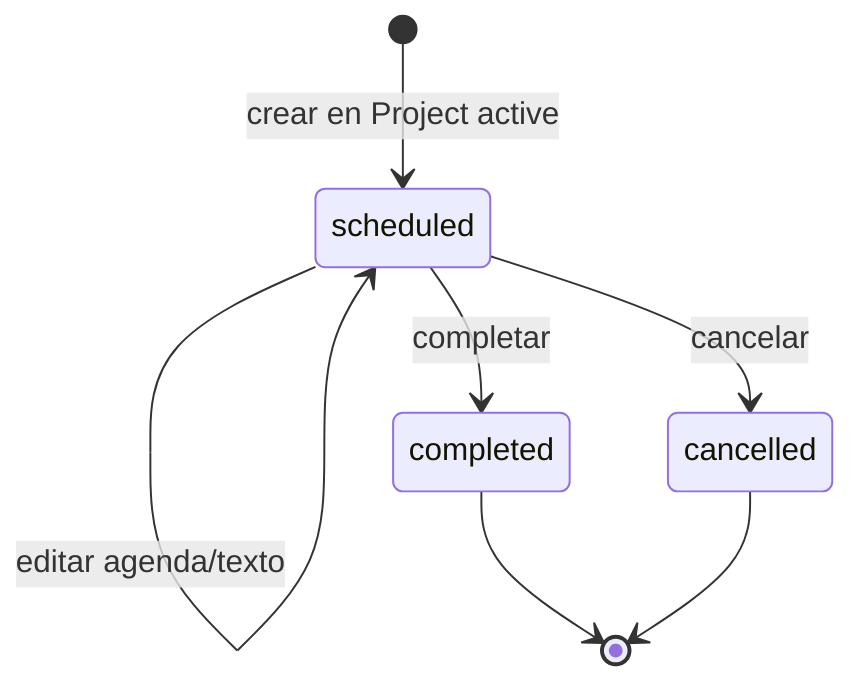
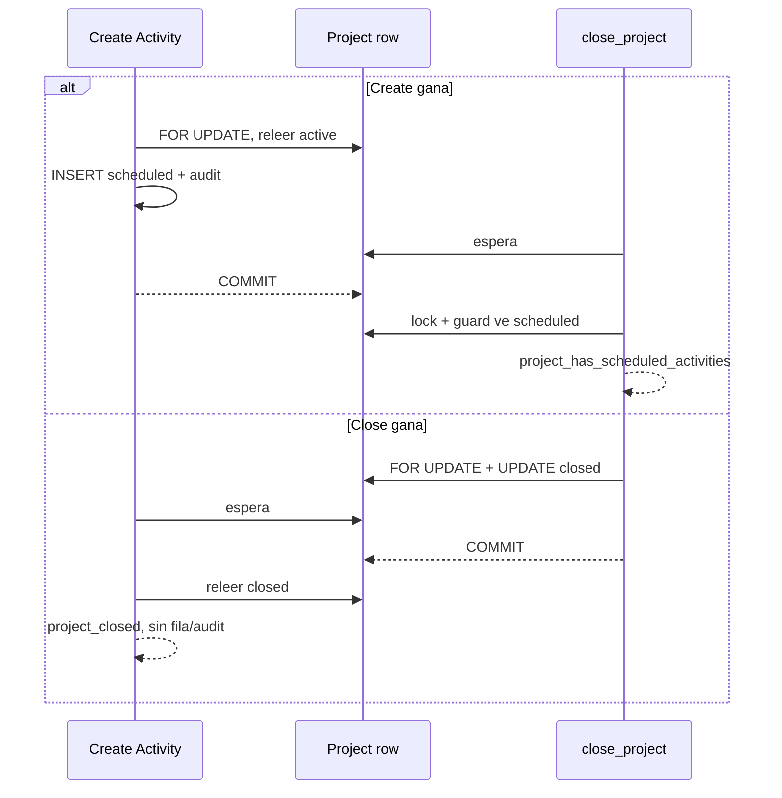
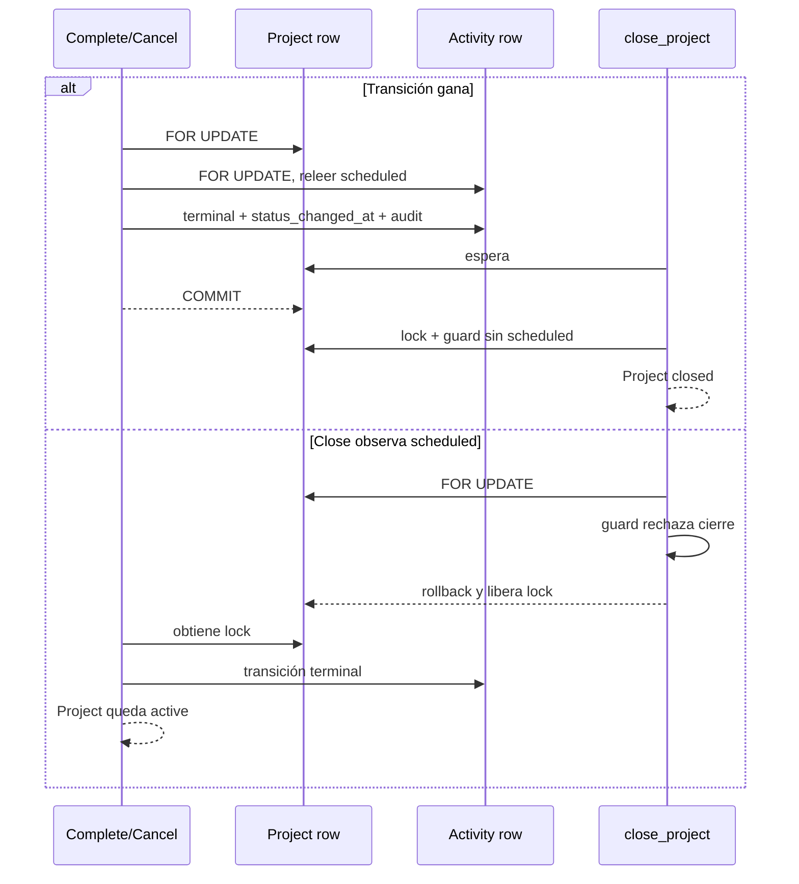
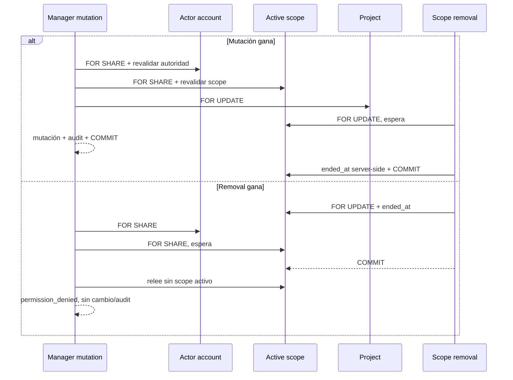

# ExecPlan 0006 — Project Activities V1

- Estado: implementación completada; lista para revisión pre-merge
- Fecha: 2026-08-26
- Rama: `feat/project-activities-v1`
- Base: `main@3416aca`
- Aprobación de implementación: 2026-08-26, recibida sobre
  `d13e73c2538a7ae962d7c45435de1cf8d3d6c89b`

## Objetivo

Implementar el siguiente slice vertical de Projects: actividades pertenecientes a un
proyecto, con agenda mínima, lifecycle terminal, consulta histórica,
autorización global/contextual y concurrencia compatible con el cierre del
proyecto y la revocación de manager scope. La fase de diseño fue aprobada en
`d13e73c`; la fase técnica incorpora dominio, PostgreSQL/RLS/RPC, adaptador,
composición, UI mínima, pruebas y documentación sin ampliar Participation o
Tasks.

## Contexto y estado inicial

- El workspace disponible corresponde al repositorio Git
  `/Users/grovergonzalez/Documents/Sistema-Voluntariado`; la ruta Windows
  `C:\Users\grove\Desktop\PROYECTOS\Sistema-VOLUNTARIADO` indicada en el
  encargo no existe en este entorno macOS. `git rev-parse --show-toplevel`
  confirmó el workspace citado.
- La rama requerida no existía local ni remotamente. Se creó
  `feat/project-activities-v1` desde `main@3416aca`; después de
  `git fetch origin --prune`, `HEAD`, `main`, `origin/main` y ambos merge-base
  coinciden en `3416aca5de7b648ada6b0e2bdeff458351f12046`.
- Projects V1 ya implementa `Project`, `ProjectVolunteerAssignment` y
  `ProjectManagerAssignment` dentro de `apps/web/src/modules/projects`.
  Dominio/aplicación no importan Identity, Volunteers, React, SQL ni Supabase;
  infraestructura y composición respetan los límites vigentes.
- `close_project(uuid)` bloquea la fila `projects FOR UPDATE` y el trigger
  `guard_project_update()` impide hoy cerrar con participaciones voluntarias
  activas mediante `project_has_active_assignments`.
- El acceso contextual exige dinámicamente cuenta `active`, rol
  `project_manager`, permiso contextual y scope activo. El helper autoritativo
  toma locks `account FOR SHARE → scope FOR SHARE`; las mutaciones continúan
  con `project FOR UPDATE → child row FOR UPDATE`.
- Al iniciar el incremento no existía tabla, tipo de dominio, RPC, gateway,
  ruta, componente o prueba de Project Activity.
- `activity.create` y `activity.join` existen únicamente en el seed local y en
  documentación histórica como permisos futuros. El seed los concede a
  administrator, pero ninguna migración productiva, RPC, policy, aplicación o
  UI los usa. No se reinterpretan ni eliminan en este incremento.

## Baseline inicial

Se usó un runtime temporal fuera del repositorio para cumplir exactamente Node
`22.18.0`; Corepack resolvió pnpm `11.9.0`. El shell global tenía Node
`22.21.0` y pnpm `11.19.0`, por lo que no se usó como evidencia de los gates.

| Gate                                                    | Resultado observado                                                                                                                                                   |
| ------------------------------------------------------- | --------------------------------------------------------------------------------------------------------------------------------------------------------------------- |
| `node --version` / `pnpm --version` con runtime aislado | `v22.18.0` / `11.9.0`                                                                                                                                                 |
| `pnpm install --frozen-lockfile`                        | aprobado; 6 proyectos, lockfile al día                                                                                                                                |
| `pnpm verify`                                           | aprobado: formato, lint, boundaries, 4 probes arquitectónicos, typecheck web/Functions, 13/13 orquestación, 176/176 unitarias, 2/2 integración y build de 462 módulos |
| `pnpm db:start`                                         | aprobado; Supabase local sin Edge Runtime automático                                                                                                                  |
| `pnpm db:reset`                                         | aprobado; aplicó migraciones 0001–0005 y seed local                                                                                                                   |
| `pnpm exec supabase db lint --local --level warning`    | aprobado; cero resultados/avisos de esquema                                                                                                                           |
| `pnpm db:test`                                          | aprobado; 5 archivos y 309/309 pgTAP                                                                                                                                  |
| `pnpm projects:test:concurrency`                        | aprobado; 7/7 carreras con bloqueo PostgreSQL observado                                                                                                               |
| `pnpm test:functions`                                   | aprobado; 21/21                                                                                                                                                       |
| `pnpm test:e2e`                                         | aprobado; 11/11 con un worker serial                                                                                                                                  |
| `pnpm db:stop`                                          | aprobado; Supabase local detenido y cero contenedores activos del proyecto confirmados con Docker                                                                     |

No se observó flakiness, tests omitidos ni fallos funcionales. Avisos no
bloqueantes: Supabase CLI y Turbo informaron versiones más nuevas disponibles;
Playwright informó que `NO_COLOR` se ignoró porque `FORCE_COLOR` estaba activo.
No se actualizó ninguna dependencia.

## Alcance aprobado

- `ProjectActivity` como recurso hijo de exactamente un `Project` y propiedad
  del bounded context Projects.
- Alta, listado, detalle, edición mientras está `scheduled`, completar y
  cancelar.
- Agenda mínima con inicio obligatorio, fin y ubicación textual opcionales.
- Histórico consultable en proyecto cerrado, sin mutaciones posteriores.
- Administrator global por `project.manage` y project manager por
  `project.read_assigned`/`project.manage_assigned` más autoridad contextual.
- Persistencia PostgreSQL forward-only, RLS default-deny, RPC de mínimo
  privilegio y auditoría atómica sin PII.
- Integración autoritativa con `close_project` y regresiones reales de locks.
- UI accesible y simple dentro del detalle de Project.

## Fuera de alcance

- Activity Participation o cualquier relación Activity–Volunteer/Account.
- `activity_participants`, `activity_volunteers`, RSVP, self join, waiting
  lists, attendance o estados de asistencia.
- `responsible_user_id` u otro responsable individual de Activity.
- Tasks, notificaciones, calendarios externos, recurrencia, archivos o
  documentos.
- Capacidad, solapamientos, unicidad de nombre, auto-completion, restricciones
  contra fechas pasadas o reglas basadas en la hora actual.
- Reabrir, descompletar, descancelar o eliminar Activities desde cliente.
- Crear un módulo top-level Activities/Work o un framework genérico de scopes.
- Cambiar migraciones 0001–0005, desplegar, enlazar Supabase remoto, push,
  merge, rebase o amend.

La exclusión de Participation es deliberada. Modelarla exigiría antes acordar
eligibility, inscripción propia/administrativa, retiro, asistencia, histórico,
efecto de finalizar una participación de proyecto, cancelación y permisos del
voluntario. Ninguna de esas reglas se infiere en V1.

## Modelo de dominio y lenguaje ubicuo

`ProjectActivity` es el nombre de la entidad; `project_activities`, el nombre
implementado de su tabla. No se usa `Event`, `Task`, `Assignment`, `Participation`
ni `active` como sinónimos.

Campos de dominio:

- `id`
- `projectId`
- `name`
- `description`
- `startsAt`
- `endsAt`
- `locationText`
- `status`
- `statusChangedAt`
- `createdAt`
- `updatedAt`

Normalización implementada, simétrica entre TypeScript y PostgreSQL:

- `name`: trim, whitespace visible colapsado, obligatorio, 1–120 caracteres.
- `description`: trim, whitespace colapsado, vacío a `null`, máximo 1.000.
- `locationText`: trim, whitespace colapsado, vacío a `null`, máximo 200.
- `startsAt`: instante válido y obligatorio.
- `endsAt`: instante válido o `null`; cuando existe, `endsAt >= startsAt`.
- Sin columna de timezone. PostgreSQL conserva instantes y presentación aplica
  locale.

Los tests de paridad incluyen Unicode astral para no aceptar una diferencia
accidental entre `String.length` y `char_length`. Los instantes exigen offset
explícito, calendario real, finitud y representación UTC ISO en años 0001–9999.

## Estados, lifecycle e invariantes

1. Toda Activity nace `scheduled`; el cliente no envía el estado inicial.
2. `scheduled` es el único estado editable y transicionable.
3. `completed` y `cancelled` son terminales e inmutables.
4. No existe reapertura, transición cruzada terminal ni DELETE cliente.
5. `project_id`, `id` y `created_at` son inmutables; no se mueve una Activity
   entre proyectos.
6. Crear o mutar exige Project `active`. Project `closed` solo permite lectura
   histórica.
7. `closed + scheduled Activity` es una combinación prohibida.
8. Cerrar no toca filas Activity, no cambia timestamps, no completa/cancela y
   no genera auditoría Activity.
9. `status_changed_at` se fija por servidor al crear la Activity para marcar el
   comienzo de `scheduled`, permanece estable en ediciones y se reemplaza por
   hora de servidor al completar o cancelar.
10. `updated_at` cambia en edición y transición; `created_at` nunca cambia.
11. `ends_at` es el fin planificado, no un indicador de estado; no provoca
    transición automática.
12. No hay unicidad de nombre, límites de cantidad, regla de solapamiento,
    duración máxima/mínima ni requisito de fecha futura.

## Autorización

### Administrator

Una cuenta activa con `project.manage` puede listar/detallar Activities en
cualquier Project y crear/editar/completar/cancelar cuando Project y Activity
cumplan el lifecycle.

### Project manager contextual

Cada RPC revalida en PostgreSQL:

- actor de `auth.uid()` enlazado a `accounts`;
- `accounts.status = 'active'`;
- rol vigente `project_manager`;
- `project.read_assigned` para lectura o `project.manage_assigned` para mutar;
- `project_manager_assignments.ended_at IS NULL` para el Project target.

El manager puede leer histórico de un Project cerrado mientras el scope siga
vigente, pero no crear ni mutar Activities allí. No puede cerrar Project ni
administrar managers.

### Permisos históricos

Activities V1 no usa `activity.create` ni `activity.join`. Conservar esos
placeholders evita un cambio silencioso de significado; pgTAP los retira
temporalmente del administrator y concede `activity.create` a un actor no
autorizado para demostrar que no influyen. No se añade
`activity.manage_assigned`: Activity hereda la autoridad de su Project.

La UI usa capacidades solo para UX. Para operaciones compartidas debe considerar
`project.manage || project.manage_assigned`, pero el scope de una fila nunca se
decide en React.

## Modelo SQL implementado

### Tabla `public.project_activities`

| Columna             | Tipo               | Regla                                                   |
| ------------------- | ------------------ | ------------------------------------------------------- |
| `id`                | `uuid`             | PK, `extensions.gen_random_uuid()`                      |
| `project_id`        | `uuid`             | NOT NULL, FK `projects(id) ON DELETE RESTRICT`          |
| `name`              | `text`             | NOT NULL, normalizado, 1–120                            |
| `description`       | `text null`        | normalizado, 1–1.000 cuando existe                      |
| `starts_at`         | `timestamptz`      | NOT NULL, finito y representable como ISO UTC 0001–9999 |
| `ends_at`           | `timestamptz null` | `null` o finito/representable y `>= starts_at`          |
| `location_text`     | `text null`        | normalizado, 1–200 cuando existe                        |
| `status`            | `text`             | NOT NULL DEFAULT `scheduled`, allowlist exacta          |
| `status_changed_at` | `timestamptz`      | NOT NULL DEFAULT `statement_timestamp()`; servidor      |
| `created_at`        | `timestamptz`      | NOT NULL DEFAULT `statement_timestamp()`; servidor      |
| `updated_at`        | `timestamptz`      | NOT NULL DEFAULT `statement_timestamp()`; trigger       |

Constraints implementados:

- nombre/descripción/ubicación normalizados y dentro de límites;
- `status IN ('scheduled', 'completed', 'cancelled')`;
- instantes finitos, representables por el contrato TypeScript/Zod y
  `ends_at IS NULL OR ends_at >= starts_at`;
- `status_changed_at >= created_at`;
- `updated_at >= created_at AND updated_at >= status_changed_at`.

No hay FK a `volunteers`, `accounts`, `profiles` o Auth; tampoco columnas de
responsable/participación ni unicidad por nombre.

Índices mínimos:

- `project_activities_project_starts_at_id_idx` en
  `(project_id, starts_at, id)` para un orden estable de listado;
- `project_activities_scheduled_project_idx` parcial en `(project_id) WHERE
status = 'scheduled'` para el guard de cierre;
- la PK cubre acceso por `id` y todas las búsquedas de detalle combinan además
  `project_id`.

### Triggers internos

- guard de insert/update: estado inicial, transiciones, terminalidad, campos
  inmutables, Project active y timestamps server-side;
- guard de DELETE: `42501/project_activity_delete_not_allowed`;
- `set_updated_at` existente;
- auditoría after insert/update.

Los guards tampoco son ejecutables por roles cliente. Las RPC prebloquean en
el orden canónico; los triggers conservan defensa para cualquier futura ruta
privilegiada interna.

## RPC implementadas

Todas son `SECURITY DEFINER`, `search_path = ''`, nombres cualificados, actor
derivado de `auth.uid()`, parámetros validados y `EXECUTE` exclusivo para
`authenticated`:

- `list_project_activities(requested_project_id uuid)`
- `get_project_activity_detail(requested_project_id uuid,
requested_activity_id uuid)`
- `create_project_activity(requested_project_id uuid, requested_name text,
requested_description text, requested_starts_at timestamptz,
requested_ends_at timestamptz, requested_location_text text)`
- `update_project_activity(requested_project_id uuid,
requested_activity_id uuid, requested_name text,
requested_description text, requested_starts_at timestamptz,
requested_ends_at timestamptz, requested_location_text text)`
- `complete_project_activity(requested_project_id uuid,
requested_activity_id uuid)`
- `cancel_project_activity(requested_project_id uuid,
requested_activity_id uuid)`

No hay RPC pública genérica que reciba el estado objetivo. Ninguna firma
acepta `status`, `status_changed_at`, `created_at` o `updated_at`.

Detalle/update/complete/cancel reciben Project y Activity para autorizar primero
el Project y después buscar `activity.id = requested_activity_id AND
activity.project_id = requested_project_id`. Así un manager no puede usar un
UUID de Activity como oráculo de existencia fuera de su scope.

Errores estables implementados:

| SQLSTATE | Código                                  |
| -------- | --------------------------------------- |
| `42501`  | `permission_denied`                     |
| `P0002`  | `project_not_found`                     |
| `P0002`  | `project_activity_not_found`            |
| `23514`  | `project_closed`                        |
| `23514`  | `project_activity_not_scheduled`        |
| `23514`  | `project_has_scheduled_activities`      |
| `22023`  | `project_activity_immutable_fields`     |
| `22023`  | `project_activity_must_start_scheduled` |
| `22023`  | `invalid_project_activity`              |
| `42501`  | `project_activity_delete_not_allowed`   |

`project_activity_not_scheduled` es el error único para editar o intentar una
segunda transición terminal; permite que el perdedor de complete/cancel tenga
un contrato estable sin revelar una transición diferente.

## RLS y grants

- RLS está habilitada en `project_activities`, sin policies permisivas.
- La tabla tiene `REVOKE ALL` para `public`, `anon` y `authenticated`.
- No existe SELECT/DML directo del navegador; toda proyección sale por RPC
  mínima.
- Helpers/triggers están revocados a cliente.
- Cada RPC está revocada a `public`/`anon` y concedida solo a `authenticated`.
- No se concedió nada nuevo a `service_role`.
- pgTAP verifica catálogo, grants por firma y ejecuta INSERT/UPDATE/DELETE
  directos como un actor que sí podría usar la RPC equivalente.

## Auditoría

Eventos implementados, consistentes con Projects:

- `project_activity.created`
- `project_activity.updated`
- `project_activity.completed`
- `project_activity.cancelled`

`entity_type = 'project_activity'`, `entity_id = activity.id`, actor desde
`auth.uid()` y escritura en la misma transacción. `changed_fields` contiene
solo nombres de campos; `previous_state/new_state` solo contienen códigos de
estado para transiciones; `metadata = '{}'`; no se usa `target_user_id`.

No se copian nombre, descripción, ubicación, fechas de agenda, valores previos,
PII ni cuerpos de solicitud. Una operación fallida revierte cualquier evento.

## Integración forward-only con cierre de Projects

La migración forward-only `202608260006_project_activities.sql`, posterior a
0005:

1. crea tabla, constraints, índices, guards, auditoría y RPC nuevas;
2. reemplaza mediante `CREATE OR REPLACE FUNCTION`
   `public.guard_project_update()`;
3. conserva primero el chequeo y error histórico
   `project_has_active_assignments`;
4. añade después `EXISTS` de `project_activities` scheduled y lanza
   `23514/project_has_scheduled_activities`;
5. conserva el trigger existente y la firma/cuerpo/grant de
   `close_project(uuid)`.

No se modificó 0004. El guard central protege tanto la RPC como una futura ruta
interna que actualice `projects.status`. Duplicar el chequeo solo en
`close_project` dejaría una defensa incompleta.

La tabla nueva comienza vacía: proyectos activos/cerrados existentes siguen
válidos, no hay backfill, no se inventan Activities ni timestamps, y ninguna
fila histórica se reescribe. La migración es aditiva salvo el reemplazo
compatible del guard.

## Orden de locks

| Operación                            | Orden autoritativo                                                                             |
| ------------------------------------ | ---------------------------------------------------------------------------------------------- |
| Create administrator                 | `project FOR UPDATE → insert activity`                                                         |
| Create manager                       | `actor account FOR SHARE → active scope FOR SHARE → project FOR UPDATE → insert activity`      |
| Update/complete/cancel administrator | `project FOR UPDATE → activity FOR UPDATE`                                                     |
| Update/complete/cancel manager       | `actor account FOR SHARE → active scope FOR SHARE → project FOR UPDATE → activity FOR UPDATE`  |
| Close                                | `project FOR UPDATE → comprobar assignments → comprobar scheduled activities → update project` |
| Scope removal                        | `scope FOR UPDATE`                                                                             |

Nunca se bloquea Activity antes de Project ni scope después de Project. Las
operaciones de manager llaman primero a `lock_project_contextual_access`; si la
revocación ganó, el helper espera, relee `ended_at` y niega. Si la mutación ganó,
el finalizador de scope espera el lock compartido y termina después.

## Concurrencia

### Create Activity ↔ close Project

Resultados únicos: `active + nueva scheduled` si create gana, o `closed + cero
nuevas` si close gana. Nunca `closed + newly-created scheduled`.

### Complete/cancel last scheduled ↔ close

Complete y cancel entre sí toman Project y luego la misma Activity. Solo el
primero cambia `scheduled`; el perdedor relee terminal y falla
`project_activity_not_scheduled`. Debe existir exactamente un evento terminal.

### Manager mutation ↔ scope removal

La regresión parametriza create, update, complete y cancel en ambos órdenes;
así demuestra nominalmente que las cuatro RPC de mutación siguen el helper
autoritativo cuando corresponde.

## Arquitectura de aplicación y UI

Activities permanece en `apps/web/src/modules/projects`. Para no seguir
acumulando responsabilidades en archivos ya grandes, la implementación se
separó dentro del mismo módulo:

- `domain/project-activity.ts`
- puerto/servicio de aplicación específico de Activity
- gateway Supabase específico de Project Activity
- `presentation/project-activities-section.tsx`

No se crea un módulo top-level, CRUD genérico, base repository, aggregate
framework ni framework de scope. La composición conecta el nuevo servicio
mediante la API pública de Projects; dominio/aplicación no conocen Supabase ni
Identity.

Project detail incorpora una sección Activities con:

- nombre, fecha/hora, estado y ubicación opcional;
- empty/loading/error/success accesibles;
- Create/Edit/Complete/Cancel solo como UX para actor capaz, Project active y
  Activity scheduled;
- confirmación de complete/cancel;
- terminales y Project closed estrictamente read-only;
- `toLocaleString`/i18n, sin calendario complejo, drag/drop o timeline.

Los controles `datetime-local` no se parsean mediante cadenas dependientes del
locale. `project-activity-date-time.ts` extrae componentes numéricos, construye
la hora de pared en el timezone vigente del sistema/navegador, valida round-trip
calendárico y envía `toISOString()` como instante UTC; al editar realiza la
conversión inversa. V1 no guarda una timezone propia ni resuelve la ambigüedad
de la hora repetida durante un cambio DST: usa la resolución estándar del
runtime local y conserva únicamente el instante resultante.

## Estrategia y cobertura de pruebas

### Dominio y aplicación

- trim, colapso de whitespace y vacíos a `null`;
- límites 120/1.000/200, borde y `+1`, incluido Unicode astral;
- instantes inválidos, offsets equivalentes, fechas pasadas permitidas,
  `ends_at = starts_at` y fin anterior rechazado;
- creación solo scheduled, ambas transiciones y terminalidad;
- Project closed, UUID inválido y validación antes de gateway;
- ninguna llamada a infraestructura ante entrada/autoridad local inválida;
- capacidades `manage || manageAssigned` sin pretender decidir scope.

### Gateway y presentación

- mapping completo snake_case/camelCase y argumentos RPC sin estado/timestamps
  técnicos;
- traducción de todos los errores propuestos;
- listado vacío, carga, error, éxito y refresh después de mutación;
- formularios etiquetados, errores asociados, ubicación opcional y fechas;
- acciones solo scheduled y Project active; terminal/closed read-only.

### pgTAP/RLS

- tabla, tipos, FK restrictiva, constraints, índices, triggers y ausencia de
  DELETE RPC;
- RLS activa, cero policies, cero grants de tabla y DML directo denegado;
- `SECURITY DEFINER`, `search_path = ''`, nombres cualificados y grants exactos;
- administrator activo; manager con scope; proyecto ajeno; scope terminado;
  manager sin rol/permiso, suspended y archived; coordinator, volunteer y anon;
- create/read/update/complete/cancel y todas las transiciones inválidas;
- Project closed lee histórico y rechaza mutación;
- `close_project` y UPDATE interno fallan con scheduled; preservar precedencia
  `project_has_active_assignments` cuando ambas invariantes fallan;
- cierre posterior a todas las terminales y asignaciones finalizadas;
- cierre no cambia ninguna fila/timestamp/auditoría Activity;
- cuatro eventos exactos, actor correcto, payload mínimo y fallos sin evento;
- retirar `activity.create/join` del admin y conceder `activity.create` a
  coordinator para probar que no autorizan.

### Concurrencia y mutation testing

- create-first/close-first;
- complete-first/close y close observa scheduled;
- cancel-first/close y close observa scheduled;
- complete-first/cancel-first;
- create/update/complete/cancel ↔ scope removal, ambos órdenes;
- `pg_blocking_pids`, SQLSTATE/mensaje, estado final, auditoría y cleanup en
  cada caso, sin sleeps arbitrarios;
- mutaciones temporales dirigidas: retirar locks/guards/precondición
  scheduled/helper contextual y demostrar FAIL; restaurar y confirmar PASS sin
  diff.

El harness Activity está incorporado a `projects:test:concurrency`; la prueba
de orquestación y el workflow conservan el mismo comando. Sus 17 escenarios,
sumados a los 7 de participaciones/scopes, permanecen dentro del timeout CI de
dos minutos. La suite se repite cinco veces antes del cierre.

Evidencia de mutation testing local, nunca versionada:

- A: se retiraron temporalmente los locks explícitos de create y se difirió la
  FK solo para aislar el lock incidental; create-first y close-first fallaron
  porque el contendiente terminó sin espera (`exit 1`).
- B: se sustituyó temporalmente el lock/recheck contextual por el helper de
  lectura; scope-removal-first falló por ausencia de espera (`exit 1`).
- C: se neutralizó temporalmente el predicado scheduled del guard; pgTAP dejó
  cerrar el Project, lo observó `closed` y falló la terminalización (`exit 1`).
- Cada mutación se revirtió mediante parche inverso. El hash productivo
  `38839f359f2e4825a1df125dc2ac58aad31c6c2b508ba9c546cda7cedfa6f82a`
  fue restaurado; reset/lint, 397 pgTAP y 17 carreras volvieron a PASS antes de
  continuar. La ampliación posterior de pgTAP elevó el total a 406.

### E2E

- Administrator: crear Project; crear dos Activities; editar; comprobar que el
  cierre falla; completar una y cancelar otra; cerrar; ver ambas históricas sin
  acciones.
- Project manager scoped: abrir asignado; crear; editar; completar/cancelar al
  menos una Activity y verificar la otra transición en el recorrido o pgTAP.
- Manager no asignado: no enumera y URL directa se deniega.
- Project closed: administrator y manager con scope ven histórico read-only.
- Los negativos autoritativos permanecen en PostgreSQL; ausencia de botones no
  sustituye RLS/RPC.

Descubrimiento QA: la suite de 0005 no probaba nominalmente que un manager
mutara un recurso hijo; Activities V1 cerró ese hueco con pgTAP, E2E y ocho
intercalaciones create/update/complete/cancel frente a scope removal.

## Riesgos y mitigaciones

| Riesgo                                                    | Mitigación                                                                                 |
| --------------------------------------------------------- | ------------------------------------------------------------------------------------------ |
| `closed + scheduled` por TOCTOU                           | lock común de Project, guard central e intercalaciones reales                              |
| complete/cancel dobles                                    | Project → Activity locks, precondición scheduled y error estable                           |
| mutación tras revocar scope                               | account → scope → project → activity y carreras por cada RPC                               |
| acceso horizontal por UUID Activity                       | firmas con Project + Activity, autorización previa y predicado compuesto                   |
| permisos placeholders adquieren semántica accidental      | no usarlos y probar su irrelevancia                                                        |
| timestamps manipulados                                    | firmas sin campos técnicos, defaults/triggers server-side y cero DML cliente               |
| PII/agenda sensible en auditoría                          | solo IDs, nombres de campos, estados técnicos y metadata vacía                             |
| UI Projects monolítica                                    | slice/section Activity separado dentro del mismo bounded context                           |
| harness excede timeout CI                                 | medir duración, mantener gate raíz y ajustar timeout con evidencia                         |
| documentación desactualizada frente al slice implementado | actualizar arquitectura, datos, seguridad, operación y trazabilidad en el mismo incremento |

## Preguntas abiertas reales

No hay preguntas de producto bloqueantes para cerrar la fase técnica.
Quedan como decisiones técnicas no bloqueantes ya resueltas en este plan:

- `status_changed_at` es no nulo y comienza en la creación scheduled;
- ubicación máxima 200 y normalización igual a Projects;
- precedencia de cierre conserva primero `project_has_active_assignments`;
- el perdedor terminal usa `project_activity_not_scheduled`;
- listado tendrá orden estable por `(starts_at, id)`.

Cualquier propuesta posterior de preservar saltos de línea, solapamientos,
fechas futuras, razones de cancelación o participación reabre producto y no se
implementa por inferencia.

## Fases y validaciones

| Fase                     | Resultado                                                   | Validación                                                     | Estado     |
| ------------------------ | ----------------------------------------------------------- | -------------------------------------------------------------- | ---------- |
| 0. Precheck/baseline     | rama, gobernanza, estado real y suite base                  | Git, frozen install, verify, DB, concurrencia, Functions y E2E | completada |
| 1. Diseño y revisión     | ExecPlan, SQL previo, locks, QA y trazabilidad IA           | cinco revisores read-only y revisión humana                    | completada |
| 2. Dominio/aplicación    | tipos, normalización, lifecycle, puertos/casos de uso       | tests focalizados, typecheck, boundaries                       | completada |
| 3. PostgreSQL            | migración 0006, tabla, guards, RPC, RLS, auditoría y cierre | reset, lint, pgTAP, catálogo y mutation tests                  | completada |
| 4. Infra/composición     | adaptador tipado y servicio conectado                       | gateway tests, boundaries, typecheck                           | completada |
| 5. UI                    | sección Project Activities accesible y read-only histórica  | component tests, i18n y accesibilidad                          | completada |
| 6. Concurrencia/E2E/docs | harness integrado, recorridos y documentación vigente       | cinco repeticiones, E2E local/CI y docs review                 | completada |
| 7. Cierre                | baseline completa y revisiones finales                      | release-readiness, scans y revisión humana                     | completada |

La fase 2 comenzó únicamente después de la aprobación humana del diseño. Los
bloqueantes de revisión inicial se integraron antes de escribir la migración.

## Criterios de aceptación del incremento

- Activities pertenece a Projects y no introduce Participation, Tasks ni un
  framework genérico.
- Estados exactos y terminalidad quedan protegidos en dominio y PostgreSQL.
- Administrator y manager contextual autorizado completan el flujo; todos los
  sujetos/estados negativos fallan cerrados.
- Project closed conserva histórico y no admite alta/mutación Activity.
- Nunca existe `closed + scheduled`, ni siquiera bajo concurrencia.
- Una sola transición terminal gana y el perdedor recibe error estable.
- Scope removal y cada mutación Activity serializan en ambos órdenes.
- RLS/grants niegan DML directo; RPC privilegiadas son mínimas y seguras.
- Auditoría atómica contiene solo metadata técnica mínima.
- Migraciones 0001–0005 permanecen byte-for-byte intactas.
- Gates, mutation tests, cinco repeticiones, revisiones y documentación quedan
  verdes antes de declarar el incremento completado.

## Revisiones iniciales

- Architect: PASS con observaciones. Confirmó ownership en Projects, ausencia
  de framework genérico, orden de locks y necesidad de extraer el slice UI.
- Database security: GO condicionado a este diseño. Exigió guard de cierre
  forward-only, firmas Project + Activity, estados server-authoritative y RLS
  default-deny.
- Domain modeler: PASS con observaciones. Confirmó lifecycle, terminalidad,
  lenguaje ubicuo y exclusión explícita de Participation.
- QA: GO para el diseño con criterios obligatorios. Señaló el hueco existente de
  mutación contextual de recurso hijo y exigió carreras por cada RPC.
- Docs governor: NO-GO inicial por omitir la evidencia de `db:stop` y mantener
  un estado contradictorio de la propia revisión. Ambos puntos se corrigieron;
  el recheck final emitió GO documental.

Todos los revisores operan en solo lectura; el agente principal es el único
escritor. Sus observaciones no sustituyen revisión humana.

## Progreso

- 2026-08-26: ruta Git, rama, limpieza, HEAD/base/merge-base y alineación fresca
  con `origin/main` confirmadas.
- 2026-08-26: lectura completa de gobernanza, documentación requerida,
  ExecPlans 0004/0005 y trazabilidad IA; inspección de dominio, aplicación,
  adaptadores, composición, router, UI, migraciones, RLS/RPC, audit, pgTAP,
  harness, E2E y CI.
- 2026-08-26: baseline completa aprobada con runtime exacto; no hubo fallos ni
  flakiness observada.
- 2026-08-26: `pnpm db:stop` aprobó al finalizar la inspección y una consulta
  posterior de Docker confirmó cero contenedores activos del proyecto.
- 2026-08-26: revisiones iniciales de arquitectura, base de datos, dominio y QA
  integradas sin preguntas de producto bloqueantes.
- 2026-08-26: ExecPlan y prompt 0010 redactados; no se creó migración, RPC,
  código productivo, UI ni prueba productiva.
- 2026-08-26: el NO-GO documental inicial señaló dos defectos de trazabilidad;
  se integraron la evidencia de apagado y un estado de revisión coherente; el
  recheck emitió GO.
- 2026-08-26: dominio, aplicación, gateway, composición y sección UI Activity
  implementados dentro de Projects; validación focalizada aprobó 26/26.
- 2026-08-26: migración 0006 aplicada desde reset limpio; DB lint sin
  hallazgos y 397/397 pgTAP con DML directo denegado, actor auditado y matriz
  global/contextual.
- 2026-08-26: harness Activity ampliado a 17 carreras, incluyendo las cuatro
  mutaciones contextuales frente a scope removal en ambos órdenes; 17/17 PASS
  con `pg_blocking_pids` y mensajes ordenados por stdout de `psql`.
- 2026-08-26: revisión detectó y corrigió normalización SQL de whitespace,
  instantes ambiguos/calendáricamente inválidos, infinity y rango UTC fuera de
  0001–9999; dominio, SQL y gateway quedaron totales entre sí.
- 2026-08-26: los tres mutation checks dirigidos produjeron FAIL esperado; la
  restauración recuperó el hash productivo, 397 pgTAP y 17/17 carreras. La
  cobertura adicional de precedencia/cierre llevó pgTAP a 406/406.
- 2026-08-28: una primera serie extendida detectó flakiness del canal de
  observación: el cuarto proceso agotó el timeout de un `docker exec` usado solo
  en cleanup tras 16 escenarios correctos. El polling de `pg_stat_activity` se
  movió a una tercera sesión `psql` persistente por escenario; el recheck pasó
  17/17 y después cinco repeticiones consecutivas, 85/85, en ~17 segundos cada
  una, sin sesiones ni locks residuales.
- 2026-08-28: E2E desde reset limpio aprobó 15/15, incluidos los cuatro
  recorridos Activity, URL directa fuera de scope y Project cerrado histórico.
  La primera ejecución expuso un selector global obsoleto en un E2E Projects;
  se acotó por fila y la repetición completa quedó verde.
- 2026-08-28: E2E normal y `CI=true` aprobaron 15/15 desde resets limpios. El
  gate CI definitivo usó un shim temporal de Corepack para conservar Node
  22.18.0 y pnpm 11.9.0 también en los procesos hijos.
- 2026-08-28: release-readiness completo aprobó frozen install, `verify`,
  Functions, DB, concurrencia y scans; cero sesiones/locks Activity y cero
  procesos propios quedaron activos. `pnpm db:stop` detuvo Supabase conservando
  volúmenes.

## Baseline final

| Gate                        | Resultado final                                                                                                                                                                                 |
| --------------------------- | ----------------------------------------------------------------------------------------------------------------------------------------------------------------------------------------------- |
| Runtime y dependencias      | Node `22.18.0`, pnpm `11.9.0`; frozen install aprobado para 6 proyectos                                                                                                                         |
| Formato y estática          | `format`, `format:check`, lint, boundaries, 4 probes arquitectónicos, typecheck web/Functions y `git diff --check` aprobados                                                                    |
| Unitarias/integración/build | 202/202 unitarias, 2/2 integración y build de 468 módulos                                                                                                                                       |
| Orquestación/Functions      | 13/13 pruebas de orquestación y 21/21 Functions                                                                                                                                                 |
| PostgreSQL                  | reset 0001–0006, lint sin hallazgos y 406/406 pgTAP; 0006 aporta 97 checks                                                                                                                      |
| Concurrencia                | suite combinada 24/24; harness Activity 17/17 repetido cinco veces, 85/85                                                                                                                       |
| Mutation testing temporal   | A lock Project de create, B lock/revalidación scope y C guard scheduled produjeron FAIL esperado; restauración recuperó hash `38839f359f2e4825a1df125dc2ac58aad31c6c2b508ba9c546cda7cedfa6f82a` |
| E2E                         | 15/15 normal y 15/15 con `CI=true`, ambos desde reset limpio                                                                                                                                    |
| `pnpm verify`               | aprobado con runtime exacto; incluye todos los gates estáticos, tests TypeScript y build                                                                                                        |
| Gobernanza/cleanup          | scans sin secretos ni patrones prohibidos productivos; 0001–0005 intactas; 0 sesiones, 0 locks y 0 procesos propios; Supabase detenido con volúmenes conservados                                |

GitHub Actions no se ejecutó remotamente y no se declara aprobado; el workflow
queda configurado para la validación pre-merge.

## Revisiones finales y commits

- Architect: GO; ownership y dependencias permanecen en Projects, UI extraída
  y sin framework de scope genérico.
- Domain modeler: GO; lifecycle terminal, instantes con zona/calendario válidos,
  fechas y cierre son coherentes entre capas.
- Database security: GO; migración/RLS/RPC/grants/audit, locks y TOCTOU quedan
  protegidos, con 97/97 checks 0006 y 17/17 carreras independientes.
- QA: GO; matriz negativa, once intercalaciones, mutations y E2E cubren las
  invariantes sin skips ni falsos positivos conocidos.
- Docs governor: GO; ExecPlan, producto, arquitectura, datos, seguridad,
  operación y trazabilidad IA son coherentes.

Commits técnicos nuevos, sin amend: `21db0cd` (`feat(projects): add project
activities v1`) y `bb1a16a` (`test(projects): cover activity lifecycle and
concurrency`). El cierre documental se conserva en el commit que contiene esta
versión del plan.

## Descubrimientos

- Los permisos Activity históricos son fixtures/documentación, no una API
  funcional, y no expresan el scope del recurso hijo.
- El guard de cierre, no solo `close_project`, es la frontera que debe evolucionar
  para proteger también rutas internas privilegiadas.
- Las firmas actuales de finalización de participaciones preleen la relación por
  ID antes de autorizar scope; Activities evitará repetir ese oráculo menor.
- La cobertura contextual existente prueba Project pero no una mutación nominal
  de recurso hijo por manager.
- La documentación que agrupaba Activities/Tasks como contexto futuro quedó
  separada: Project Activity pertenece a Projects; Participation, attendance y
  Tasks continúan futuros.

## Decisiones durante esta fase

- Reutilizar permisos Project y helpers específicos de Projects.
- Mantener `close_project(uuid)` y reemplazar únicamente su guard central en la
  migración 0006.
- Usar Project como raíz de consistencia y el orden de locks de 0005.
- No copiar el prelookup por child ID de la participación existente.
- Separar Activities en archivos propios dentro de Projects para limitar
  acoplamiento sin inventar otro módulo.

## Resultado de esta fase

El slice vertical está implementado, todos los gates locales y revisores están
en GO y la rama queda lista para revisión pre-merge. No hubo push, merge,
rebase, amend, despliegue, modificación de `main` ni operación Supabase remota.
