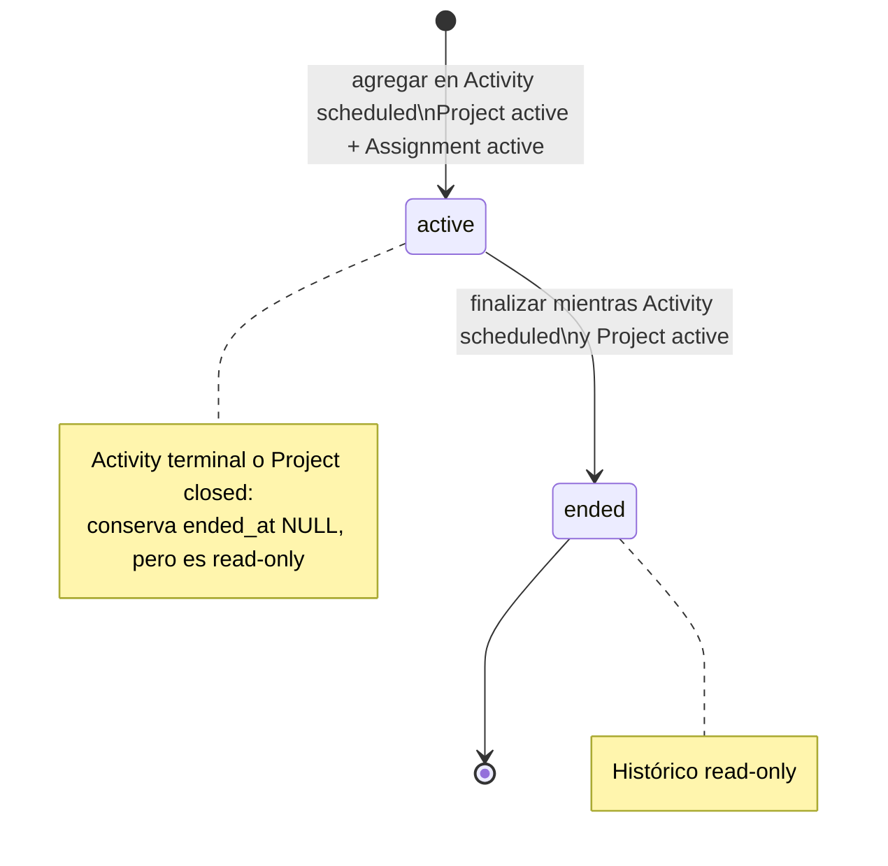

# ExecPlan 0007 — Activity Participation V1

- Estado: implementación completa; lista para PRE-MERGE REVIEW
- Fecha: 2026-09-02
- Rama: `feat/activity-participation-v1`
- Base: `main@fdc05c1`
- Implementación: completada el 2026-09-02; cinco revisores GO y gates locales aprobados

## Objetivo

Permitir que administrator y project manager contextual seleccionen qué registros
del padrón `volunteers` que ya pertenecen a un Project participan en una
`ProjectActivity` del mismo Project. La relación conserva histórico, se administra
solo mientras Project y Activity admiten mutaciones y mantiene PostgreSQL/RPC como
frontera autoritativa de elegibilidad, autorización y concurrencia.

La primera ejecución terminó en inspección, baseline, diseño, revisiones y
documentación. La ejecución actual implementa el slice vertical aprobado y se
detendrá lista para PRE-MERGE REVIEW, sin push, merge, rebase ni despliegue.

## Estado inicial y evidencia Git

- El workspace es `/Users/grovergonzalez/Documents/Sistema-Voluntariado`.
- El shell comenzó en `main`; antes de cualquier edición, `HEAD`, `main`,
  `origin/main` y `merge-base(HEAD, main)` coincidían en
  `fdc05c15ef4d758c2c28039fa8a1efbb448564ec`, con working tree limpio.
- La rama requerida no existía localmente. Se creó
  `feat/activity-participation-v1` desde ese mismo HEAD y se volvió a confirmar
  base, merge-base y limpieza antes de editar.
- Projects V1, Project Volunteer Assignments V1, Project Manager Contextual Scope
  V1 y Project Activities V1 están integrados en la base.
- Al iniciar no existía tabla, RPC, tipo, servicio, gateway, componente o prueba de
  Activity Participation. La implementación actual parte de ese estado confirmado.

## Baseline inicial

El shell global tenía Node `22.21.0`; una primera ejecución de frozen install y
`verify` aprobó pero emitió el warning de engine. Esa ejecución no se usa como
evidencia canónica. Se resolvió Node `22.18.0` en un runtime temporal del store de
pnpm fuera del repositorio, se antepuso su directorio a `PATH` y se repitieron todos
los gates con pnpm `11.9.0`.

| Gate                                                 | Resultado observado                                                                                                                                   |
| ---------------------------------------------------- | ----------------------------------------------------------------------------------------------------------------------------------------------------- |
| `node --version` / `pnpm --version`                  | `v22.18.0` / `11.9.0`                                                                                                                                 |
| `pnpm install --frozen-lockfile`                     | aprobado; 6 proyectos, lockfile al día                                                                                                                |
| `pnpm verify`                                        | aprobado: formato, lint, boundaries, 4 probes, typecheck web/Functions, 13/13 orquestación, 202/202 unitarias, 2/2 integración y build de 468 módulos |
| `pnpm db:start`                                      | aprobado; confirmó servicios locales y Edge Runtime excluido                                                                                          |
| `pnpm db:reset`                                      | aprobado; aplicó migraciones 0001–0006 y seed local                                                                                                   |
| `pnpm exec supabase db lint --local --level warning` | aprobado; cero resultados/avisos de esquema                                                                                                           |
| `pnpm db:test`                                       | aprobado; 6 archivos y 406/406 pgTAP                                                                                                                  |
| `pnpm projects:test:concurrency`                     | aprobado; 24/24 escenarios con PostgreSQL real                                                                                                        |
| `pnpm test:functions`                                | aprobado; 21/21                                                                                                                                       |
| `pnpm test:e2e`                                      | aprobado; 15/15 con un worker serial                                                                                                                  |
| `pnpm db:stop`                                       | aprobado; Supabase local detenido y Docker no mostró contenedores activos del proyecto                                                                |

No hubo fallos, skips ni flakiness observada. Los únicos avisos fueron la versión
más nueva disponible de Supabase CLI y `NO_COLOR` ignorado por Playwright debido a
`FORCE_COLOR`. No se actualizó ninguna dependencia.

## Alcance

- `ProjectActivityParticipation` como relación histórica Activity–Volunteer y
  propiedad del bounded context Projects.
- Listado de participantes activos y finalizados por Activity.
- Búsqueda mínima de candidatos entre las Project Volunteer Assignments activas
  del Project exacto.
- Alta de Participation y finalización monotónica mientras Activity esté
  `scheduled` y Project `active`.
- Administrator global por `project.manage` y manager contextual por la autoridad
  Project vigente.
- Migración forward-only, tabla RLS default-deny, RPC de mínimo privilegio,
  auditoría atómica sin PII y adaptación del guard de Project Assignment.
- Diseño de dominio/aplicación, gateway, composición y una sección Participants
  dentro de la superficie Activity existente.
- Estrategia de pruebas unitarias, gateway/componente, pgTAP, concurrencia y E2E.

## Fuera de alcance

- Self-join, volunteer portal, inscripción pública o autoenrollment.
- RSVP, invited/confirmed/declined, waiting list, capacity, quotas o aprobación.
- Attendance, check-in, presence states, horas o responsables.
- Roles dentro de Activity, invitados externos o personas fuera de `volunteers`.
- Participation entre Projects o elegibilidad por pertenecer a otro Project.
- Tasks, notificaciones, recurrencia, calendar sync o calendarios externos.
- Eliminación física, edición manual de timestamps o finalización automática.
- Un módulo top-level Participation, framework genérico de relaciones o scopes.
- Cambiar migraciones 0001–0006, push, merge, rebase, amend, despliegue, `main` o
  Supabase remoto.

## Lenguaje ubicuo y ownership

- Entidad de dominio: `ProjectActivityParticipation`.
- Tabla definitiva: `public.project_activity_participations`.
- `Participation` significa la ocurrencia histórica que enlaza exactamente una
  `ProjectActivity` con exactamente un `Volunteer` del padrón.
- Participación activa significa exclusivamente `ended_at IS NULL`.
- Finalizar una Participation fija `ended_at` una sola vez; no elimina ni reactiva
  la ocurrencia.
- `ProjectVolunteerAssignment` conserva su significado: pertenencia histórica del
  Volunteer al Project. No se renombra ni se convierte en Participation Activity.
- El sujeto es `public.volunteers.id`. No se usa `accounts`, `profiles`,
  `auth.users`, email, teléfono, `phone_match_key` ni Auth metadata.
- Projects posee Project, Project Assignment, manager scope, Activity y la nueva
  Participation. Volunteers e Identity no importan internals de Projects.

## Modelo de datos

Tabla implementada `public.project_activity_participations`:

| Columna        | Tipo               | Regla                                                                 |
| -------------- | ------------------ | --------------------------------------------------------------------- |
| `id`           | `uuid`             | PK, `extensions.gen_random_uuid()`, estable                           |
| `activity_id`  | `uuid`             | NOT NULL, FK a `project_activities(id) ON DELETE RESTRICT`, inmutable |
| `volunteer_id` | `uuid`             | NOT NULL, FK a `volunteers(id) ON DELETE RESTRICT`, inmutable         |
| `started_at`   | `timestamptz`      | NOT NULL, servidor al crear, inmutable                                |
| `ended_at`     | `timestamptz null` | `null` activa; servidor al finalizar; monotónica                      |
| `created_at`   | `timestamptz`      | NOT NULL, servidor, inmutable                                         |
| `updated_at`   | `timestamptz`      | NOT NULL, trigger existente al finalizar                              |

Se incorpora `updated_at` además del mínimo de producto porque las dos relaciones
históricas existentes de Projects lo usan y permite un contrato consistente sin
exponerlo como entrada del cliente.

Constraints e índices implementados:

- `ended_at IS NULL OR ended_at >= started_at`.
- `created_at <= started_at`, y `updated_at >= created_at`/`started_at`; los valores
  nacen de la misma hora de sentencia al insertar.
- índice único parcial `(activity_id, volunteer_id) WHERE ended_at IS NULL`;
- índice histórico `(activity_id, started_at DESC, id)` para listado estable;
- índice histórico `(volunteer_id, started_at DESC, id)` para la FK y consultas de
  histórico por Volunteer;
- índice parcial `(volunteer_id, activity_id) WHERE ended_at IS NULL` para el guard
  de finalización de Project Assignment;
- no `project_id`, `project_assignment_id`, nombre, email, teléfono, estado RSVP,
  rol, attendance ni metadata duplicada en la tabla.

La FK a Activity permite derivar el Project de forma autoritativa. La ausencia de
`project_assignment_id` es deliberada: Participation representa Activity–Volunteer,
y la elegibilidad se revalida contra la asignación activa al crear. Una Activity
terminal puede conservar una Participation con `ended_at IS NULL` aun cuando su
Project Assignment se finalice después; enlazar la ocurrencia de Assignment como FK
introduciría una semántica que producto no aprobó.

## Lifecycle de Participation



Reglas:

1. Una Participation nace activa; el cliente no envía `started_at`, `ended_at`,
   `created_at` ni `updated_at`.
2. Solo una Activity `scheduled` de un Project `active` admite alta o
   finalización.
3. Finalizar es monotónico. El segundo intento falla sin reescribir timestamps ni
   auditoría.
4. Activity `completed`/`cancelled` y Project `closed` son histórico read-only.
5. Completar/cancelar Activity no finaliza Participations en V1. Una fila activa al
   momento de terminalizar puede conservar `ended_at IS NULL` como evidencia de que
   no fue retirada antes del cierre de Activity.
6. Cerrar Project tampoco altera Participations. El modelo actual exige que no haya
   Activities scheduled antes del cierre, por lo que todo el conjunto ya es
   histórico read-only.
7. Una Participation finalizada permite una nueva ocurrencia del mismo par si la
   Activity todavía está scheduled, el Project activo y existe Assignment activa.
8. No existe DELETE cliente ni reapertura de una ocurrencia finalizada.

La expresión “activa” describe `ended_at`, no capacidad de mutación. Una
Participation activa dentro de Activity terminal es histórica e inmutable. La UI
debe evitar presentarla como una acción pendiente: mostrará el periodo y el estado
terminal de la Activity, sin botón de finalizar.

“Histórico read-only” es una condición contextual de mutabilidad y no sustituye la
definición persistida de activa por `ended_at IS NULL`.

## Eligibility

Agregar exige, dentro de la misma transacción autoritativa:

1. Project existe y está `active`.
2. Activity existe, pertenece exactamente al Project solicitado y está
   `scheduled`.
3. Volunteer existe mediante una `project_volunteer_assignment` activa
   (`ended_at IS NULL`) para exactamente ese Project.
4. No existe Participation activa para la misma pareja Activity/Volunteer.
5. La autoridad del actor sigue vigente después de tomar los locks.

Una Assignment activa hacia otro Project no satisface la regla. La búsqueda de
candidatos filtra por el Project exacto y excluye pares activos, pero es solo una
ayuda de UI: la RPC de alta repite todas las comprobaciones bajo lock.

Errores estables propuestos:

| SQLSTATE | Código conceptual                                   |
| -------- | --------------------------------------------------- |
| `42501`  | `permission_denied`                                 |
| `P0002`  | `project_not_found`                                 |
| `P0002`  | `project_activity_not_found`                        |
| `P0002`  | `project_activity_participation_not_found`          |
| `23514`  | `project_closed`                                    |
| `23514`  | `project_activity_not_scheduled`                    |
| `23514`  | `volunteer_not_assigned_to_project`                 |
| `23505`  | `project_activity_participation_already_active`     |
| `23514`  | `project_activity_participation_already_ended`      |
| `23514`  | `volunteer_has_scheduled_activity_participations`   |
| `42501`  | `project_activity_participation_delete_not_allowed` |

Los códigos definitivos deben conservar esta semántica y pasar revisión de
consistencia al implementar; no se reutiliza `activity.join`, porque es un permiso
placeholder y además implicaría self-join fuera de alcance.

## Autorización

### Administrator

Una cuenta activa con `project.manage` tiene autoridad global para leer y mutar
Participations sujetas al lifecycle y eligibility. No se comprueba el nombre del
rol en paralelo.

### Project manager contextual

Lectura exige dinámicamente:

- sesión de `auth.uid()` enlazada a cuenta `active`;
- rol vigente `project_manager`;
- `project.read_assigned` vigente;
- manager scope activo sobre el Project derivado/solicitado.

Mutación exige la misma conjunción con `project.manage_assigned`, y el helper
autoritativo toma `account FOR SHARE` y `scope FOR SHARE` antes de cualquier lock
Project. La revocación de cuenta, rol, permiso o scope corta autoridad sin cambiar
el histórico de Participation.

Las firmas reciben Project + Activity y autorizan primero el Project. El detalle de
una Participation nunca se busca globalmente antes de confirmar acceso al Project,
evitando usar UUID hijos como oráculo fuera del scope.

## Relación con Project Volunteer Assignment

Decisión de producto aprobada:

- no se puede finalizar una Project Volunteer Assignment si el mismo Volunteer
  conserva al menos una Participation activa en una Activity `scheduled` del mismo
  Project;
- Participation finalizada no bloquea;
- Participation activa en Activity `completed` o `cancelled` no bloquea;
- no se finalizan Participations automáticamente al finalizar Assignment;
- el usuario debe resolver primero las Participations activas relevantes.

La migración reemplaza `finish_project_volunteer_assignment(uuid)` con la misma
firma y proyección para conservar compatibilidad. Después de autorizar y tomar
`project FOR UPDATE → project assignment FOR UPDATE`, la función relee la
Assignment y consulta Participations activas unidas a Activities scheduled del
mismo Project. Si existe alguna, fallará
`23514/volunteer_has_scheduled_activity_participations` antes de actualizar o
auditar.

El chequeo ocurre en la RPC autoritativa y se replica como defensa de consistencia
en el guard de cambio de Assignment sin conceder DML directo. La seguridad contra
la carrera proviene del orden canónico y del lock exclusivo de Project compartido
por ambas operaciones, no de una lectura aislada del trigger.

## Relación con Activity lifecycle

- Add y finish Participation exigen Activity `scheduled` bajo lock.
- Complete/cancel no inspeccionan ni mutan Participations; pueden continuar después
  de que un add ya confirmado haya ganado.
- Si complete/cancel gana primero, add relee estado terminal y falla sin fila ni
  auditoría.
- Activity terminal conserva Participants activos/finalizados como histórico
  read-only.
- El guard existente de cierre Project permanece: cualquier Activity scheduled
  impide cerrar. No se añade un guard Project directo por Participations, porque una
  Participation solo bloquea indirectamente mientras su Activity está scheduled.
- No se altera `status_changed_at`, agenda ni auditoría Activity al administrar
  Participants.

## Invariantes

1. Toda Participation referencia una Activity y un Volunteer existentes.
2. Nunca hay más de una Participation activa por Activity/Volunteer.
3. Toda Participation nueva se creó mientras Activity estaba scheduled, Project
   active y el Volunteer tenía Assignment activa al Project exacto.
4. No puede crearse una Participation si la Project Assignment ya terminó. Después,
   una Activity terminal sí permite finalizar la Assignment sin modificar una
   Participation que conserve `ended_at IS NULL`.
5. No se crea Participation después de completar/cancelar Activity.
6. Solo una finalización de Participation cambia `ended_at` y audita.
7. Manager sin autoridad contextual vigente no lee ni muta el Project.
8. Ninguna operación cliente hace INSERT/UPDATE/DELETE/SELECT directo de la tabla.
9. No hay DELETE físico; FKs son restrictivas e histórico monotónico.
10. Auditoría usa actor real y solo IDs/estados técnicos mínimos.

## Diseño SQL implementado

La migración forward-only
`supabase/migrations/202609010007_project_activity_participations.sql` contiene:

1. tabla, constraints e índices descritos;
2. RLS y revokes de tabla antes de exponer funciones;
3. reutilización de los helpers internos de autoridad Project y locks explícitos
   en las mutaciones Participation;
4. guards de insert/update y DELETE, trigger `updated_at` y auditoría;
5. cuatro RPC públicas mínimas;
6. reemplazo compatible de `finish_project_volunteer_assignment(uuid)` y del guard
   de Assignment para el nuevo bloqueo de negocio;
7. revokes por firma y grants exclusivos a `authenticated`;
8. ningún seed productivo, backfill ni cambio a migraciones 0001–0006.

Forma del objeto principal:

```sql
public.project_activity_participations (
  id uuid primary key,
  activity_id uuid not null references public.project_activities(id)
    on delete restrict,
  volunteer_id uuid not null references public.volunteers(id)
    on delete restrict,
  started_at timestamptz not null,
  ended_at timestamptz null,
  created_at timestamptz not null,
  updated_at timestamptz not null
)
```

La implementación fija todos los defaults/timestamps con
`statement_timestamp()`, califica nombres, usa `extensions.gen_random_uuid()` y
mantiene los checks temporales coherentes con las relaciones existentes.

Guards implementados:

- `guard_project_activity_participation_change`: campos inmutables, alta activa,
  finalización monotónica, timestamps de servidor y defensa cross-row;
- `guard_project_activity_participation_delete`: siempre
  `project_activity_participation_delete_not_allowed`;
- `audit_project_activity_participation_change`: solo create/ended;
- adaptación de `guard_project_assignment_change` para rechazar finalización con
  Participation activa en Activity scheduled, sin intentar auto-finalizarla.

Todas las mutaciones expuestas prebloquean en orden canónico antes del DML. Los
triggers no se presentan como sustituto de las RPC/locks y no autorizan rutas
internas futuras por inferencia.

## RPC implementadas

Todas `SECURITY DEFINER`, `search_path = ''`, nombres totalmente cualificados,
actor de `auth.uid()`, parámetros estructurales no nulos, ejecución solo para
`authenticated` y sin permisos cliente controlables:

- `list_project_activity_participations(requested_project_id uuid,
requested_activity_id uuid)`: lectura global/contextual; devuelve IDs, nombre del
  Volunteer y timestamps Participation. Incluye activas/finalizadas y funciona en
  histórico terminal/cerrado si el scope de lectura sigue vigente.
- `search_project_activity_volunteer_candidates(requested_project_id uuid,
requested_activity_id uuid, requested_query text, requested_limit integer)`:
  exige autoridad de mutación, Project active y Activity scheduled; devuelve solo
  `volunteer_id` y `volunteer_name` de Assignments activas al Project exacto y sin
  Participation activa equivalente. Canoniza whitespace, limita query a 100
  caracteres, escapa `LIKE` (`%`, `_` y `\`), exige limit `1..50` y usa
  `22023/invalid_project_activity_volunteer_query` para inputs inválidos, siguiendo
  la convención vigente del buscador Project.
- `create_project_activity_participation(requested_project_id uuid,
requested_activity_id uuid, requested_volunteer_id uuid)`: toma locks, revalida
  autoridad/eligibility, inserta y devuelve la proyección mínima.
- `finish_project_activity_participation(requested_project_id uuid,
requested_activity_id uuid, requested_participation_id uuid)`: autoriza Project,
  bloquea Activity filtrada por Project y luego Participation filtrada por Activity,
  relee estado/`ended_at` y finaliza una vez. Ausencia o mismatch de Activity/
  Participation dentro de la tupla devuelve el mismo
  `project_activity_participation_not_found`, sin lookup global de Volunteer ni
  oráculo horizontal.

No hay RPC DELETE, estado genérico, bulk add, bulk finish, self-join, RSVP,
attendance ni consulta global de participantes. `get` separado no es necesario para
la UI V1; el listado por Activity proporciona el read model completo.

## RLS y grants

- RLS habilitada en `project_activity_participations`.
- Cero policies permisivas.
- `REVOKE ALL` de tabla para `public`, `anon` y `authenticated`, incluido SELECT.
- Cero INSERT/UPDATE/DELETE directos aun para un actor que puede ejecutar la RPC.
- Helpers y triggers sin EXECUTE cliente.
- Cada RPC revocada a `public`/`anon` y concedida solo a `authenticated` por firma.
- Ningún grant nuevo a `service_role`; ningún secreto o actor recibido del cliente.
- Proyección mínima: IDs técnicos, nombre del Volunteer y timestamps Participation.
  No email, teléfono, `phone_match_key`, metadata Auth, nombre/descripcion/ubicación
  Activity ni snapshots del Project.

Matriz obligatoria de catálogo/comportamiento:

| Superficie                       | `public` | `anon` | `authenticated` directo | RPC autorizada         |
| -------------------------------- | -------- | ------ | ----------------------- | ---------------------- |
| Tabla SELECT                     | deny     | deny   | deny                    | lectura proyectada     |
| Tabla INSERT                     | deny     | deny   | deny                    | create                 |
| Tabla UPDATE                     | deny     | deny   | deny                    | finish                 |
| Tabla DELETE                     | deny     | deny   | deny                    | inexistente            |
| RPC públicas                     | deny     | deny   | execute                 | autoridad dinámica     |
| Helpers/guards/audit             | deny     | deny   | deny                    | solo internos          |
| Policies sobre la tabla expuesta | 0        | 0      | 0                       | owner mediante definer |

## Orden único de locks

Orden global compatible implementado:

`actor account → active manager scope → project → project volunteer assignment → activity → participation`

Modos y operaciones:

| Operación                           | Locks en orden                                                                                                                                             |
| ----------------------------------- | ---------------------------------------------------------------------------------------------------------------------------------------------------------- |
| Add, administrator                  | `project FOR UPDATE → active project assignment FOR SHARE → activity FOR UPDATE → insert participation`                                                    |
| Add, manager                        | `actor account FOR SHARE → active scope FOR SHARE → project FOR UPDATE → active project assignment FOR SHARE → activity FOR UPDATE → insert participation` |
| Finish Participation, administrator | `project FOR UPDATE → activity FOR UPDATE → participation FOR UPDATE`                                                                                      |
| Finish Participation, manager       | `account FOR SHARE → scope FOR SHARE → project FOR UPDATE → activity FOR UPDATE → participation FOR UPDATE`                                                |
| Finish Project Assignment           | `[account FOR SHARE → scope FOR SHARE] → project FOR UPDATE → assignment FOR UPDATE → consultar scheduled activity/active participation`                   |
| Complete/cancel Activity            | `[account FOR SHARE → scope FOR SHARE] → project FOR UPDATE → activity FOR UPDATE`                                                                         |
| Scope removal                       | `scope FOR UPDATE`                                                                                                                                         |

Finish Participation autoriza y bloquea Project antes de bloquear Activity por la
tupla `(requested_project_id, requested_activity_id)` y Participation por
`(requested_activity_id, requested_participation_id)`. No realiza prelookup global
de Volunteer o Participation ni revela filas fuera de esa tupla. Toda mutación
Participation/Activity/Assignment del mismo Project toma primero el Project
exclusivo.

Justificación:

- 0005 ya aprobó `account → scope → project → assignment`.
- 0006 ya aprobó `account → scope → project → activity`.
- Insertar Assignment antes de Activity cuando una operación necesita ambas une los
  dos órdenes sin invertir ninguno.
- Cuando una operación necesita Assignment y Activity, Assignment se bloquea
  primero. Participation siempre es el último hijo de las filas que esa operación
  realmente necesita.
- Finish Participation no revalida Assignment: la elegibilidad por Assignment es
  una precondición de alta, no de retiro. El Project exclusivo basta para serializar
  su interacción con finish Assignment.
- Complete/cancel no toma Assignment; finish Assignment no necesita bloquear
  Activity/Participation para serializar porque el Project exclusivo ya excluye add.
  Sus consultas del guard ocurren después de Project/Assignment y no introducen un
  lock inverso.
- Nunca se toma Activity antes de Project, Participation antes de Activity, Project
  antes de scope en una mutación contextual ni Assignment después de Participation.

No se detectó incompatibilidad con los órdenes reales existentes. La migración y
el harness confirman que ninguna ruta implementada necesita invertir este orden.

## Concurrencia

### Add Participation ↔ finish Project Assignment

```mermaid
sequenceDiagram
  participant A as Add Participation
  participant P as Project
  participant V as Project Assignment
  participant F as Finish Assignment
  alt Participation gana
    A->>P: FOR UPDATE
    A->>V: FOR SHARE; releer active
    A->>A: lock Activity + INSERT + audit
    F->>P: espera
    A-->>P: COMMIT
    F->>P: obtiene lock
    F->>V: FOR UPDATE; releer active
    F->>F: ve active Participation en scheduled Activity
    F-->>F: volunteer_has_scheduled_activity_participations
  else Finish Assignment gana
    F->>P: FOR UPDATE
    F->>V: FOR UPDATE + ended_at
    A->>P: espera
    F-->>P: COMMIT
    A->>P: obtiene lock
    A->>V: relee Assignment finalizada
    A-->>A: volunteer_not_assigned_to_project
  end
```

Estados finales permitidos: Assignment activa + Participation activa, o Assignment
finalizada + ninguna Participation nueva. Nunca ambas nueva activa/finalizada.

### Add Participation ↔ complete Activity

```mermaid
sequenceDiagram
  participant A as Add Participation
  participant P as Project
  participant T as Activity
  participant C as Complete Activity
  alt Add gana
    A->>P: FOR UPDATE
    A->>A: lock Assignment
    A->>T: FOR UPDATE; releer scheduled
    A->>A: INSERT + audit + COMMIT
    C->>P: obtiene lock después
    C->>T: FOR UPDATE + completed + audit
    C-->>C: Participation queda histórica sin auto-finish
  else Complete gana
    C->>P: FOR UPDATE
    C->>T: FOR UPDATE + completed
    A->>P: espera
    C-->>P: COMMIT
    A->>P: obtiene lock
    A->>T: relee completed
    A-->>A: project_activity_not_scheduled
  end
```

Cancel usa exactamente la misma intercalación y el mismo error para el add perdedor.

### Manager mutation ↔ scope removal

```mermaid
sequenceDiagram
  participant M as Participation mutation
  participant A as Actor account
  participant S as Manager scope
  participant P as Project
  participant R as Scope removal
  alt Mutación gana
    M->>A: FOR SHARE + autoridad vigente
    M->>S: FOR SHARE + scope activo
    M->>P: locks canónicos + mutación + audit
    R->>S: FOR UPDATE; espera
    M-->>M: COMMIT
    R->>S: ended_at + COMMIT
  else Removal gana
    R->>S: FOR UPDATE + ended_at
    M->>A: FOR SHARE
    M->>S: FOR SHARE; espera
    R-->>S: COMMIT
    M->>S: relee sin scope activo
    M-->>M: permission_denied; sin cambio/audit
  end
```

Casos adicionales obligatorios:

- add/add misma pareja: Project serializa; índice único parcial es segunda defensa;
  exactamente una fila/evento gana y el perdedor recibe error estable;
- finish/finish: ambos toman el mismo orden hasta Participation; uno fija `ended_at`
  y audita, el otro relee finalizada y falla;
- add/cancel: misma semántica que add/complete;
- búsquedas/candidates nunca sustituyen la revalidación transaccional del add;
- cada carrera comprueba `pg_blocking_pids`, SQLSTATE/mensaje, estado final,
  auditoría exacta, invariante global y cleanup, sin sleeps como evidencia.

## Auditoría

Eventos definitivos implementados, coherentes con el naming existente:

- `project_activity_participation.created`
- `project_activity_participation.ended`

`entity_type = 'project_activity_participation'`, `entity_id = participation.id`,
actor de `auth.uid()` y misma transacción. `changed_fields` solo puede contener los
nombres técnicos necesarios (`activity_id`, `volunteer_id`, `started_at` al crear;
`ended_at` al finalizar), `previous_state/new_state` permanecen vacíos y
`metadata = '{}'`. No se usa `target_user_id`, porque el sujeto es Volunteer y no
Auth.

No registrar nombre del Volunteer, email, teléfono, `phone_match_key`, nombre,
descripción, ubicación o agenda Activity, nombre Project, Auth metadata ni cuerpo de
request. Fallos y perdedores concurrentes no dejan evento.

## Arquitectura y UI V1

Participation permanece dentro de `apps/web/src/modules/projects`, con archivos
reales separados para limitar el crecimiento señalado por TD-010:

- dominio `project-activity-participation.ts`;
- puerto/servicio de aplicación específico;
- gateway Supabase específico;
- sección de presentación `project-activity-participants-section.tsx`;
- composición mediante la API pública de Projects.

No se crea módulo top-level ni imports desde Volunteers/Identity. Dominio y
aplicación solo usan IDs/read models; infraestructura resuelve RPC.

La superficie Activity actual es una sección dentro de Project detail, no existe una
ruta Activity detail. V1 incorpora un control accesible para seleccionar/expandir
una Activity y muestra su subsección Participants equivalente al detalle:

- activos e históricos con nombre, inicio y fin;
- ID técnico solo si hace falta distinguir nombres duplicados;
- búsqueda/agregado y finalización solo para actor capaz, Project active y Activity
  scheduled;
- Activity completed/cancelled o Project closed: histórico read-only;
- estados loading/error/empty/success, confirmación antes de finalizar,
  prevención de doble submit e i18n español/inglés;
- ninguna navegación al padrón global para manager contextual;
- no teléfono, email, `phone_match_key`, Auth metadata, RSVP ni attendance.

La UI usa capacidades para UX; nunca decide scope o elegibilidad.

## Estrategia de migración forward-only y compatibilidad

- La migración 0007 es el único cambio forward-only de esquema del incremento.
- No editar migraciones 0001–0006 ni datos históricos.
- La tabla nueva inicia vacía; no hay backfill ni inferencia desde Assignments o
  Activities actuales.
- Project/Activity/Volunteer existentes permanecen válidos.
- Reemplazar `finish_project_volunteer_assignment(uuid)` mediante
  `CREATE OR REPLACE FUNCTION` conservando firma, tipo de retorno, grants y errores
  previos; solo añade el nuevo error antes del update.
- Reemplazar el guard de Assignment conservando checks y precedencia existentes.
- No cambiar `close_project`, `guard_project_update`, las RPC Activity ni los
  permisos placeholders.
- El esquema local se inspeccionó con el generador Supabase reproducible; como el
  repositorio mantiene un archivo de tipos curado, se integraron únicamente la tabla,
  las cuatro firmas y sus row types, preservando enums/nullability preexistentes.
- Se actualizaron README/CHANGELOG, visión/recorridos, roles-and-permissions,
  open-questions, initial-model, data-dictionary, context-map, module-boundaries,
  overview/runtime-view, threat-model, technical-debt, risk-register, desarrollo
  local, CI y trazabilidad IA para describir la implementación real. ADR 0011
  conserva su decisión e incorpora el hito 0007 sin borrar el registro histórico de
  diferimiento.
- Rollback operativo es forward-fix: no borrar tabla/histórico ni reescribir la
  migración ya aplicada.

No existe riesgo de violar el nuevo guard al aplicar la migración porque la tabla
nace vacía. En entornos posteriores, cualquier corrección debe preservar filas y
resolverse con otra migración.

## Estrategia de pruebas implementada

### Dominio y aplicación

- activa por `endedAt === null`, finalizada monotónica e histórico terminal;
- UUID inválidos, permisos `manage || manageAssigned` y lectura
  `manage || readAssigned`;
- validación antes de gateway y ausencia de llamadas ante inputs inválidos;
- mapping de todos los errores estables;
- no reglas RSVP/attendance/capacity/roles accidentales.

### Gateway y presentación

- snake_case/camelCase total y argumentos RPC exactos sin timestamps/actor;
- salida inválida falla cerrada;
- activos/históricos, selector mínimo, nombres duplicados distinguibles;
- loading/error/empty/success, refresh después de mutación y doble submit;
- Project/Activity terminal read-only y manager sin enlace al padrón global;
- ninguna columna PII en schemas, tablas o render.

### pgTAP/RLS/RPC

- 124 checks nuevos cubren tabla/campos, FKs restrictivas, constraints, índices,
  triggers, RLS sin policies, ausencia de DML directo y grants de las cuatro RPC;
- `SECURITY DEFINER`, `search_path = ''`, helpers no ejecutables y proyecciones sin
  PII;
- administrator; manager con scope, Project ajeno, scope terminado, sin rol, sin
  permiso read/manage, suspended y archived; coordinator, volunteer y anon;
- list/candidates acotados conjuntamente por Project/Activity, candidatos solo con
  Assignment activa, Project activo y Activity scheduled, y UUID Volunteer
  inexistente indistinguible de uno no asignado;
- Project closed, Activity completed/cancelled, Assignment ended/otro Project,
  duplicado activo, finish doble, histórico y nueva ocurrencia futura;
- guard de finish Assignment: bloquea active+scheduled del mismo Project y no
  bloquea ended, completed, cancelled ni Participation de otro Project;
- auditoría exacta de create/ended, actor y metadata mínimos, sin evento adicional
  en fallos;
- como owner: alta no puede comenzar ended; id, Activity, Volunteer, started/create/
  updated y `ended_at` final son inmutables; no reactivación ni DELETE.

### Concurrencia y mutation testing

- add ↔ finish Assignment, ambos órdenes;
- add ↔ complete y add ↔ cancel, ambos órdenes;
- add ↔ add misma pareja;
- finish ↔ finish;
- add/finish contextual ↔ scope removal, ambos órdenes;
- finish Participation ↔ finish Assignment y complete/cancel Activity ↔ finish
  Assignment en ambos órdenes si caben en el límite CI; como mínimo sus estados
  secuenciales se cubren en pgTAP;
- tres mutation checks temporales ejecutados: retirar eligibility Assignment del
  add, retirar lock/recheck de scope y neutralizar el guard de finish Assignment.
  Cada degradación hizo fallar su regresión dirigida y la restauración recuperó el
  mismo hash del diff antes de continuar.

El harness nuevo se agregó a `projects:test:concurrency` y reutiliza sesiones `psql`
persistentes, PIDs conocidos, `application_name`, `pg_stat_activity`,
`pg_blocking_pids` y timeout. Cada
`finally` borra audit y fixtures en orden Participation → Activity → Assignment/scope
→ Project/Volunteer y demuestra cero filas, sesiones y locks residuales. La suite
completa debe aprobar dentro del timeout CI actual de 120 segundos, con varias
repeticiones; cualquier ajuste del timeout requiere evidencia y documentación antes
del cierre.

### E2E

- Administrator crea Project/Assignment/Activity, agrega y finaliza Participation y
  comprueba el timestamp histórico.
- Intento de finalizar Assignment con Participation activa/scheduled muestra el
  error de negocio; después de resolver la Participation, finaliza Assignment.
- Manager scoped agrega/finaliza en su Project y no descubre Project ajeno ni padrón
  global.
- Administrator comprueba que Activities completed/cancelled y Project closed
  conservan Participations no finalizadas visibles y sin acciones de mutación.
- PostgreSQL cubre los negativos autoritativos; ausencia de botones no sustituye
  RLS/RPC.

## Riesgos y mitigaciones

| Riesgo                                                    | Mitigación                                                                       |
| --------------------------------------------------------- | -------------------------------------------------------------------------------- |
| Participation nueva con Assignment terminada              | root lock Project compartido, lock/recheck Assignment y carrera en ambos órdenes |
| Add después de Activity terminal                          | Project → Activity lock/recheck y complete/cancel races                          |
| Duplicado activo concurrente                              | Project serializa, índice único parcial y error estable                          |
| Finish doble reescribe historia                           | Participation FOR UPDATE, precondición `ended_at IS NULL` y audit exacto         |
| Scope revocado aún muta                                   | account/scope locks existentes y carreras add/finish en ambos órdenes            |
| Manager enumera voluntarios globales                      | candidatos por Project/Activity, autoridad manageAssigned y proyección mínima    |
| PII en tabla/auditoría/UI                                 | solo FK/IDs, nombre mínimo en read model y scans explícitos                      |
| Semántica confusa de `ended_at NULL` en Activity terminal | documentar activa por periodo pero histórico read-only; UI sin acción pendiente  |
| Inversión de locks con slices previos                     | orden único derivado de 0005/0006 y bloqueo de implementación ante desviación    |
| Guard Assignment rompe contrato existente                 | misma firma/proyección/grants, pgTAP de regresión y E2E existente                |
| Crecimiento de Project detail                             | sección Participation separada dentro de Projects; sin framework prematuro       |
| Harness supera timeout CI                                 | medir escenarios, reutilizar utilidades y ajustar solo con evidencia             |

## Preguntas abiertas

No hay ambigüedad de producto bloqueante con las reglas recibidas. Quedan resueltas
conservadoramente en este plan estas decisiones técnicas:

- nombre definitivo de tabla/entidad: `project_activity_participations` /
  `ProjectActivityParticipation`;
- se incluye `updated_at` por coherencia con relaciones históricas existentes;
- Activity terminal no auto-finaliza Participations y las deja histórico read-only;
- la tabla no duplica `project_id` ni enlaza una ocurrencia de Project Assignment;
- la UI vive como subsección Participants de la superficie Activity existente;
- error de guard Assignment:
  `volunteer_has_scheduled_activity_participations`;
- la lectura de histórico terminal requiere scope de lectura todavía vigente.

Una revisión especializada que demuestre contradicción material con SQL/locks,
dominio o documentación reabre esta sección y mantiene la implementación bloqueada.

## Criterios de aceptación del incremento

- Solo Volunteers asignados activamente al Project exacto pueden agregarse a una
  Activity scheduled de ese Project active.
- Una sola Participation activa existe por par; una finalizada permite nueva
  ocurrencia mientras el lifecycle siga abierto.
- Administrator y manager contextual autorizado completan el flujo; actores,
  Projects y scopes ajenos fallan cerrados.
- Activity terminal y Project closed conservan histórico read-only, sin
  auto-finalización.
- Finish Project Assignment falla solo ante Participation activa en Activity
  scheduled del mismo Project y nunca altera Participations.
- Todas las intercalaciones críticas producen uno de los dos estados finales
  aprobados, con espera observada y sin auditoría duplicada.
- RLS/grants niegan acceso directo; RPC revalidan actor, scope, Project, Assignment,
  Activity y Participation según corresponda a cada operación.
- Tabla/auditoría/UI no copian PII ni datos Activity no necesarios.
- Projects conserva ownership y límites; no aparece framework genérico ni módulo
  futuro.
- Migraciones 0001–0006 permanecen byte-for-byte intactas.
- `pnpm projects:test:concurrency` completo pasa dentro de 120 segundos en
  configuración CI o un ajuste queda justificado antes del cierre.
- Gates, mutation checks, revisiones y documentación quedan verdes antes de declarar
  implementación completa.

## Fases y validaciones

| Fase                     | Resultado esperado                                 | Validación                                                                      | Estado     |
| ------------------------ | -------------------------------------------------- | ------------------------------------------------------------------------------- | ---------- |
| 0. Inspección/baseline   | rama, estado real, locks y suite base              | Git, runtime, frozen install, verify, DB, concurrencia, Functions, E2E, db:stop | completada |
| 1. Diseño/revisión       | ExecPlan, SQL/RPC/RLS, locks, QA y trazabilidad IA | cinco revisores read-only + revisión humana                                     | completada |
| 2. Dominio/aplicación    | tipos, lifecycle, puertos/casos de uso             | tests focalizados, typecheck, boundaries                                        | completada |
| 3. PostgreSQL            | migración 0007, guards, RPC, RLS, audit            | reset, lint, pgTAP, catálogo, mutation tests                                    | completada |
| 4. Infra/composición     | gateway tipado y servicios conectados              | gateway tests, boundaries, typecheck                                            | completada |
| 5. UI                    | Participants accesible y read-only histórica       | componentes, i18n, accesibilidad                                                | completada |
| 6. Concurrencia/E2E/docs | harness, recorridos y docs vigentes                | repeticiones, E2E local/CI, reviews                                             | completada |
| 7. Cierre                | gates y revisiones finales                         | release-readiness y revisión humana                                             | completada |

## Revisiones iniciales

Los revisores requeridos operan en modo de solo lectura; el agente principal es el
único escritor. Sus veredictos y cualquier hallazgo integrado se registran aquí
antes del commit documental.

- Architect: PASS con observaciones. Confirmó ownership/límites y compatibilidad de
  locks; pidió retirar Assignment de finish Participation para no convertir una
  regla de alta en requisito de retiro. Integrado.
- Domain modeler: PASS. Confirmó sujeto Volunteer, lifecycle, eligibility y guard de
  Assignment; pidió separar estado persistido de mutabilidad contextual y acotar la
  invariante post-terminal. Integrado.
- Database security reviewer: NO-GO temporal inicial por lookup finish
  insuficientemente acotado y matrices/index/guards incompletos. Se integraron join
  por los tres IDs, error uniforme, índice histórico Volunteer, límites de búsqueda
  y casos privilegiados/IDs cruzados. Recheck: GO, sin contradicción material.
- QA reviewer: GO técnico condicionado y NO-GO de implementación inicial. Se
  integraron combinaciones de IDs/multiplicidad, mutations del predicado, cleanup de
  datos, interacciones secundarias y evidencia del timeout CI. Recheck: GO para el
  diseño documental; solo queda aprobación humana antes de implementar.
- Docs governor: NO-GO temporal inicial por formato, estado/revisores
  contradictorios, redacción sobre Project cerrado y catálogo RPC Activity
  desactualizado. Hallazgos integrados. Recheck: GO documental final.

Una contradicción material de cualquier revisor mantiene la implementación
bloqueada. La aprobación de este commit documental no sustituye la revisión humana
exigida antes de la fase técnica.

## Revisiones finales de implementación

Los cinco revisores trabajaron en modo read-only y emitieron GO después de integrar
sus hallazgos:

- Architect: GO. Confirmó ownership en Projects, dependencias hacia adentro,
  composición por API pública y orden de locks. Detectó candidatos Add persistentes
  al terminalizar; se condicionaron a `mutable`, se añadió key Project/Activity y
  regresión de componente.
- Domain modeler: GO. Confirmó sujeto Volunteer, histórico no auto-finalizado,
  eligibility, nueva ocurrencia, guard Assignment y fuera de alcance. Se
  desambiguó Assignment frente a Participation en producto/datos.
- Database security reviewer: GO. Detectó que create distinguía Volunteer
  inexistente de uno global no asignado; se retiró el lookup global, ambos casos
  usan `volunteer_not_assigned_to_project` y pgTAP prueba la indistinguibilidad.
  RLS, grants, definer, audit y locks quedaron aprobados.
- QA reviewer: GO. Sus revisiones cerraron stale UI, orden CI, audit aislado por
  entidad, grants de las cuatro RPC, candidates terminal/cross-ID/Assignment ended,
  guard cross-Project, inmutabilidad owner y aserción E2E de `ended_at`.
- Docs governor: GO. Se alinearon visión, recorrido, ADR 0011, runtime, ExecPlan,
  CI/local development y trazabilidad con la implementación y cobertura reales.

No queda contradicción material. El oráculo histórico preexistente de
`finish_project_volunteer_assignment(uuid)` por prelookup del Assignment se mantiene
como follow-up fuera del cambio aprobado de contrato y no fue introducido por 0007.

## Progreso

- 2026-09-01: `main`, `origin/main`, HEAD y merge-base confirmados en `fdc05c1`;
  working tree limpio y rama obligatoria creada desde esa base.
- 2026-09-01: leídos AGENTS aplicables, PLANS, README, SECURITY, CHANGELOG,
  ExecPlans 0004–0006, producto, datos, arquitectura, runtime, amenazas, deuda,
  riesgos, desarrollo local, CI y gobernanza IA.
- 2026-09-01: inspeccionados dominio/aplicación/gateway/UI de Projects, migraciones
  0004–0006, helpers contextuales, guards, auditoría, pgTAP, harness y E2E reales.
- 2026-09-01: baseline completa aprobada con runtime exacto; Supabase local detenido
  al finalizar la inspección.
- 2026-09-01: diseño inicial de modelo, SQL, RPC, RLS, locks, concurrencia, UI y
  pruebas redactado sin crear artefactos productivos.
- 2026-09-01: cinco revisiones iniciales completadas. No detectaron contradicción de
  producto ni inversión de locks; sus NO-GO temporales de precisión/cobertura/docs
  se integraron antes del recheck.
- 2026-09-01: docs review detectó que el catálogo PostgreSQL omitía las seis RPC
  Activity ya implementadas; `data-dictionary` se corrigió en este commit
  documental sin afirmar que Participation esté implementada.
- 2026-09-01: database security y QA rechecks emitieron GO después de integrar sus
  hallazgos; no queda contradicción material de SQL, locks, lifecycle o pruebas.
- 2026-09-01: docs governor emitió GO final; Prettier y `git diff --check`
  aprobaron. El `pnpm verify` post-diff aprobó con runtime exacto, 202 unitarias, 2
  integración, 13 orquestación y build de 468 módulos.
- 2026-09-02: la aprobación humana autorizó la implementación desde
  `0457cbb20b652e88c9224a324b15379f284645a9`; se reconfirmaron rama/base y se
  mantuvieron intactas las migraciones 0001–0006.
- 2026-09-02: implementados dominio, servicio, migración 0007, cuatro RPC, RLS,
  auditoría, guard Assignment, gateway/tipos/composición y la subsección
  Participants bilingüe dentro de Activities.
- 2026-09-02: pgTAP creció a 530/530, incluidas 124 comprobaciones nuevas de
  catálogo, grants, RLS, autoridad, eligibility, lifecycle, guard y auditoría.
- 2026-09-02: se añadió un harness de 12 escenarios PostgreSQL reales. La suite
  combinada aprobó 36/36 y cinco repeticiones focalizadas aprobaron 60/60, siempre
  con PIDs conocidos, bloqueo observado y cleanup de sesiones/locks.
- 2026-09-02: mutation checks temporales retiraron por separado la eligibility de
  Assignment al crear, el lock/recheck de scope y el guard de finish Assignment.
  Las tres regresiones dirigidas fallaron; `apply_patch` restauró el contenido y el
  hash del diff `e4b04b1d35bb24d0300be60ae94b4b13e5fb6660bb5e1e451454eaa69c60010f`.
- 2026-09-02: cuatro E2E Participation aprobaron en aislamiento y la suite completa
  aprobó 19/19 tanto normal como con `CI=true`; Functions aprobó 21/21.
- 2026-09-02: el gate pre-review aprobó 226 unitarias, 4 integración, 13
  orquestación, typecheck, boundaries y build de 472 módulos. La primera ejecución
  detectó que el test de ownership aún congelaba dos harness; se actualizó a los
  tres y el gate pasó.
- 2026-09-02: revisión final de dominio/arquitectura detectó candidatos Add que
  podían permanecer visibles al terminalizar Activity. Se condicionaron a
  `mutable`, se remontó Participants por Project/Activity y una regresión
  scheduled→completed aprobó 6/6 pruebas focalizadas.
- 2026-09-02: database security cerró un oráculo horizontal de Volunteer en create;
  QA amplió negativos de grants/candidates, guard cross-Project e inmutabilidad;
  pgTAP focalizado aprobó 124/124 y los cinco revisores emitieron GO.
- 2026-09-02: validación pre-commit con runtime exacto aprobó frozen install,
  formato, lint, typecheck, 226 unitarias, 4 integración, build de 472 módulos,
  reset/lint, 530 pgTAP, 36 carreras, 21 Functions y 19 E2E tanto normal como
  `CI=true`.
- 2026-09-02: una invocación focalizada incorrecta ejecutó toda la suite unitaria
  bajo carga concurrente de revisores y el test XLSX de 1.000 filas excedió 5 s.
  La invocación correcta pasó y dos ejecuciones completas posteriores aprobaron el
  mismo test (4,72 s en la validación pre-commit); no se ocultó ni amplió timeout.
- 2026-09-02: commits técnicos `4fecd5c` y `a1264d4` separaron el slice vertical de
  sus harness/E2E/CI. El cierre documental se crea sin amend ni reescritura.

## Descubrimientos

- La fila Project ya serializa todas las mutaciones Activity y Assignment del mismo
  Project; es la raíz común que hace compatible el nuevo guard bidireccional.
- El helper contextual real toma account y scope antes de Project, y cada mutación
  Activity toma Project antes de Activity.
- La finalización actual de Project Assignment ya toma Project antes de Assignment;
  solo necesita el nuevo chequeo antes del update.
- La RPC actual de finish Assignment hace un prelookup por assignment ID antes de
  autorizar; este plan conserva firma/comportamiento para no ampliar el slice. Las
  nuevas RPC Participation sí autorizan Project antes de localizar el hijo.
- Activity detail no es una ruta propia; la sección Activities en Project detail es
  la superficie equivalente aprobada para Participants V1.
- `activity.create` y `activity.join` siguen siendo placeholders y no expresan esta
  administración contextual.

## Decisiones durante esta fase

- Mantener Participation dentro de Projects y usar `volunteers` como único sujeto.
- Extender, no sustituir, el orden de locks aprobado por 0005/0006.
- Mantener Participations estrictamente read-only cuando Activity sea terminal o
  Project esté cerrado.
- No auto-finalizar filas al cambiar Activity o Assignment.
- Preservar firma de finish Assignment y evolucionar su guard forward-only.
- Exponer solo cuatro RPC específicas y una UI acotada, sin CRUD/framework genérico.

## Resultado de esta fase

La implementación vertical, los cinco GO y la validación local prueban esquema,
autoridad, histórico, guards, concurrencia y UI. Los tres commits convencionales
separan feature, regresiones y cierre documental. La rama queda lista para
PRE-MERGE REVIEW, sin push, merge, rebase, amend, despliegue, modificación de `main`
ni operación Supabase remota. GitHub Actions no se declara aprobado: su ejecución
remota corresponde a la revisión pre-merge.
