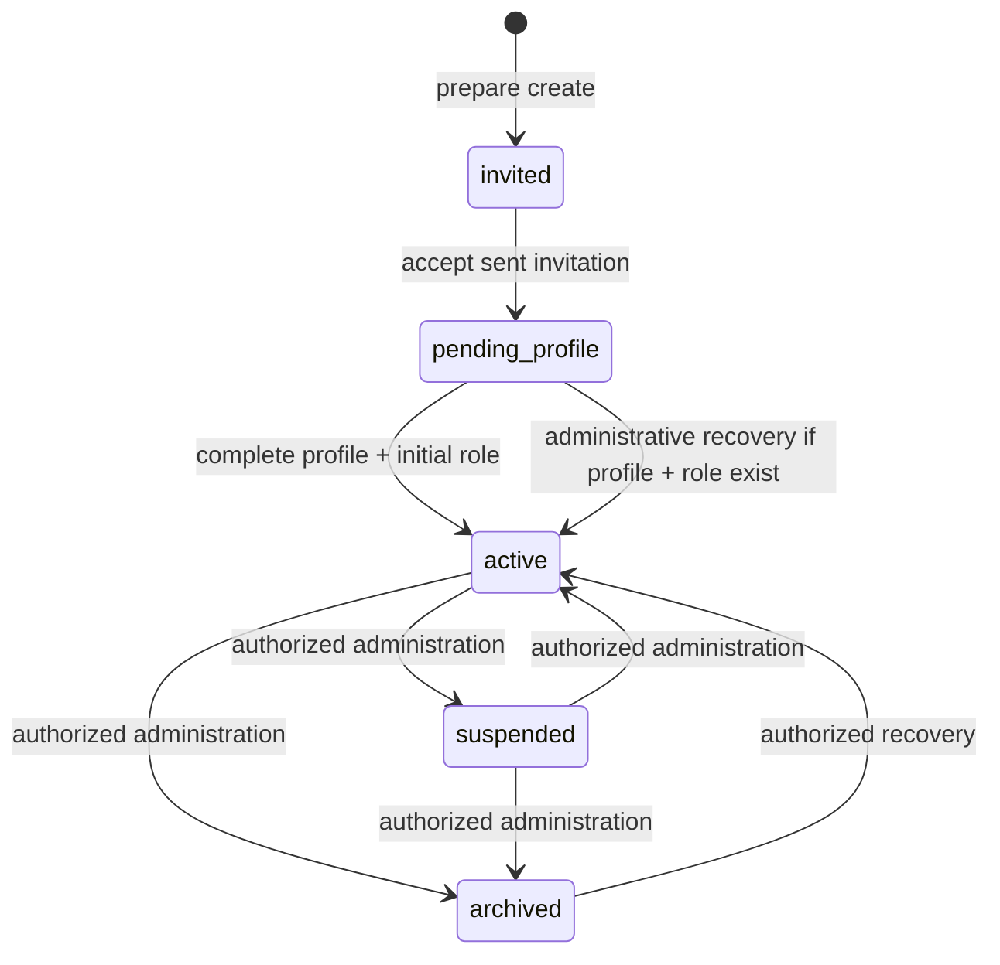

# ExecPlan 0008: Invitation Flow Hardening V1

- Estado: FASE A implementada; gates locales completados;
  paridad CI bloqueada por runtime Node no disponible
- Inicio del diagnóstico: 2026-09-03
- Responsable: agente principal de Codex, con revisión humana obligatoria
- Rama autorizada: `fix/invitation-flow-hardening`
- Commit base: `34c25dde52f1439639236ea2d192a53fd79739d3`
- Prioridad: anterior a Attendance, Tasks y cualquier funcionalidad nueva

## Objetivo

Endurecer el flujo real de invitaciones para que una invitación administrativa pueda recorrerse de extremo a extremo en Supabase local —creación, entrega en Mailpit, consumo del link Auth, onboarding, activación y login posterior— sin manipulación manual de la base entre esos pasos, y para que los fallos, reintentos y carreras relevantes tengan regresiones reproducibles.

El diagnóstico inicial quedó preservado como evidencia histórica. La FASE A añade
el hardening de backend/Auth/PostgreSQL/Edge Function y las regresiones focales;
callback/E2E canónico y rediseño frontend permanecen fuera de este incremento.

## FASE A — contrato implementado

El spike local se repitió con Supabase CLI `2.109.1` y GoTrue `v2.192.0`, sin
persistir ni imprimir tokens. Con Invitation A ya enviada, la API Admin soportada
volvió a invitar la misma identidad no confirmada,
actualizó `app_metadata.account_invitation_id` a B y emitió B. Al abrir A después
de esa rotación, Auth respondió `303` con `otp_expired` y no emitió sesión. B
respondió `303` con sesión y `accept_current_account_invitation_v2` aceptó
exactamente B. A y B conservaron el mismo `auth_user_id`.

La implementación adopta por tanto el CASO 1:

- `inviteUserByEmail` rota el artefacto Auth previo de una identidad no confirmada;
- `app_metadata`, escribible solo por Auth Admin, vincula el JWT a una generación;
- PostgreSQL exige ese claim tanto al aceptar como al completar onboarding;
- `user_metadata` no concede autoridad y solo conserva locale/display name no
  autoritativos;
- la Edge Function persiste un ACK técnico de Auth antes del finalize y un retry
  con ACK no vuelve a enviar correo;
- respuestas públicas distinguen `completed`, `replayed`, `in_progress` y
  `failed`; `execute` es exclusivamente una disposición interna RPC→Edge;
- revoke usa idempotency key/fingerprint y el mismo replay no repite audit.

No se eliminan identidades automáticamente. Si un link revocado o expirado se
consume antes de que Auth lo invalide, puede confirmar la identidad, pero el claim
solo referencia la invitación terminal y PostgreSQL rechaza aceptación y profile
completion. El resultado queda recuperable como Account `invited`, Invitation
terminal y vínculo Auth técnico; la reconciliación administrativa de esa identidad
confirmada sigue siendo una tarea explícita de FASE B, no una compensación
destructiva automática.

`preferred_locale=es` continúa llegando a metadata no autoritativa, pero el
template único local de Supabase no selecciona contenido dinámico versionado en el
mecanismo actual. Se difiere el email localizado a FASE B para no duplicar HTML ni
acoplar seguridad a metadata de plantilla.

**LOCAL NODE PARITY WITH CI: NOT CONFIRMED** (`v22.21.0` local frente a
`22.18.0` requerido). No se cambió runtime ni tooling.

## Estado inicial y Git

El precheck de implementación de FASE A observó el árbol limpio, la rama
obligatoria y el commit de planificación esperado. No se hizo push, merge,
rebase, amend, deploy, `supabase link`, `db push` ni ninguna operación Supabase
remota.

| Referencia en precheck FASE A      | Valor observado                            |
| ---------------------------------- | ------------------------------------------ |
| Rama de trabajo                    | `fix/invitation-flow-hardening`            |
| `HEAD` inicial de implementación   | `181929ddd3bab469722431aa113ab4fd1890a06f` |
| `main`                             | `34c25dde52f1439639236ea2d192a53fd79739d3` |
| `origin/main`                      | `34c25dde52f1439639236ea2d192a53fd79739d3` |
| `merge-base HEAD main/origin-main` | `34c25dde52f1439639236ea2d192a53fd79739d3` |
| Árbol inicial de implementación    | limpio                                     |

La tabla histórica siguiente corresponde al inicio del diagnóstico que produjo
el commit de planificación `181929d`, antes de comenzar esta implementación:

| Referencia                    | Valor observado                            |
| ----------------------------- | ------------------------------------------ |
| Rama de trabajo               | `fix/invitation-flow-hardening`            |
| `HEAD` inicial                | `34c25dde52f1439639236ea2d192a53fd79739d3` |
| `main`                        | `34c25dde52f1439639236ea2d192a53fd79739d3` |
| `origin/main`                 | `34c25dde52f1439639236ea2d192a53fd79739d3` |
| `merge-base HEAD origin/main` | `34c25dde52f1439639236ea2d192a53fd79739d3` |
| Árbol inicial                 | limpio                                     |

Se leyeron `AGENTS.md`, `apps/web/AGENTS.md`, `supabase/AGENTS.md`, `PLANS.md` y las instrucciones de revisión aplicables. Los `AGENTS.md` encontrados dentro de `node_modules` pertenecen a dependencias instaladas y no gobiernan archivos del repositorio.

## Baseline y entorno

| Comando                                              | Resultado observado                                                                                                                   |
| ---------------------------------------------------- | ------------------------------------------------------------------------------------------------------------------------------------- |
| `node --version`                                     | `v22.21.0`; **desviación** respecto de `22.18.0`, sin actualizar ni cambiar el runtime                                                |
| `pnpm --version`                                     | `11.9.0`                                                                                                                              |
| `corepack pnpm exec supabase --version`              | `2.109.1`                                                                                                                             |
| `pnpm install --frozen-lockfile`                     | aprobado; workspace ya actualizado; warning por Node distinto                                                                         |
| `pnpm verify`                                        | PASS local; formato, lint, boundaries, arquitectura, tipos, 13/13 pruebas del orquestador, 226/226 unitarias, 4/4 integración y build |
| `pnpm db:reset`                                      | aprobado para la reproducción inicial y nuevamente antes de pgTAP                                                                     |
| `pnpm exec supabase db lint --local --level warning` | aprobado; cero errores de esquema                                                                                                     |
| `pnpm db:test` tras reset limpio                     | aprobado; 8 archivos, 553 pruebas                                                                                                     |
| `pnpm test:functions`                                | aprobado; 21/21                                                                                                                       |
| `pnpm test:e2e`                                      | PASS local; 19/19, Chromium local                                                                                                     |
| Paridad CI Node `22.18.0`                            | **NOT EXECUTED**; el host solo expone `22.21.0` y esta fase prohíbe actualizar Node                                                   |
| `CI=true pnpm test:e2e`                              | **NOT EXECUTED** en esta fase                                                                                                         |
| `pnpm projects:test:concurrency`                     | **NOT EXECUTED** en esta fase; el baseline no se presenta como gate de concurrencia                                                   |

Una ejecución de `db:test` inmediatamente después de E2E falló por conteos contaminados por los fixtures creados durante E2E, condición ya documentada en el plan 0002. Tras un `db:reset`, pgTAP aprobó. Durante resets posteriores, Storage y luego Analytics/Vector quedaron temporalmente `unhealthy`; se reinició el stack local y se levantó el subconjunto necesario (`db`, Auth, PostgREST/Kong, Mailpit y pgMeta), excluyendo servicios ajenos a Identity/Invitations. No se cambió configuración ni versión.

Los comandos exactos del entorno de reproducción fueron `pnpm db:start`,
`pnpm db:reset`, `pnpm functions:serve` y `pnpm dev`. Para aislar el incidente de
salud se usó una vez la CLI local fijada por el lockfile:
`pnpm exec supabase start --exclude edge-runtime,logflare,vector,imgproxy,storage-api,realtime,studio`.
El teardown es `Ctrl+C` para Function/Vite y `pnpm db:stop`. Este comando de
diagnóstico no sustituye los scripts raíz como procedimiento canónico.

## Alcance de la corrección futura

1. Flujo de creación, resend, replace y revoke que ya existe en producto.
2. Consistencia entre PostgreSQL, Supabase Auth, correo y sesión frontend.
3. Callback, aceptación, onboarding, activación, logout y login posterior.
4. Idempotencia, leases, reintentos ambiguos y carreras del agregado cuenta/invitación.
5. Expiración, one-time semantics, links inválidos, sesiones preexistentes y errores seguros.
6. Pruebas unitarias, de Function, pgTAP, concurrencia real y E2E local con Mailpit.

## Fuera de alcance

- Attendance, Tasks o módulos nuevos.
- Cambios de producto no relacionados con las operaciones existentes.
- Supabase remoto, despliegue o configuración productiva.
- Actualización de Node, pnpm, Supabase CLI o dependencias.
- Captura o persistencia de tokens, cuerpos completos de correo, claves o secretos.
- Implementación de fixes durante esta primera fase.

## Arquitectura real reconstruida

| Capa/paso                | Implementación real                                                                                                                                                                                                                                                    |
| ------------------------ | ---------------------------------------------------------------------------------------------------------------------------------------------------------------------------------------------------------------------------------------------------------------------- |
| Navegación y composición | `apps/web/src/app/router/create-app-router.tsx`, `apps/web/src/app/composition/application-services.ts`                                                                                                                                                                |
| UI administrativa        | `apps/web/src/modules/identity/presentation/invitations-page.tsx`, `invitation-detail-page.tsx`                                                                                                                                                                        |
| Aplicación/dominio       | `apps/web/src/modules/identity/application/invitation-administration-service.ts`, `apps/web/src/modules/identity/application/onboarding-service.ts`, `apps/web/src/modules/identity/domain/invitation.ts`, `apps/web/src/modules/identity/domain/account-lifecycle.ts` |
| Adaptadores Supabase     | `apps/web/src/modules/identity/infrastructure/supabase-invitation-administration-gateway.ts`, `supabase-onboarding-gateway.ts`, `supabase-auth-gateway.ts`, `supabase-account-context-gateway.ts` dentro de la misma carpeta                                           |
| Edge Function            | `supabase/functions/manage-account-invitation/handler.ts` e `index.ts`                                                                                                                                                                                                 |
| RPC de invitación        | `prepare_account_invitation`, `prepare_account_invitation_action`, `finalize_account_invitation_delivery`, `expire_open_invitations`, `list_account_invitations`, `get_account_invitation_detail`                                                                      |
| RPC de onboarding        | `get_my_account_context`, `accept_current_account_invitation`, `complete_current_account_profile`                                                                                                                                                                      |
| Tablas                   | `accounts`, `invitations`, `invitation_operation_requests`, `account_status_history`, `audit_logs`, `profiles`, `user_roles`, `roles`, `role_permissions`, `role_grant_policies`; identidad en `auth.users`                                                            |
| Configuración            | `supabase/config.toml`, `.env.local` ignorado, `supabase/functions/.env.local` ignorado y su `.env.example`                                                                                                                                                            |
| Correo                   | Mailpit `127.0.0.1:54324`; template `invite` predeterminado de Supabase Auth, no existe template versionado                                                                                                                                                            |
| Callback/onboarding      | `apps/web/src/modules/identity/presentation/auth-callback-page.tsx`, `invitation-acceptance-page.tsx`, `complete-profile-page.tsx` dentro de la misma carpeta                                                                                                          |
| E2E                      | `apps/web/tests/e2e/account-lifecycle.spec.ts`, orquestado por `scripts/e2e-service-orchestrator.mjs`                                                                                                                                                                  |

Las dependencias respetan el monolito modular: presentación llama servicios de aplicación; aplicación depende de contratos/dominio; infraestructura contiene Supabase; composición crea adaptadores. `service_role` permanece en la Edge Function y en el runner Node local de E2E, nunca en Vite ni en el navegador.

## Happy path real observado

```mermaid
sequenceDiagram
  actor Admin as Administrator
  participant UI as React / invitations
  participant App as Application service
  participant Edge as manage-account-invitation
  participant DB as PostgreSQL RPC
  participant Auth as Supabase Auth
  participant Mail as Mailpit
  actor Recipient as Destinatario
  participant Callback as /auth/callback
  participant Onboarding as /invite/accept + complete-profile

  Admin->>UI: Login y crea invitación
  UI->>App: createInvitation + idempotencyKey
  App->>Edge: POST operation=create
  Edge->>Edge: Origin, JWT, account active y permission
  Edge->>DB: prepare_account_invitation
  DB->>DB: Reautorizar actor y aplicar role grant policy
  DB-->>Edge: account invited + invitation pending + lease
  Edge->>Auth: inviteUserByEmail(redirectTo)
  Auth->>Mail: correo de invitación
  Auth-->>Edge: auth_user_id
  Edge->>DB: finalize_account_invitation_delivery
  DB-->>Edge: invitation sent + account↔Auth enlazada
  Edge-->>UI: 200 / sent
  Recipient->>Mail: abre link real
  Mail->>Auth: /auth/v1/verify?token=[REDACTED]
  Auth->>Callback: 303 + sesión en fragmento
  Callback->>Onboarding: /invite/accept
  Recipient->>DB: accept_current_account_invitation
  DB-->>Onboarding: invitation accepted; account pending_profile
  Recipient->>Auth: updateUser(password)
  Recipient->>DB: complete_current_account_profile
  DB-->>Onboarding: profile + role + account active
  Recipient->>Onboarding: logout
  Recipient->>Onboarding: login con contraseña elegida
  Onboarding-->>Recipient: /app/profile con la misma account
```

### Evidencia del recorrido

- Login administrativo y creación desde UI: `POST manage-account-invitation` respondió `200`; la UI mostró “Invitación creada”.
- PostgreSQL tras entrega: `invitations.status=sent`, `accounts.status=invited`, ambos enlazados al mismo `auth.users`; auditoría `invitation.created` y `invitation.sent`.
- Mailpit: exactamente un mensaje para el destinatario del escenario, asunto predeterminado “You've been invited”.
- Link inspeccionado sin persistir el token: origen `http://127.0.0.1:54321`, path `/auth/v1/verify`, parámetros `token`, `type`, `redirect_to`, y `redirect_to=http://localhost:5173/auth/callback`.
- El link real emitió sesión y llegó a `/invite/accept`; aceptar llevó a `/app/complete-profile`.
- PostgreSQL tras aceptar: invitación `accepted`, cuenta `pending_profile`, Auth confirmado, sin rol todavía; historia `invited→pending_profile`.
- Refresh y nueva pestaña conservaron correctamente `/app/complete-profile`.
- La reproducción manual continuó desde UI: se definió la contraseña local de
  fixture, se completó el perfil y la ruta terminó en `/app/profile`.
- La consulta de invariantes posterior devolvió `invitation=accepted`,
  `account=active`, vínculo bilateral Auth consistente, identidad confirmada,
  perfil completo y exactamente un rol inicial.
- Se cerró sesión mediante la UI, se volvió a iniciar sesión con el destinatario y
  la contraseña elegida, y `/app/profile` volvió a mostrar el mismo perfil. No hubo
  SQL manual entre crear la invitación y este relogin.
- La consola del destinatario no mostró errores: solo conexión Vite e información
  de React development. El log Edge sanitizado del create fue
  `event=invitation.delivery_completed`, `invitationId=[UUID_REDACTED]`,
  `operation=create`; no registró email, token, JWT ni payload.
- El E2E oficial sí completa perfil, pero todavía no automatiza logout/login ni
  afirma las invariantes anteriores.

## Configuración de email y redirect

La convención local vigente es coherente en el happy path:

- navegador, `site_url`, `redirectTo`, redirect permitido, `APP_ORIGIN` y `ALLOWED_ORIGINS`: `http://localhost:5173`;
- Supabase API/Auth y Mailpit: `http://127.0.0.1` en sus puertos locales;
- redirect permitido exacto: `http://localhost:5173/auth/callback`;
- la Edge Function no permite `*` y acepta solo `POST`/`OPTIONS` con JSON y Bearer token.

Defectos/gaps:

1. `preferredLocale` y `displayName` llegan a la reserva DB, pero `inviteAuthUser` solo escribe `account_invitation_id` en metadata. No existe template versionado y el correo observado fue el template Auth predeterminado en inglés aunque se solicitó `es`.
2. `AuthCallbackPage` no interpreta `error`, `error_code` ni `error_description` del fragmento Auth. Un link usado/manipulado llegó con `error_code=otp_expired`, pero el callback solo decide según la sesión que ya exista.
3. `serve-local-function.mjs` comprueba que `APP_ORIGIN` y `ALLOWED_ORIGINS` no estén vacíos, pero no comprueba URL canónica ni que `APP_ORIGIN` pertenezca a la allowlist.
4. El handler omite `Access-Control-Allow-Origin` al rechazar un origen. Eso es seguro, pero impide que JavaScript lea `origin_denied`; la prueba UI actual inyecta esa cabecera artificialmente y no reproduce el fallo CORS real.

## State machine existente

### Account



Solo `active` obtiene permisos efectivos. `invited` y `pending_profile` fuerzan onboarding; `suspended` y `archived` bloquean acceso operativo. Una fila `profiles` vacía se crea automáticamente al insertar `auth.users`; su existencia no significa que el onboarding esté completo.

### Invitation

```mermaid
stateDiagram-v2
  [*] --> pending: prepare create/replace
  pending --> sent: delivery finalized
  pending --> delivery_failed: provider failure
  pending --> revoked: revoke
  pending --> expired: TTL materialized
  pending --> superseded: replace
  sent --> sent: resend succeeds
  sent --> sent: resend fails; delivery_error_code retained
  sent --> accepted: invited identity accepts
  sent --> revoked: revoke
  sent --> expired: TTL materialized
  sent --> superseded: replace
  delivery_failed --> sent: retry/resend succeeds
  delivery_failed --> delivery_failed: provider failure
  delivery_failed --> revoked: revoke
  delivery_failed --> expired: TTL materialized
  delivery_failed --> superseded: replace
  accepted --> [*]
  revoked --> [*]
  expired --> [*]
  superseded --> [*]
```



`accepted`, `revoked`, `expired` y `superseded` son terminales. `replace` pretende crear una sucesora en la misma cuenta, pero hoy esa transición funcional está rota al cruzar Auth.

Una fila terminal no se reabre: `replace` desde `revoked` o `expired` conserva la
fuente terminal y crea una sucesora nueva `pending`. Esa relación histórica no se
representa como transición de la misma fila en Mermaid.

## Matriz de reproducción A–J

| Caso                           | Resultado real                                                                                                                          | Cobertura actual                                                     |
| ------------------------------ | --------------------------------------------------------------------------------------------------------------------------------------- | -------------------------------------------------------------------- |
| A. Email nuevo válido          | create UI `200`, 1 correo, link real, aceptación, onboarding, `active`, logout y login final manual                                     | Manual completo; E2E versionado aún parcial                          |
| B. Doble submit/mismo email    | replay con la misma key: `200 sent`, sin segundo correo; key distinta tras éxito: `409 email_already_registered`; UI deshabilita submit | No hay carrera real versionada create↔create                         |
| C. Resend/retry                | resend real `200 sent`, segundo correo; replay de la misma key no envía tercero. `replace` real falla, ver RC-01                        | Handler/pgTAP parcial; no E2E Mailpit para resend/replace            |
| D. Ya aceptada                 | Auth trata el link consumido como `otp_expired`; pgTAP prueba segundo accept como `invitation_used`                                     | Sin browser/E2E y callback no muestra causa                          |
| E. Expirada                    | Al materializar expiry DB antes de consumir un link aún válido, Auth emitió sesión y RPC respondió HTTP `400`, `invitation_expired`     | pgTAP cubre DB; no cubre divergencia Auth/DB                         |
| F. Revocada                    | Revoke existe. Link previamente emitido siguió válido en Auth, emitió sesión y RPC respondió HTTP `400`, `invitation_revoked`           | UI prueba confirmación; no invalida ni prueba link real              |
| G. Link inválido/manipulado    | Auth respondió `303` al callback con `otp_expired`; no emitió token nuevo                                                               | No existe pantalla/error E2E; callback ignora el error               |
| H. Identidad/account existente | actor autorizado recibe `409 email_already_registered`; la comprobación ocurre antes de insertar recursos                               | pgTAP parcial; no E2E UI                                             |
| I. Link desde otra sesión      | un link válido reemplazó la sesión Auth compartida del administrator por la invitada; la pestaña administrativa perdió su autoridad     | E2E lo evita usando `browser.newContext`; no hay UX segura explícita |
| J. Refresh/cambio de pestaña   | `pending_profile` sobrevivió reload y nueva pestaña                                                                                     | Solo evidencia manual; el reload E2E ocurre después de activar       |

## Ledger reproducible de la investigación

### Setup, observación y sanitización

El rerun local parte de un árbol limpio y usa, en terminales separadas:

```text
corepack pnpm db:start
corepack pnpm db:reset
corepack pnpm functions:serve
corepack pnpm dev
```

Se abre `http://localhost:5173`, se inicia sesión con la cuenta administrator y la
contraseña pública de fixture documentada en el runbook, y se usa un email nuevo
`*.invalid` por escenario. Mailpit se observa en `http://127.0.0.1:54324`. Las
consultas de estado proyectan solamente status, presencia/coincidencia de IDs,
confirmación booleana, completitud de profile, conteo de roles y eventos audit;
nunca token, JWT, password ni cuerpo de correo. Para repetir un escenario aislado
se ejecuta de nuevo `corepack pnpm db:reset` antes de iniciar sus pasos.

Los requests HTTP focales se enviaron al endpoint local
`/functions/v1/manage-account-invitation` con `Origin=http://localhost:5173`, JSON,
JWT efímero del actor local y una UUID nueva o repetida según el caso. El JWT y los
links vivieron solo en el proceso/navegador. El link se inspeccionó por origin,
path y nombres de query; el valor `token` se redactó. Para E se materializó
controladamente el TTL de la fila recién creada y se llamó
`expire_open_invitations`; fue una preparación del negativo, no parte del happy
path. Para G se alteró un carácter del token únicamente en memoria.

### Evidencia A–J

| Caso | Entrada y pasos repetibles                                                                                                   | HTTP/error y estado antes→después                                                                                                        | Mailpit, navegador, consola y Edge sanitizados                                                                                                                                                               |
| ---- | ---------------------------------------------------------------------------------------------------------------------------- | ---------------------------------------------------------------------------------------------------------------------------------------- | ------------------------------------------------------------------------------------------------------------------------------------------------------------------------------------------------------------ |
| A    | UI admin: crear email nuevo → abrir único mail → link real → accept → password/profile → logout → login destinatario         | create `200`; `invited/pending→invited/sent→pending_profile/accepted→active/accepted`; Auth enlazado/confirmado, profile completo, 1 rol | 0→1 mail; redirect Auth `303` a callback y luego `/invite/accept`, `/app/complete-profile`, `/app/profile`, `/login`, `/app/profile`; consola sin error; Edge `delivery_completed/create` con UUID redactada |
| B    | Repetir POST create primero con la misma key/payload y después con key nueva/mismo email                                     | misma key `200 sent`, sin transición adicional; key nueva `409 email_already_registered`; una account/identity/invitation                | mail permanece 1; replay final no genera nuevo evento de entrega; UI normal deshabilita doble click                                                                                                          |
| C    | Desde UI/detail reenviar; repetir el mismo POST/key; ejecutar replace existente sobre otro email nuevo                       | resend `200 sent`; replay `200 sent`; replace `500 database_error`, `sent→superseded` en fuente y sucesora `pending` sin Auth            | 1→2 mails en resend y permanece 2 al replay; replace también envía segundo mail antes del 500; Edge completa resend, finalize replace falla                                                                  |
| D    | Consumir otra vez el link ya aceptado de A y contrastar con segunda llamada de accept                                        | Auth `303` con `otp_expired`; DB conserva `accepted/active`; accept repetido devuelve `invitation_used`                                  | ningún mail; callback sin mensaje específico; no hay evento Edge porque accept es RPC frontend                                                                                                               |
| E    | Crear/link sin consumir → mover solo `expires_at` de esa fixture al pasado → `expire_open_invitations` → abrir link → accept | DB `sent→expired`; Auth aún emite sesión; accept HTTP `400 invitation_expired`; account sigue `invited`                                  | 1 mail; Auth `303` al callback; callback dirige onboarding pese al terminal; sin log Edge estructurado del rechazo                                                                                           |
| F    | Crear desde UI → revocar desde UI con motivo → abrir el link previamente recibido → accept                                   | revoke `200`, `sent→revoked`; Auth aún emite sesión; accept HTTP `400 invitation_revoked`; account sigue `invited`                       | 1 mail; Edge `command_completed/revoke`; callback dirige onboarding; rechazo RPC no produce evento Edge                                                                                                      |
| G    | Abrir link con token alterado en memoria                                                                                     | Auth `303` con `error_code=otp_expired`; DB/Auth de la fixture no cambian                                                                | ningún mail adicional; callback ignora fragmento; consola sin excepción útil                                                                                                                                 |
| H    | Como administrator, create con email de una identidad/account fixture existente                                              | `409 email_already_registered`; cero account/invitation/identity nuevas                                                                  | 0 mails; misma UI genérica; error no queda correlacionado en log estructurado                                                                                                                                |
| I    | Mantener administrator autenticado en una pestaña y abrir link válido en otra pestaña del mismo perfil                       | Auth sustituye la sesión compartida por la invitada; DB queda `sent/invited` hasta accept                                                | 1 mail; ambas pestañas resuelven `/invite/accept`; la pestaña admin pierde autoridad; E2E actual no lo ve por usar contexto aislado                                                                          |
| J    | Tras accept y antes de profile, reload y abrir otra pestaña; completar luego desde una sola                                  | DB permanece `accepted/pending_profile` durante reload/pestaña y termina `accepted/active` una vez                                       | sin mail adicional; ambas resuelven `/app/complete-profile`; evidencia manual, no cobertura E2E actual                                                                                                       |

### Probes de seguridad

Con el mismo endpoint local, un request sin JWT devolvió `401 unauthenticated`; un
origin `http://127.0.0.1:5173` devolvió `403 origin_denied`; volunteer activo sin
permiso devolvió `403 permission_denied` tanto para target nuevo como existente;
una identidad autenticada sin account devolvió `403 account_blocked` para ambos;
coordinator intentando conceder administrator devolvió `403 role_grant_denied`.
Ninguno creó fila ni correo. Los errores rechazados solo dejaron la línea genérica
“serving the request” en Edge; esa falta de correlación alimenta RC-09.

## Defectos reproducidos y root causes

No se encontró una escalada CRITICAL. Los hallazgos se ordenan por impacto.

### RC-01 — HIGH — `replace` envía correo pero deja la sucesora inutilizable

- **Capa:** Edge Function + Supabase Auth + PostgreSQL.
- **Evidencia/reproducción:** create respondió `200 sent`; replace envió un segundo correo pero respondió `500 database_error`. DB quedó con predecesora `superseded` enlazada a Auth y sucesora `pending` sin enlace. Una repetición transaccional de finalize devolvió `auth_user_reconciliation_mismatch`. La metadata Auth seguía apuntando a la predecesora, no a la sucesora.
- **Causa raíz:** `prepare_account_invitation_action` hace terminal a la fuente y crea una nueva `invitation_id` antes de la llamada externa. `inviteUserByEmail` reenvía al usuario no confirmado, pero no cambia `account_invitation_id`; `finalize_account_invitation_delivery` exige metadata igual a la sucesora y falla. La reconciliación busca solo la nueva ID, por lo que tampoco puede recuperar el usuario existente.
- **Impacto:** se entrega un correo que nunca puede activar la sucesora; la fuente ya fue cerrada; cuenta/identidad quedan atascadas y el administrador ve error genérico.
- **Corrección mínima propuesta:** antes de implementar, hacer un spike local del contrato Auth Admin. Convertir replace en una saga explícita que encuentre exactamente la identidad no confirmada de la fuente y solo marque éxito cuando DB, Auth y el artefacto de link concuerden. Actualizar metadata del usuario no demuestra vínculo link→Invitation: la RPC acepta la invitación más reciente por `auth_user_id`. El spike debe comprobar si Supabase rota/invalida el token anterior; no se diseñará un nonce propio ni una compensación destructiva sin esa evidencia.
- **Regresión requerida:** create y capturar link A→replace y capturar link B→link A no autentica ni acepta la sucesora→solo link B acepta/activa/relogin. Añadir pgTAP/Function para ACK perdido y retry en cada frontera.

### RC-02 — HIGH — revoke/expiry DB no invalidan el artefacto Auth

- **Capa:** contrato entre DB, Auth y callback.
- **Evidencia/reproducción:** links reales de invitaciones `revoked` y `expired` todavía devolvieron sesión Auth; luego `accept_current_account_invitation` rechazó con `invitation_revoked`/`invitation_expired`.
- **Causa raíz:** revoke/expiry solo cambian PostgreSQL. El token pertenece a Supabase Auth y no existe compensación/invalidation. Consumirlo confirma una identidad aunque la cuenta siga `invited`; después, replace niega identidades confirmadas.
- **Impacto:** identidad Auth confirmada y cuenta de aplicación no activable; el destinatario queda atrapado en onboarding y la recuperación administrativa normal deja de funcionar.
- **Corrección mínima propuesta:** definir y versionar una saga terminal Auth/DB. Revoke debe invalidar o retirar de forma idempotente la identidad no aceptada, o el sistema debe ofrecer una recuperación segura soportada para esa identidad. Expiry debe usar la misma convención temporal y reconciliar al observar la cuenta. El callback debe cerrar la sesión emitida para una invitación terminal.
- **Regresión requerida:** link revocado/expirado no deja sesión utilizable, no activa cuenta y permite la recuperación definida; test con Mailpit y estado Auth/DB.

### RC-03 — MEDIUM — callback no valida el resultado Auth ni la intención de sesión

- **Capa:** frontend callback/IdentityProvider.
- **Evidencia/reproducción:** link manipulado/usado llegó al callback con `otp_expired`, pero `AuthCallbackPage` ignora el fragmento. Con una sesión previa válida decide usando esa sesión; con un link válido, Supabase reemplaza globalmente la sesión administrativa del mismo perfil.
- **Causa raíz:** el callback equivale “hay cualquier `identity.user`” a “la invitación de este link fue verificada”. No conserva resultado/intención ni ofrece aislamiento/confirmación ante otro actor.
- **Impacto:** mensajes engañosos, pérdida inesperada de sesión administrativa y navegación dependiente de estado previo. DB evita aceptar para otro `auth_user_id`, por lo que no se reprodujo escalada de privilegios.
- **Corrección mínima propuesta:** parsear de forma segura el resultado Auth, mostrar errores allowlist, validar que el contexto resultante sea `invited` para este onboarding y definir UX de cambio de actor (aviso/aislamiento/signout) antes de consumir el link.
- **Regresión requerida:** invalid/used/revoked/other-session en navegador, comprobando sesión y ruta final.

### RC-04 — MEDIUM — `shouldDeliver=false` se presenta como éxito terminal

- **Capa:** contrato RPC→Edge→UI e idempotencia.
- **Evidencia:** todo replay con lease vigente devuelve `should_deliver=false`; el handler responde `200` incluso si la reserva sigue `pending`. La UI interpreta cualquier Result exitoso como “Invitación creada” y elimina la key.
- **Causa raíz:** no existe un resultado explícito `in_progress/reconciliation_required`; “este request no posee el lease” se confunde con “operación completada”.
- **Impacto:** un segundo request concurrente o retry tras ACK/finalize ambiguo puede mostrar éxito sin entrega/finalización y perder la key necesaria para reconciliar.
- **Corrección mínima propuesta:** contrato tipado que distinga finalizado, replay finalizado e in-progress; conservar la key y sondear/reintentar con límites solo cuando sea seguro.
- **Regresión requerida:** create/retry simultáneo y finalize perdido con dos conexiones/procesos, verificando una identidad, una cuenta, una invitación abierta y una entrega.

### RC-05 — MEDIUM — suite E2E no demuestra el criterio de negocio completo

- **Capa:** QA/E2E.
- **Evidencia:** `account-lifecycle.spec.ts` prueba create→Mailpit→link→accept→activate, pero luego concede rol administrativo y termina archivando la cuenta. Nunca hace logout/login del nuevo usuario, no exige exactamente un correo y no prueba resend/replace/revoke/expired/invalid/other-session.
- **Causa raíz:** un único escenario grande mezcla onboarding con lifecycle administrativo y considera `/app/profile` suficiente.
- **Impacto:** reemplazo y divergencias terminales pasan con 19/19 E2E verdes.
- **Corrección mínima propuesta:** escenario canónico independiente y corto para el acceptance test, y escenarios negativos focalizados.
- **Regresión requerida:** la cadena exacta indicada en criterios de aceptación, sin SQL manual entre pasos.

### RC-06 — MEDIUM — revoke no tiene idempotencia de comando

- **Capa:** UI/Edge/RPC.
- **Evidencia:** create/resend/replace llevan key; revoke no. Un retry tras respuesta ambigua vuelve a ejecutar contra estado terminal y produce conflicto.
- **Causa raíz:** `invitation_operation_requests` solo admite `resend` y `replace`; revoke se modeló como transición inmediata sin request record.
- **Impacto:** el actor no puede distinguir “revocación aplicada con ACK perdido” de “no aplicada”.
- **Corrección mínima propuesta:** probar primero si una transición naturalmente idempotente puede devolver el terminal existente tras ACK perdido. Añadir key/fingerprint/request record solo si esa semántica no distingue de forma segura payload distinto y concurrencia, sin reabrir terminales.
- **Regresión requerida:** dos revokes iguales/concurrentes retornan el mismo resultado seguro; si se adopta key, cambio de motivo con la misma key da conflicto.

### RC-07 — MEDIUM — locale declarada no controla el correo ni el onboarding inicial

- **Capa:** Edge/Auth/email/frontend.
- **Evidencia:** invitación `preferred_locale=es` produjo asunto/cuerpo Auth predeterminado en inglés. Edge recibe `locale` y `displayName` pero no los incluye en metadata usada por Auth; no hay template `invite` versionado.
- **Causa raíz:** el contrato guarda preferencia solo en DB; no existe adaptación de template ni carga de esa preferencia/display name en onboarding.
- **Impacto:** experiencia inconsistente y contenido de correo dependiente de versión de Auth, no del repositorio.
- **Corrección mínima propuesta:** decidir explícitamente si V1 localiza el correo. Si sí, versionar template seguro y metadata no sensible mínima; si no, retirar la promesa de locale del envío y documentar que aplica al perfil.
- **Regresión requerida:** contenido/subject/link por locale sin snapshots de token.

### RC-08 — LOW — CORS y errores de configuración no están probados como navegador real

- **Capa:** Function bootstrap/UI tests.
- **Evidencia:** el origen rechazado devuelve `403 origin_denied` sin ACAO; el test de UI intercepta y agrega ACAO. `APP_ORIGIN`/`ALLOWED_ORIGINS` solo se validan por presencia.
- **Causa raíz:** prueba simulada distinta del navegador y validación semántica incompleta.
- **Impacto:** diagnóstico de origen puede mostrarse como network error; una configuración local incoherente pasa bootstrap.
- **Corrección mínima propuesta:** test de navegador desde origen alterno y validación canónica/relación entre ambas variables.
- **Regresión requerida:** allowlist exacta localhost vs 127.0.0.1, preflight y redirect permitido.

### RC-09 — LOW — rate limit y observabilidad quedan delegados/incompletos

- **Capa:** Auth/Edge/operación.
- **Evidencia:** existe `auth.rate_limit.email_sent=2` local; no hay cuota propia por actor/target. Los logs seguros contienen evento, invitationId y operación, pero errores HTTP tipados no siempre generan evento y `correlationId` reservado no se registra en consola.
- **Causa raíz:** se delegó abuso al proveedor y no se cerró el runbook de reconciliación previsto por ADR 0012.
- **Impacto:** un actor autorizado puede generar muchas reservas fallidas y un operador no puede correlacionar bien replace/finalize.
- **Corrección mínima propuesta:** completar primero el threat model y decidir si el límite del proveedor satisface el riesgo; un rate limit propio queda como follow-up salvo requisito de producto o abuso reproducido. El logging seguro/correlacionable sí debe cerrarse sin email, token o payload personal.
- **Regresión requerida:** assertions de log sanitizado; un límite determinista de aplicación solo si la decisión de threat model lo exige.

## Seguridad

### Controles que funcionaron

- Anónimo: `401 unauthenticated`.
- Origin distinto (`127.0.0.1:5173` frente a `localhost:5173`): `403 origin_denied`.
- Identidad activa sin permiso, tanto para email nuevo como existente: `403 permission_denied`; no se observó oracle por email.
- Identidad Auth sin account: `403 account_blocked` para email nuevo y existente.
- Coordinator intentando `administrator`: `403 role_grant_denied`; E2E confirma que no se envía correo.
- Edge verifica JWT, account activa y permiso. La RPC deriva otra vez el actor,
  reautoriza y aplica `can_user_grant_role`; la role-grant policy no vive en Edge.
- Tablas administrativas tienen RLS, sin grants directos `anon`/`authenticated`; funciones `security definer` fijan `search_path=''` y ejecución mínima.
- Tokens pertenecen a Auth y no se escriben en DB/audit/logs. La investigación no los persiste.
- Auditoría usa IDs técnicos, estados y metadata allowlist; no contiene email ni token.
- Índices parciales impiden dos invitaciones abiertas por account o email y dos aceptadas por account.

Los permisos de resend/replace/revoke son globales en el contrato actual: las RPC de
acción no aplican el filtro `origin_invited_by` del listado. Hoy el seed solo los
concede al administrator, por lo que no se reprodujo acceso horizontal. Una prueba
de contrato debe fijar esta decisión o impedir que un grant futuro a un rol no-admin
abra acciones sobre invitaciones ajenas.

### Riesgos residuales

- RC-02 crea identidades confirmadas no activables tras links terminales.
- RC-03 no distingue sesión previa de sesión creada por el link.
- Un actor autorizado sí recibe códigos distintos `email_already_registered`/`email_already_invited` en el HTTP crudo; la UI actual los reduce a error genérico. Debe decidirse si esa diferencia es necesaria o constituye un oracle innecesario.
- No existe rate limit propio ni alertas; solo el límite Auth local/proveedor.
- El onboarding actual cambia la contraseña antes de activar DB. El retry es recuperable por upsert/idempotencia de complete, pero faltan pruebas de fallo entre ambos pasos y de cambio de actor entre pestañas.

## Idempotencia y concurrencia

| Carrera/retry        | Garantía actual                                                   | Gap que necesita regresión                                                                            |
| -------------------- | ----------------------------------------------------------------- | ----------------------------------------------------------------------------------------------------- |
| create ↔ mismo email | advisory lock por email + índices; no duplica cuenta abierta      | no existe harness concurrente real; código de conflicto puede variar según si Auth ya existe          |
| create ↔ misma key   | índice `(created_by,idempotency_key)` + fingerprint               | replay con lease vigente devuelve `200 pending` engañoso                                              |
| retry ↔ éxito previo | mismo resultado y sin segundo correo para create/resend observado | UI borra key ante todo `200`; falta ACK perdido real                                                  |
| resend ↔ resend      | operation request por actor/key + lease                           | carreras entre actores no tienen E2E real; límite Auth puede dominar                                  |
| replace ↔ retry      | request record + lease en DB                                      | funcionalmente roto por RC-01; retry no puede reconciliar metadata                                    |
| revoke ↔ revoke      | row lock y estado terminal                                        | segundo intento conflictivo; evaluar idempotencia natural antes de añadir persistencia                |
| accept ↔ accept      | `FOR UPDATE`; uno acepta y el otro recibe `invitation_used`       | pgTAP secuencial; falta dos conexiones reales                                                         |
| accept ↔ revoke      | ambos bloquean fila y revalidan estado                            | falta carrera real y estado Auth final                                                                |
| accept ↔ resend      | prepare libera la transacción antes de llamar Auth                | puede aceptarse mientras el correo externo está en vuelo; falta test de side effect y finalize tardío |
| accept ↔ replace     | locks DB ordenan prepare/accept                                   | replace roto; falta asegurar que no se envíe sucesora inválida                                        |

No se construirá un harness nuevo en esta fase. La implementación debe extender el patrón de scripts de concurrencia ya versionado, con conexiones PostgreSQL/HTTP reales y ownership/teardown explícitos.

## Gaps exactos del E2E actual

El E2E sí prueba UI admin, Edge Function real, Auth real, Mailpit, link real, contexto de navegador destinatario separado, RPC de aceptación, password, activación y llegada a perfil. No salta esos componentes en el happy path.

No prueba:

- exactamente un correo y ausencia de duplicado por retry;
- estados/invariantes DB/Auth en cada frontera;
- logout y login final de la cuenta recién activada;
- resend y replace reales;
- link accepted/expired/revoked/invalid;
- apertura con otra sesión y UX de actor switch;
- refresh/pestaña durante llamadas en vuelo;
- carreras create/accept/resend/revoke/replace;
- fallo después de Auth pero antes de finalize;
- resultado del callback cuando Auth trae error.

Las unitarias de UI, tests de handler y pgTAP cubren piezas aisladas, pero mocks y mutaciones SQL directas no prueban el contrato distribuido completo. El `200` de create no es evidencia suficiente.

## Comportamiento objetivo

1. Una operación solo comunica éxito final cuando DB, Auth y entrega alcanzaron un estado coherente; in-progress es explícito y reintentable con la misma key.
2. Create/resend/replace/revoke son idempotentes en sus semánticas soportadas y no producen recursos/correos duplicados.
3. Un link corresponde a una invitación vigente, a la identidad exacta y a una sola aceptación.
4. Revoke/expiry no dejan una sesión/identidad confirmada irrecuperable.
5. Callback distingue éxito, error y sesión de otro actor sin inferir por “hay usuario”.
6. Onboarding sobrevive refresh/pestaña, no mezcla actores y llega a account `active`, profile completo y rol inicial único.
7. Logout invalida la sesión visible y el login con la contraseña elegida vuelve a `/app/profile` con el account esperado.
8. Logs/audit permiten correlación sin PII, token, secreto ni cuerpo de correo.

## Oráculos objetivo A–J

| Caso | UI/HTTP y sesión esperados                                                                                                                  | Auth/DB/correo esperados                                                                                                       | Cobertura y exit criteria                                                                  |
| ---- | ------------------------------------------------------------------------------------------------------------------------------------------- | ------------------------------------------------------------------------------------------------------------------------------ | ------------------------------------------------------------------------------------------ |
| A    | Éxito explícito; callback válido; accept/onboarding; logout/login vuelve a perfil                                                           | 1 identidad, 1 account `active`, invitation `accepted`, profile y rol únicos; exactamente 1 mail                               | E2E canónico local sin SQL entre pasos                                                     |
| B    | Doble click bloqueado; mismo request devuelve replay final o `in_progress`, nunca falso éxito                                               | Máximo 1 identidad/account/invitación abierta y el número de mails definido                                                    | Function + carrera HTTP real + E2E count Mailpit                                           |
| C    | Resend informa final/replay/in-progress; replace solo informa éxito si link B es consumible                                                 | Resend replay no duplica mail; replace conserva historia y vínculo exacto                                                      | Spike Auth: link A queda inválido; link B acepta sucesora; si no se puede, NO-GO al diseño |
| D    | Link consumido muestra pantalla segura sin usar una sesión previa para inferir éxito                                                        | Invitation permanece `accepted`; ningún recurso/mail nuevo                                                                     | E2E browser + segundo accept concurrente                                                   |
| E    | Link expirado muestra error allowlist y no deja sesión operativa                                                                            | Invitation `expired`; ninguna identidad confirmada irrecuperable; 0 mails adicionales                                          | Spike de TTL Auth/DB debe elegir una convención verificable antes de código                |
| F    | Revoke es replay-safe; link revocado muestra pantalla segura y no deja sesión operativa                                                     | `revoked` una vez, audit único/definido; identidad eliminada/inutilizable o recuperación soportada                             | Spike no destructivo por defecto + E2E link real + carrera accept↔revoke                   |
| G    | Token alterado/usado nunca continúa por una sesión preexistente; error seguro no revela token                                               | Cero mutación DB/Auth y cero mail                                                                                              | E2E callback con sesión ausente y sesión previa                                            |
| H    | Actor autorizado recibe conflicto de producto estable; no autorizado recibe el mismo deny independientemente del target                     | Cero recursos/mails nuevos; sin oracle para actor no autorizado                                                                | Function/pgTAP/E2E UI                                                                      |
| I    | Si el link cambia actor, la app lo detecta y muestra una transición explícita; nunca acepta con el actor anterior ni conserva caché privada | Solo la identidad del link puede actuar sobre su Invitation; admin pierde autoridad inmediatamente si Auth ya sustituyó sesión | Spike multi-tab define UX; E2E mismo contexto + contextos aislados                         |
| J    | Reload/tab durante accept/profile conserva estado recuperable y deshabilita duplicados; cambio de actor cancela respuesta tardía            | Una aceptación, un profile/rol y estado `active`; sin mail adicional                                                           | E2E multi-tab y fallos entre accept, password y complete                                   |

El spike de Auth bloquea la implementación hasta demostrar: rotación/invalidation de
link A en replace; semántica de revoke/expiry; y comportamiento de actor switch. La
localización V1 se fija como contrato verificable: `preferred_locale=es|en` debe
seleccionar un template versionado equivalente y no alterar ni exponer el token.

## Deriva documental descubierta

- `docs/adr/0012-auth-account-consistency.md` promete reconciliación exacta y que
  una identidad confirmada nunca supersede antes de fallar; RC-01 contradice ambas
  garantías en `replace`.
- `docs/architecture/runtime-view.md` afirma fallo seguro y que usuarios Auth nunca
  se eliminan automáticamente; debe preservarse por defecto. Cualquier estrategia
  automática incompatible exige actualizar o superseder ADR 0012 con aprobación
  humana antes de implementar.
- `docs/product/user-journey.md` promete pantalla segura para links terminales;
  RC-02/RC-03 muestran que el callback puede recibir sesión y dirigir onboarding.
- `CHANGELOG.md` describe invitaciones idempotentes con reconciliación segura;
  RC-01, RC-04 y RC-06 delimitan esa afirmación histórica.
- `docs/deployment/local-development.md` termina el runbook al completar perfil y
  omite invariantes, logout y login final.

La fase de implementación debe corregir esos documentos con el contrato que apruebe
el spike, no anticipar como hecho una solución aún desconocida.

## Estrategia de corrección y fases de implementación

### Fase 1 — Contratos y pruebas rojas

- Separar el E2E canónico de invitación del lifecycle administrativo.
- Añadir pruebas rojas para RC-01 a RC-06 y matriz de carrera prioritaria.
- Definir respuestas `completed`, `replayed`, `in_progress`, `delivery_failed` y conflictos terminales.
- Spike local documentado de Auth Admin para resend, actualización de metadata, invalidación/eliminación de identidad no aceptada y comportamiento de links.
- Conservar ADR 0012 por defecto; si el spike exige mutación/eliminación automática
  o cambia el vínculo link→Invitation, aprobar primero una ADR que actualice o
  superseda esa decisión.

### Fase 2 — Saga Auth/DB e idempotencia

- Diseñar una migración nueva; no alterar `202607240002_account_lifecycle.sql`.
- Hacer revoke replay-safe con la menor superficie posible; extender request
  records/leases solo si la idempotencia natural no cubre ACK perdido/payload distinto.
- Corregir replace para no cerrar irreversiblemente la única invitación válida antes de garantizar una ruta de reconciliación.
- Definir compensación y retry para fallos en cada frontera: prepare, Auth ACK, email ACK y finalize.
- Preservar deny-by-default, `search_path=''`, actor JWT y execute grants mínimos.

### Fase 3 — Callback/onboarding/email

- Hacer explícito el resultado Auth y el cambio de actor.
- Mostrar errores allowlist sin revelar existencia/token y cerrar sesiones inválidas/terminales.
- Proteger submit y cambios de actor durante aceptación/perfil.
- Resolver el contrato de locale/template y prefill sin confiar en metadata enviada por cliente.
- Validar coherencia semántica de URLs/orígenes en bootstrap local.
- Corregir ADR/runtime view, user journey, changelog y runbook local para que reflejen
  el contrato realmente implementado y el acceptance con relogin.

### Fase 4 — Regresiones distribuidas

- Handler tests para mapping, logs y fallos Auth/DB.
- pgTAP para estados, permisos, grants, idempotencia y auditoría.
- pgTAP explícito para RLS y denegación DML directa sobre
  `invitation_operation_requests`, ACL exacta de cada RPC y execute exclusivo de
  `finalize_account_invitation_delivery` para `service_role`.
- Harness concurrente versionado para create/accept/resend/revoke/replace.
- E2E Mailpit para happy path y negativos prioritarios con contextos separados.
- Repetir `verify`, reset, DB lint, pgTAP, Functions, E2E, scans y revisiones especializadas.

## Estrategia de pruebas requerida

### Acceptance E2E obligatorio

Sin SQL manual entre pasos:

1. administrator inicia sesión en UI;
2. crea una invitación para un email `.invalid` nuevo;
3. HTTP termina en estado coherente y Mailpit contiene exactamente un correo esperado;
4. un contexto de navegador destinatario abre el link real extraído sin imprimirlo;
5. Auth redirige al callback permitido y la app valida la identidad/invitación;
6. acepta y completa onboarding;
7. assertions locales confirman `invitation=accepted`, `account=active`, profile y rol inicial, una sola identidad Auth y auditoría segura;
8. el destinatario cierra sesión desde UI;
9. vuelve a iniciar sesión con la contraseña elegida;
10. llega a `/app/profile` con la misma account y permisos esperados.

### Fallos e idempotencia

- misma key/mismo payload, misma key/payload distinto y key distinta/mismo email;
- respuesta perdida tras Auth y tras finalize;
- resend único y replay sin correo adicional;
- replace end-to-end con sucesora consumible;
- revoke idempotente y link revocado no utilizable;
- expiry real/control de reloj alineado con Auth;
- link usado, manipulado y de otra identidad;
- link A previo a replace no puede autenticar ni aceptar la sucesora; solo link B;
- sesión previa de otro usuario;
- refresh/pestaña/cambio de actor durante aceptación y complete profile;
- create↔create, accept↔accept, accept↔resend, accept↔revoke y accept↔replace;
- actor sin account, cuenta bloqueada, permiso ausente y role escalation;
- CORS `localhost` vs `127.0.0.1` desde navegador real;
- logging/audit sin token, correo, password, JWT o `service_role`.
- scope global actual de resend/replace/revoke queda fijado por contrato, o las RPC
  incorporan un scope horizontal probado antes de conceder esos permisos a no-admin.

## Riesgos de implementación

- Auth y PostgreSQL no comparten transacción; toda corrección necesita saga/reconciliación, no una apariencia de atomicidad.
- Eliminar o mutar una identidad Auth puede romper FKs/snapshots históricos; cualquier cambio requiere migración nueva y revisión de privacidad/auditoría.
- Un template custom puede filtrar metadata o producir links incorrectos; debe usar variables Auth documentadas y tests sanitizados.
- Cerrar la sesión por error de invitación puede afectar legítimamente otra pestaña; la UX de cambio de actor debe ser explícita.
- Tests de email pueden agotar `email_sent=2`; cada escenario debe resetear/aislar de forma oficial y contar mensajes por destinatario.
- El runtime Node observado no coincide con el fijado; el cierre futuro debe repetirse con `22.18.0` sin actualizar dependencias dentro de este incremento.

## Criterios de aceptación futuros

- El acceptance E2E obligatorio anterior pasa localmente y no usa manipulación DB entre pasos.
- Todos los casos A–J tienen expectativa explícita y cobertura proporcional al riesgo.
- Replace no puede entregar un correo cuyo link termine en una invitación superseded/pending no enlazada.
- Revoke/expiry no producen identidades confirmadas sin recuperación soportada.
- Replays/concurrencia producen como máximo una account, una identidad, una invitación abierta y el número de correos definido.
- Errores de Auth/callback no dependen de una sesión preexistente ni revelan tokens/existencia innecesaria.
- Estado, Auth, profile, rol e historia/audit son coherentes después de éxito y fallo.
- Con Node `22.18.0`, pnpm `11.9.0` y la Supabase CLI fijada pasan exactamente:
  `pnpm verify`, `pnpm db:reset`,
  `pnpm exec supabase db lint --local --level warning`, `pnpm db:test`,
  `pnpm projects:test:concurrency`, `pnpm test:functions`, `pnpm test:e2e` y
  `CI=true pnpm test:e2e`.
- Architect, database security, QA y docs governance no tienen hallazgos bloqueantes.
- ADR/runtime view, user journey, changelog y runbook local ya no contienen claims
  incompatibles con el contrato probado.

## Revisiones de solo lectura

La primera ronda solicitada se ejecutó sin ediciones por parte de los revisores:

| Revisor           | Veredicto inicial                      | Hallazgos incorporados                                                                                                          | Recheck final                                      |
| ----------------- | -------------------------------------- | ------------------------------------------------------------------------------------------------------------------------------- | -------------------------------------------------- |
| architect         | NO-GO documental; NO-GO implementación | happy path manual incompleto; vínculo link A/B en replace; separación Edge/RPC; gate ADR; evitar rate limit/leases prematuros   | Recheck LUNA no ejecutado (límite de uso)          |
| database security | NO-GO documental; NO-GO implementación | vínculo link→Invitation; scope horizontal futuro; ACL/RLS pgTAP concretos                                                       | Recheck LUNA no ejecutado (límite de uso)          |
| QA                | NO-GO documental                       | ledger A–J, oráculos objetivo, state machines, paridad CI y cobertura real de J                                                 | Recheck LUNA no ejecutado (límite de uso)          |
| docs governor     | NO-GO documental                       | runtime fijado no disponible, sobreafirmación del happy path, deriva documental, comandos/teardown y trazabilidad de revisiones | GO commit documental; NO-GO implementación/release |

Se completó el happy path manual faltante y se incorporaron los demás hallazgos. La
ausencia de Node `22.18.0` no se presenta como PASS: la paridad CI sigue
**NOT EXECUTED** y deberá repetirse cuando ese runtime esté disponible.

## Progreso

- [x] Confirmar Git/base y crear rama obligatoria.
- [x] Leer instrucciones y registrar versiones sin actualizarlas.
- [x] Ejecutar instalación congelada y baseline.
- [x] Reconstruir UI→Edge→DB→Auth→email→callback→onboarding.
- [x] Reproducir happy path completo desde UI hasta active, logout y login final,
      sin SQL manual entre pasos.
- [x] Reproducir casos focales A–J hasta donde existe soporte.
- [x] Identificar root causes, seguridad, idempotencia, concurrencia y gaps E2E.
- [x] Diseñar fases y tests de corrección.
- [x] Implementar FASE A de backend/Auth/PostgreSQL/Edge e idempotencia.
- [x] Versionar el spike A/B y carreras críticas sin navegador destinatario.
- [ ] Versionar el acceptance E2E final con logout/login (la reproducción manual sí
      se completó).
- [ ] Repetir paridad CI con Node `22.18.0` (runtime no disponible y actualización
      prohibida en esta fase).

## Descubrimientos

- Supabase Auth permite resend a una identidad no confirmada y envía otro correo, pero no transfiere la metadata de invitación a la sucesora de `replace`.
- La reinvitación soportada invalida A (`otp_expired`) y B funciona cuando la Edge
  Function actualiza después `app_metadata` mediante Auth Admin; el mismo
  `auth_user_id` se conserva.
- `user_metadata` es editable por el usuario y no es una frontera de autoridad;
  la generación vigente se valida exclusivamente desde `app_metadata` firmado.
- Un link revocado en DB sigue siendo válido en Auth hasta su expiración/consumo; la autorización DB niega activación, pero no evita confirmar la identidad.
- El E2E verde usa un contexto destinatario aislado, por lo que no observa el cambio global de sesión al abrir el link en el perfil administrativo.
- Ejecutar pgTAP después de E2E sin reset produce fallos de conteo; el orden de gates debe preservar el reset ya documentado.
- El perfil técnico nace con `auth.users`; los campos/rol/estado, no la mera fila, determinan onboarding completo.

## Decisiones durante el diagnóstico

- Mantener `identity` como módulo dueño; no crear un módulo nuevo.
- Tratar `replace` como operación existente rota, no como feature futura.
- No considerar el segundo correo evidencia de éxito: finalize y consumo deben aprobar.
- No ocultar la divergencia Auth/DB con UI; corregir el contrato y probarlo.
- Mantener tokens exclusivamente dentro de Auth/test runtime y redactarlos en toda evidencia.
- No elegir todavía una API Auth destructiva: el spike y la revisión de FKs preceden cualquier migración/Edge change.

## Resultado de FASE A

El backend separa autenticación Auth de autorización de invitación y conserva
estado durable de operación/ACK. Las regresiones versionadas cubren A/B real,
replay/leases, revoke idempotente, estados terminales, ausencia de secretos y las
carreras críticas solicitadas. FASE A se detiene antes del rediseño completo de
callback y del E2E canónico con navegador destinatario. La paridad CI exacta sigue
pendiente por ausencia del runtime Node fijado.

## Validación final de FASE A

Con la migración y regresiones actuales se verificó:

- `supabase test db supabase/tests/0002_account_lifecycle.test.sql`: 113/113;
- `pnpm exec supabase db lint --local --level warning`: sin errores;
- `pnpm test:functions`: 28/28;
- `pnpm invitations:test:auth-contract`: 1/1;
- `pnpm invitations:test:concurrency`: 6/6;
- `pnpm format:check`, `pnpm lint:boundaries`, `pnpm typecheck` y
  `pnpm typecheck:functions`: aprobados.

Los mutation checks temporales para autorización vigente, replay
`in_progress` y recuperación/idempotencia de replace fallaron como debían y se
restauraron inmediatamente; no se conservaron mutaciones. La ejecución final de
`pnpm verify` queda para el cierre de la rama, junto con el `db:test` completo y
el teardown local.

Se solicitaron rechecks read-only de arquitectura, seguridad de base de datos y
QA usando GPT-5.6 Luna; el proveedor devolvió límite de uso antes de ejecutar
esas tres revisiones. No se presenta ese recheck como aprobación ni se oculta la
limitación.

## FASE A.1 — Invitation provenance and recovery (2026-09-05)

Esta pasada cierra únicamente los bloqueantes de la mini-review. El spike local
demostró que Supabase conserva un parámetro `redirectTo` por entrega hasta el
callback; por ello cada create/replace/resend genera un acceptance challenge
aleatorio, transportado solo en el redirect y capturado en estado efímero del
callback. PostgreSQL guarda únicamente hash, generación y timestamp de consumo.
La aceptación v3 exige sesión/Auth user, metadata técnica, Invitation y generación
vigentes, hash coincidente y consumo one-time bajo lock. Replace y resend rotan la
generación; revoke/expiry/terminalización invalidan el challenge.

La saga de entrega usa `reconcileAuthDelivery` antes de marcar un lease ambiguo o
un ACK incierto como `delivery_outcome_unknown`. Solo metadata técnica exacta y el
usuario Auth esperado prueban que el efecto de Auth ya ocurrió; eso no afirma que
el correo llegó a la bandeja humana. Si Auth no permite distinguir, se devuelve
`recovery_required` fail-closed sin borrar identidades.

Las reservas v3 serializan `(actor, operation, idempotency_key)` mediante advisory
transaction lock. Una clave repetida con fingerprint distinto devuelve siempre
`idempotency_conflict`, incluso bajo INSERT concurrente. El harness PostgreSQL
prueba ambos ganadores de accept↔replace y verifica predecessor, successor,
`successor_of`, Auth user, cuenta y auditoría.

Regresiones implementadas: contrato Auth A/B (challenge A + sesión válida no puede
aceptar B), concurrencia de idempotencia y carreras de lifecycle; pgTAP ACL/ACK/
challenge/recovery; callback mínimo y funciones. Mutation checks A (comparación de
challenge), B (reconciliación antes de unknown) y C (conflicto idempotente) se
ejecutaron de forma temporal y fallaron sus pruebas dirigidas; todas las
mutaciones fueron restauradas.

La recuperación administrativa completa de una identidad confirmada con Account o
Invitation terminal queda explícitamente fuera de A.1; FASE B deberá exigir
evidencia de Auth, Invitation predecessor/successor, generación/challenge y
auditoría antes de conceder autoridad, sin eliminar `auth.users` automáticamente.
