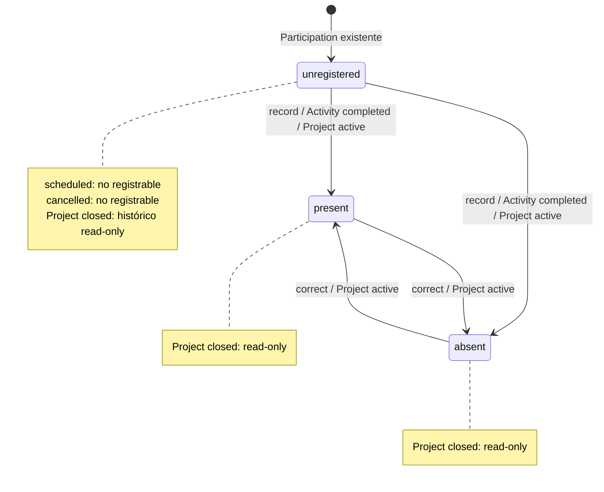

# ExecPlan 0011 — Activity Attendance V1

- Estado: FASE A y FASE B implementadas y validadas; pre-merge pendiente
- Fecha: 2026-09-16
- Rama: `feat/activity-attendance-v1`
- Base: `main@cb554c8`

## Objetivo

Añadir asistencia real a las Activities existentes sin crear un sistema genérico
de asistencia. Attendance representará qué ocurrió con una persona voluntaria
en una Activity concreta a través de una `ProjectActivityParticipation` ya
existente:

`Project → ProjectActivity → ProjectActivityParticipation → ProjectActivityAttendance`.

La V1 permitirá registrar `present` o `absent`, distinguirá la ausencia de una
fila como `unregistered`, admitirá una corrección auditada mientras el Project
siga activo y convertirá el historial en read-only al cerrar el Project.

Este documento resolvió el diseño. La aprobación humana del 2026-09-20 autorizó
FASE A PostgreSQL y la instrucción posterior del 2026-09-21 autorizó FASE B.
Ambas fases están implementadas; no se autorizaron operaciones Supabase remotas.

## Estado inicial verificado

- El repositorio es
  `/Users/grovergonzalez/Documents/Sistema-Voluntariado`.
- Antes de crear la rama, `main`, `origin/main` y `HEAD` coincidían en
  `cb554c873b6fc7913dc4c5f0126f2740aa08db69`; el working tree estaba limpio.
- `feat/activity-attendance-v1` no existía localmente y se creó desde esa base.
- El siguiente número real de ExecPlan es `0011`; existen `0001`–`0010`.
- El siguiente sufijo real de migración es `0013`; existen migraciones
  `202607230001`–`202609070012`.
- Se leyeron `AGENTS.md`, `apps/web/AGENTS.md`, `supabase/AGENTS.md`, `PLANS.md`,
  `docs/exec-plans/0004-project-volunteer-assignments-v1.md`,
  `0005-project-manager-contextual-scope-v1.md`,
  `0006-project-activities-v1.md`,
  `0007-activity-participation-v1.md` y
  `docs/architecture/module-boundaries.md`.
- Se inspeccionaron dominio, aplicación, gateways, composición, router, UI,
  tipos Supabase, migraciones 0004–0008, pgTAP 0006–0008, los tres harness de
  concurrencia Projects y los E2E Activities/Participation actuales.
- Node global es `22.21.0`; no se usará como evidencia. El repositorio exige
  Node `22.18.0` y pnpm `11.9.0`. La validación documental usará el runtime
  exacto disponible fuera del repositorio.

## Contrato actual reconstruido

### Ownership y arquitectura

- `projects` posee `Project`, `ProjectVolunteerAssignment`,
  `ProjectManagerAssignment`, `ProjectActivity` y
  `ProjectActivityParticipation`; Attendance continuará en ese bounded context.
- Dominio y aplicación representan IDs/read models y no conocen React,
  navegador, SQL, Supabase, Identity ni Volunteers internamente.
- Solo infraestructura importa Supabase. `apps/web/src/app/composition` conecta
  gateways y autoridad mediante la API pública de Projects.
- La superficie Activity no es una ruta propia: Activities y Participants viven
  dentro de Project detail. Attendance debe aparecer en las filas actuales de
  Participants.

### Activity

- Estados exactos: `scheduled | completed | cancelled`.
- Nace `scheduled`; `completed` y `cancelled` son terminales.
- Crear/editar/completar/cancelar exige Project `active`.
- Las mutaciones Activity bloquean autoridad, Project y Activity en ese orden.
- Project no puede cerrarse mientras exista una Activity `scheduled`.

### Participation

- Es una ocurrencia histórica Activity–Volunteer, no una cuenta ni la Project
  Assignment.
- `ended_at IS NULL` significa no finalizada explícitamente. No significa que la
  fila sea mutable para siempre.
- Solo puede agregarse/finalizarse mientras Activity esté `scheduled` y Project
  `active`.
- Completar/cancelar Activity no finaliza Participations. Una Participation con
  `ended_at IS NULL` en Activity terminal queda como historial read-only.
- Puede existir una nueva ocurrencia del mismo Volunteer en la misma Activity
  después de finalizar la anterior, siempre que Activity siga `scheduled`.
- Finalizar Project Assignment solo se bloquea por Participation no finalizada
  en Activity `scheduled`; una Activity terminal deja de bloquearla.

### Autoridad real

- La sesión se deriva exclusivamente de `auth.uid()` y se enlaza a
  `accounts.auth_user_id`.
- Ningún permiso es efectivo si `accounts.status <> 'active'`.
- `administrator` opera Projects mediante `project.manage`; no se duplica un
  check nominal de rol.
- `project_manager` contextual requiere en cada llamada cuenta activa, rol
  vigente `project_manager`, permiso vigente `project.read_assigned` o
  `project.manage_assigned` y `project_manager_assignments.ended_at IS NULL`
  para el Project exacto.
- Suspensión, archivo y grant/revoke de rol serializan mediante
  `accounts FOR UPDATE`. Las rutas Activity/Participation endurecidas que usan
  `lock_project_mutation_authority` aceptan autoridad bajo
  `accounts FOR SHARE`; `close_project` es una excepción vigente que comprueba
  permiso y bloquea directamente Project. Scope removal usa la fila scope
  `FOR UPDATE`; una mutación contextual usa esa fila `FOR SHARE`.
- `activity.create` y `activity.join` son placeholders históricos sin autoridad
  funcional. Attendance no los usará.
- React solo decide affordances. PostgreSQL vuelve a autorizar y revalidar todos
  los recursos en cada RPC.

## Alcance

- Entidad `ProjectActivityAttendance` dentro de Projects.
- Persistencia 0..1 Attendance por `ProjectActivityParticipation`.
- Estados exactos `present | absent`; ausencia de fila = `unregistered`.
- Listado de Attendance por Activity y combinación con el read model de
  Participants ya autorizado.
- Registro inicial y corrección `present ↔ absent` solo para Activity
  `completed` de Project `active`.
- Administrator global y project manager contextual mediante permisos Project
  existentes.
- Migración forward-only, RLS default-deny, RPC de privilegio mínimo, auditoría
  atómica sin PII, tipos, dominio, aplicación, gateway, composición y UI.
- pgTAP, unit/component, concurrencia PostgreSQL real y un E2E canónico.

## Fuera de alcance

- Horas de voluntariado, duración efectiva o agregados de tiempo.
- Check-in/check-out, QR, biometría o geolocalización.
- Notas, razones de ausencia, `excused`, `late` u otros estados.
- Autoasistencia, self-service, RSVP, waiting lists o aprobaciones.
- Invitados externos, personas fuera de `volunteers` o Attendance sin
  Participation.
- Certificados, reportes, analytics, Tasks o notificaciones.
- Registro/corrección masivos y DELETE físico.
- Bloqueo de complete Activity o close Project por cobertura de Attendance.
- Permisos nuevos, reinterpretación de placeholders o framework genérico de
  attendance/scopes.
- Push, merge, rebase, amend, deploy o Supabase remoto.

## Decisiones de producto resueltas

### 1. Tabla propia, no extensión de Participation

Attendance se modelará en `public.project_activity_attendances` con una FK/PK a
`project_activity_participations.id`.

Razones:

1. La inexistencia es un estado de negocio (`unregistered`), no `absent` ni un
   valor por defecto.
2. Participation hoy es monotónica: alta y finalización. Añadirle un campo
   corregible mezclaría el roster histórico con un hecho posterior y obligaría a
   debilitar sus guards de inmutabilidad.
3. La fila separada expresa naturalmente cardinalidad 0..1, permite timestamps y
   auditoría propios, y no modifica filas Participation preexistentes.
4. No es un sistema genérico: la FK solo acepta
   `ProjectActivityParticipation`.

No se creará un ID artificial. `participation_id` será a la vez PK y FK porque
Attendance no tiene identidad independiente de esa ocurrencia.

### 2. Participation finalizada sigue siendo elegible

Sí. Si la Activity se completa después, una Participation con `ended_at` no nulo
puede recibir Attendance. `ended_at` registra el periodo del roster; no prueba
presencia/ausencia y no invalida que la persona haya participado realmente.

También es elegible una Participation no finalizada que quedó histórica al
completar la Activity. Attendance no exige ni cambia `ended_at`.

El modelo actual permite varias ocurrencias históricas del mismo
Activity/Volunteer. La V1 conserva la propuesta recibida: Attendance pertenece
a la ocurrencia Participation, no impone una unicidad adicional global
Activity/Volunteer. La UI muestra cada ocurrencia por separado. Cambiar esa
semántica exigiría una regla de producto para elegir o fusionar ocurrencias y
queda fuera de esta V1.

### 3. Corrección mientras Project siga activo

Sí. En Activity `completed` y Project `active`, un actor autorizado puede
corregir `present ↔ absent`. No existe corrección a `unregistered`; la V1 no
borra Attendance. La RPC de corrección recibirá estado esperado y estado nuevo;
tras bloquear la fila, PostgreSQL rechaza una precondición obsoleta para evitar
lost updates concurrentes.

### 4. Cierre no exige Attendance completa

No se añade ese bloqueo. El cierre actual protege Assignments activas y
Activities `scheduled`. Exigir Attendance completa sería una invariante nueva
sin necesidad demostrada y convertiría datos pendientes en un bloqueo
operativo.

### 5. Faltantes al cerrar Project

Permanecen como `unregistered` histórico y read-only. Cerrar no crea filas
`absent`, no completa Attendance y no altera timestamps/auditoría del slice.

### 6. Actores autorizados

- Administrator activo con `project.manage`.
- Project manager activo con rol vigente, `project.manage_assigned` y scope
  activo sobre el Project exacto.
- Lectura: `project.manage` global o `project.read_assigned` + scope.
- Coordinator, volunteer, otros roles, anon, cuenta suspendida/archivada, manager
  sin scope, con scope finalizado o sin permiso fallan cerrados.

No se crean permisos ni se usa `activity.join`/`activity.create`.

## Modelo propuesto

Tabla `public.project_activity_attendances`:

| Columna            | Tipo          | Regla                                                                       |
| ------------------ | ------------- | --------------------------------------------------------------------------- |
| `participation_id` | `uuid`        | PK y FK `project_activity_participations(id) ON DELETE RESTRICT`; inmutable |
| `status`           | `text`        | NOT NULL; allowlist exacta `present` o `absent`                             |
| `created_at`       | `timestamptz` | NOT NULL; `statement_timestamp()` del servidor; inmutable                   |
| `updated_at`       | `timestamptz` | NOT NULL; servidor; cambia solo al corregir                                 |

Constraints y guards:

- PK sobre `participation_id`: como máximo una fila vigente y total por
  Participation.
- FK restrictiva: no Attendance huérfana y sin cascada destructiva.
- `status IN ('present', 'absent')`.
- `updated_at >= created_at`.
- insert fija ambos timestamps server-side y rechaza status no permitido.
- update conserva `participation_id`/`created_at`, solo permite cambiar a la
  alternativa exacta y fija `updated_at` server-side.
- insert/update revalidan también en el guard `Project = active`,
  `Activity = completed` y ownership Participation→Activity; la RPC no es la
  única defensa de lifecycle.
- update sin cambio, reactivación, campos arbitrarios y DELETE fallan.

Las RPC son la autoridad concurrente y adquieren/releen todos los locks padre
antes del DML. Un trigger `BEFORE UPDATE` ya se ejecuta con Attendance bloqueada;
por ello los guards revalidan lifecycle/ownership mediante lecturas sin adquirir
locks de ancestros y no pretenden serializar una ruta privilegiada futura. Esa
ruta necesitaría reutilizar el mismo helper/orden RPC; los guards son defensa
secuencial de integridad, no sustituto de autorización ni locks.

No se duplican `activity_id`, `project_id`, `volunteer_id`, nombre, email,
teléfono, `phone_match_key`, account/Auth IDs ni metadata. Project, Activity y
Volunteer se derivan por FKs autoritativas.

### Estado de dominio



`unregistered` no se persiste: es la ausencia de Attendance para una
Participation. La mutabilidad contextual es:

| Project | Activity  | Sin fila       | `present/absent`            |
| ------- | --------- | -------------- | --------------------------- |
| active  | scheduled | no registrable | estado imposible por RPC V1 |
| active  | completed | registrable    | corregible                  |
| active  | cancelled | no registrable | estado imposible por RPC V1 |
| closed  | terminal  | read-only      | read-only                   |

Una fila inesperada creada por una futura ruta privilegiada en Activity no
completed se mostraría read-only; la V1 no la borra ni la corrige por inferencia.

## RLS, RPC y errores

### RLS/grants

- RLS habilitada sin policies permisivas.
- `REVOKE ALL` de tabla para `public`, `anon` y `authenticated`, incluido SELECT.
- Cero DML directo desde cliente.
- Helpers, guards y auditor no ejecutables por cliente.
- RPC públicas revocadas a `public`/`anon` y concedidas por firma solo a
  `authenticated`.
- `SECURITY DEFINER`, `search_path = ''`, nombres calificados y actor derivado de
  `auth.uid()`.
- Ningún grant nuevo a `service_role`.

### RPC mínimas

1. `list_project_activity_attendances(requested_project_id uuid,
requested_activity_id uuid)`
   - exige lectura global/contextual;
   - autoriza Project antes de validar Activity;
   - devuelve solo `participation_id`, `status`, `created_at`, `updated_at`;
   - la aplicación combina por `participation_id` con el listado de Participants;
   - una Participation sin fila se representa como `unregistered`.
2. `set_project_activity_attendance(requested_project_id uuid,
requested_activity_id uuid, requested_participation_id uuid,
expected_status text, requested_status text)`
   - exige mutación global/contextual, Project activo, Activity completed y
     Participation perteneciente a esa Activity;
   - `expected_status is null` significa registro inicial y falla si ya existe
     Attendance;
   - `expected_status in ('present', 'absent')` significa corrección, bloquea la
     fila y exige `current_status = expected_status` y estado nuevo distinto;
   - no existe overwrite ciego ni upsert ambiguo.

No habrá RPC DELETE, upsert ambiguo, status genérico con `unregistered`, bulk,
consulta global ni actor/Volunteer controlado como autoridad por el cliente.

La UI solo deriva `unregistered` después de que ambos listados hayan respondido
con éxito. Si falla la consulta Attendance, muestra error y no presenta la falta
de datos como “Sin registrar”. En Activity completed las Participations ya son
inmutables, por lo que separar ambas proyecciones no introduce una carrera de
roster; cada mutación Attendance refresca su propia proyección.

### Errores estables definitivos

| SQLSTATE | Código conceptual                                |
| -------- | ------------------------------------------------ |
| `42501`  | `permission_denied`                              |
| `P0002`  | `project_not_found`                              |
| `P0002`  | `project_activity_not_found`                     |
| `P0002`  | `project_activity_participation_not_found`       |
| `23514`  | `project_closed`                                 |
| `23514`  | `project_activity_not_completed`                 |
| `22023`  | `invalid_project_activity_attendance_status`     |
| `23505`  | `project_activity_attendance_already_recorded`   |
| `23514`  | `project_activity_attendance_status_conflict`    |
| `42501`  | `project_activity_attendance_delete_not_allowed` |

Una firma Project + Activity + Participation evita lookups globales observables.
Para actores sin scope, UUID inexistente y UUID real fuera de scope continúan
siendo `permission_denied`.

## Lock order

Orden global confirmado y extendido:

`actor account → active manager scope → project → project volunteer assignment → activity → participation → attendance`.

El orden es una secuencia parcial: una operación omite filas que no necesita, pero
nunca invierte las restantes. Attendance no bloquea ni exige Project Volunteer
Assignment porque:

- la elegibilidad por Assignment fue una precondición autoritativa al crear la
  Participation;
- al completar Activity, la Assignment puede finalizar legítimamente;
- exigir una Assignment activa impediría registrar Attendance antes de cerrar el
  Project y contradiría el historial aprobado.

| Operación         | Locks en orden                                                                                                                      |
| ----------------- | ----------------------------------------------------------------------------------------------------------------------------------- |
| Record admin      | `account FOR SHARE → project FOR UPDATE → activity FOR UPDATE → participation FOR UPDATE → insert attendance`                       |
| Record manager    | `account FOR SHARE → scope FOR SHARE → project FOR UPDATE → activity FOR UPDATE → participation FOR UPDATE → insert attendance`     |
| Correct admin     | `account FOR SHARE → project FOR UPDATE → activity FOR UPDATE → participation FOR UPDATE → attendance FOR UPDATE`                   |
| Correct manager   | `account FOR SHARE → scope FOR SHARE → project FOR UPDATE → activity FOR UPDATE → participation FOR UPDATE → attendance FOR UPDATE` |
| Complete Activity | `account FOR SHARE → [scope FOR SHARE] → project FOR UPDATE → activity FOR UPDATE`                                                  |
| Close Project     | `project FOR UPDATE → guards existentes`                                                                                            |
| Scope removal     | `scope FOR UPDATE`                                                                                                                  |

Las mutaciones reutilizarán el primitive vigente de autoridad (`account` y
`scope`) y la raíz Project. No bloquearán Attendance antes de Participation,
Activity antes de Project ni Project antes de scope.

## Concurrencia

El harness usará sesiones `psql` independientes, PIDs conocidos,
`application_name`, `pg_stat_activity` y `pg_blocking_pids`. Los marcadores de
protocolo pueden hacer polling breve; ningún `sleep` será evidencia de
sincronización. Cada escenario afirmará SQLSTATE/mensaje, estado final, auditoría
exacta, invariantes globales y cleanup de sesiones/locks/fixtures.

### Regresiones obligatorias

1. Record ↔ record, misma Participation:
   - ambas toman el mismo Project/Activity/Participation;
   - exactamente una inserta y audita;
   - la perdedora relee/encuentra la PK y falla
     `project_activity_attendance_already_recorded`.
2. Correct ↔ correct:
   - ambas parten del mismo `expected_status`;
   - una corrige y audita;
   - la otra relee un estado distinto y falla
     `project_activity_attendance_status_conflict`;
   - nunca hay lost update ni dos eventos exitosos.
3. Record/correct ↔ close Project, ambos órdenes:
   - Attendance primero: persiste; close espera y luego puede cerrar sin exigir
     cobertura completa;
   - close primero: Attendance espera, relee `closed` y falla sin cambio/audit.
   - el fixture finaliza Project Assignment y usa Activity completed para que el
     cierre sea válido por las reglas actuales.
4. Record/correct de manager ↔ scope removal, ambos órdenes:
   - mutación primero: termina y removal continúa;
   - removal primero: la mutación relee scope finalizado y falla
     `permission_denied`.
5. Complete Activity ↔ record Attendance:
   - complete primero: record espera en Project/Activity, relee `completed` y
     puede registrar;
   - record primero sobre `scheduled`: falla
     `project_activity_not_completed`; complete continúa y no aparece Attendance.

La carrera complete↔record es real porque `completed` es una precondición
server-side. Se versionará; no basta un test secuencial de estados.

No se añaden carreras con cancelled porque no existe transición desde completed a
cancelled. Los negativos cancelled pertenecen a pgTAP.

## Auditoría

Convenciones nuevas coherentes con los eventos Projects existentes:

- `project_activity_attendance.recorded`
- `project_activity_attendance.updated`

Contrato:

- `entity_type = 'project_activity_attendance'`.
- `entity_id = participation_id`.
- actor = `auth.uid()` de la transacción.
- recorded: `changed_fields = ['participation_id', 'status', 'created_at']`,
  `new_state = present|absent`.
- updated: `changed_fields = ['status']`, `previous_state` y `new_state` contienen
  solo los códigos técnicos `present|absent`.
- `metadata = '{}'`; sin `target_user_id` porque el sujeto es Volunteer, no Auth.
- ningún nombre, email, teléfono, `phone_match_key`, contenido Activity, fecha de
  agenda, request body ni Auth metadata.
- fallo o perdedor concurrente no deja evento.

## Aplicación y UI

Attendance permanece dentro de `apps/web/src/modules/projects` con archivos
específicos reales, sin módulo top-level ni abstracción genérica:

- `domain/project-activity-attendance.ts`;
- gateway/servicio de aplicación Attendance;
- gateway Supabase Attendance;
- composición mediante la API pública Projects;
- integración en `project-activity-participants-section.tsx`, extrayendo un
  control de fila solo si el componente gana responsabilidad real.

`ProjectActivityParticipantsSection` es el único propietario de combinar la
lista Participation con el mapa tipado que devuelve el servicio Attendance por
`participation_id`. El servicio no importa presentación y no se crea un
repositorio genérico. La carga cancela o descarta respuestas obsoletas al cambiar
Project/Activity y no mezcla resultados de selecciones anteriores.

La tabla Participants añadirá una columna Attendance:

- `Sin registrar`: `StatusBadge` neutral cuando no existe fila.
- `Present`: `StatusBadge` success.
- `Absent`: `StatusBadge` danger; siempre con texto, nunca solo color.
- Activity `completed` + Project `active` + actor capaz: `Button`/control
  accesible para registrar y corregir.
- Activity `scheduled`: mensaje/estado no registrable, sin acción.
- Activity `cancelled`: read-only, sin acción.
- Project `closed`: todos los estados read-only; faltantes permanecen
  `Sin registrar`.
- Participation finalizada y no finalizada se tratan igual para Attendance.

Se reutilizan `PageHeader` en Project detail, `StatusBadge`, `Notice`,
`EmptyState`, `LoadingState`, `Button` y `TableRegion`; no se rediseña la
aplicación. Loading/busy se acota a la fila o acción para evitar doble submit;
success/error se anuncia mediante `Notice`. Los controles tienen label/nombre
accesible, foco visible y teclado. La corrección es una acción directa y
optimista, sin diálogo adicional. `TableRegion`
mantiene el comportamiento responsive existente. Textos se agregan en español e
inglés.

La UI muestra solo `volunteerName` e identificadores/timestamps técnicos ya
autorizados por Participation. Attendance no agrega email, teléfono,
`phone_match_key` ni Auth metadata.

## Estrategia de migración

- Crear, al implementar, una migración forward-only posterior a 0012,
  tentativamente
  `supabase/migrations/202609200013_project_activity_attendance.sql`.
- No editar 0001–0012.
- Crear tabla vacía, constraints, RLS/revokes, guards, auditor y dos RPC.
- No backfill: toda Participation previa, incluida la de Activities completed,
  comienza visualmente como `unregistered`.
- No reemplazar `close_project`, su guard, RPC Activity ni RPC Participation
  salvo necesidad técnica demostrada durante implementación. El contrato de
  cierre no cambia.
- Actualizar el archivo curado `database.types.ts` solo con tabla/firmas/rows
  nuevas después de contrastarlo contra generación local reproducible.
- Actualizar en la fase documental `README.md`, `CHANGELOG.md`, visión/recorrido
  de producto, `roles-and-permissions.md`, `open-questions.md`,
  `data/initial-model.md`, `data/data-dictionary.md`,
  `architecture/context-map.md`, `architecture/module-boundaries.md`, runtime,
  threat model, deuda/riesgos, desarrollo local, CI y trazabilidad IA. ADR 0011
  debe conservar la decisión histórica de diferimiento y registrar que
  Attendance pasó a Projects en este hito; el context map debe dejar de agrupar
  Attendance con Tasks futuros.
- Rollback operativo: forward-fix; no borrar filas Attendance ni reescribir una
  migración aplicada.

## Estrategia de pruebas

### Dominio/aplicación

- allowlist `present|absent`, ausencia como `unregistered` derivado;
- Activity `completed`/Project `active` como único contexto mutable;
- Participation finalizada y no finalizada elegibles;
- corrección solo al estado alternativo y precondición esperada;
- UUID/input inválidos antes del gateway;
- lectura `manage || readAssigned`, mutación `manage || manageAssigned`;
- ningún permiso placeholder ni regla de Assignment activa accidental.

### Gateway/componentes

- mapping snake_case/camelCase y argumentos RPC exactos, sin actor/timestamps
  enviados por cliente;
- traducción de errores y respuesta inválida fail-closed;
- fallo del listado Attendance no se degrada a `Sin registrar`;
- `Sin registrar`, Present y Absent;
- registro, corrección, refresh y estado esperado enviado;
- loading/success/error, doble submit y error de conflicto con recarga;
- scheduled/cancelled/closed y falta de autoridad sin controles mutables;
- Participation terminada conserva controles Attendance cuando Activity completed
  y Project active;
- accesibilidad y ausencia de PII.

### PostgreSQL/pgTAP

- tabla/columnas, PK/FK restrictiva, checks, timestamps, triggers e inexistencia
  de DELETE RPC;
- RLS activa, cero policies, cero grants de tabla/DML y grants exactos por firma;
- `SECURITY DEFINER`, `search_path = ''`, helpers no ejecutables y proyección
  mínima;
- administrator global;
- manager con scope; Project ajeno; scope finalizado; sin rol/permiso; suspended;
  archived; coordinator; volunteer; anon;
- `project.read_assigned` + scope permite listar pero no mutar;
  `project.manage_assigned` solo muta junto con rol `project_manager` vigente y
  scope activo; ambos permisos sin rol o sin scope siguen denegados;
- Project closed;
- Activity scheduled/cancelled/completed;
- Participation inexistente, de otra Activity y de otro Project;
- Participation con `ended_at` nulo/no nulo;
- record inicial present y absent;
- duplicado, status inválido, correction en ambos sentidos, corrección stale y
  unchanged;
- inputs `null`/fuera de allowlist por separado para `requested_status` y
  `expected_status`, same-state explícito e IDs RPC nulos;
- listado vacío devuelve cero filas, filtra estrictamente por la tupla
  Project/Activity y no expone Attendance de otra Activity o Project;
- cerrar Project con faltantes no falla ni crea Attendance; cerrado preserva
  lectura y niega mutación;
- auditoría exacta, actor, estados técnicos, metadata vacía y fallos sin evento;
- propietario/route privilegiada no puede mutar FK/created_at, escribir
  `unregistered`, borrar ni evadir lifecycle mediante los guards;
- retirar/conceder temporalmente `activity.join`/`activity.create` demuestra que
  no autorizan Attendance.

### Concurrencia

Implementar los escenarios de la sección Concurrencia en un harness Attendance
integrado a `projects:test:concurrency`. Reutilizar utilidades/patrones existentes
sin copiar un cuarto harness completo si una extracción pequeña y segura reduce
duplicación; no hacer esa refactorización si amplía el riesgo del slice. Medir el
timeout CI real antes de modificarlo. Al ampliar el alias en `package.json`,
actualizar también la aserción de ownership/composición del comando en
`scripts/e2e-service-orchestrator.test.mjs`; el workflow ya consume el alias y no
debe duplicar archivos. El cleanup cierra o revierte holder, contender y observer
en `finally`, y después elimina Attendance antes de Participation por la FK
restrictiva, seguido del resto de fixtures. Debe demostrar cero sesiones y locks
residuales.

### E2E

Un recorrido canónico de administrator es suficiente:

1. crear Project, Assignment, Activity y Participation;
2. completar Activity;
3. observar `Sin registrar`;
4. registrar `present`;
5. corregir a `absent`;
6. recargar y confirmar `Absent` persistido y controles aún disponibles mientras
   Project esté activo.

La matriz de autorización y negativos permanece en pgTAP; no se duplican E2E para
cada actor/estado.

### Implementación FASE B

- `ProjectActivityAttendance` y su status exacto viven en dominio de Projects;
  el puerto y `ProjectActivityAttendanceService` validan IDs, reutilizan la
  autoridad Project existente y transmiten `expectedStatus` sin autolectura ni
  retry.
- `SupabaseProjectActivityAttendanceGateway` es el único adaptador nuevo. Valida
  las proyecciones de ambas RPC, conserva error frente a empty y traduce los dos
  conflictos optimistas estables a `attendance-stale`.
- La composición crea explícitamente gateway y servicio; router, presentación y
  dominio no importan Supabase ni conocen SQLSTATE.
- Participants carga Participation y Attendance como un único snapshot de UI.
  Solo un empty exitoso produce `Sin registrar`; loading y read failure no
  renderizan datos parciales como autoritativos.
- La UI usa `StatusBadge`, `Notice`, `LoadingState`, `EmptyState`, `Button` y
  `TableRegion`. Activity completed de Project active expone registro/corrección;
  scheduled, cancelled, Project closed y actor sin affordance permanecen
  read-only.
- El alta envía `expectedStatus = null`; la corrección envía el estado visible.
  Un stale no reintenta la mutación: muestra feedback, relee y presenta el estado
  confirmado por servidor.
- Un contador de request descarta lecturas fuera de orden. Una revisión local de
  Attendance impide que una lectura iniciada antes de una mutación exitosa
  reemplace el estado confirmado posteriormente.
- El E2E canónico crea el contexto, completa Activity, registra `present`, corrige
  a `absent`, recarga y confirma persistencia. No duplica la matriz PostgreSQL.

## Fases de implementación

| Fase                     | Resultado esperado                                   | Validación incremental                             | Estado                                    |
| ------------------------ | ---------------------------------------------------- | -------------------------------------------------- | ----------------------------------------- |
| 0. Plan y aprobación     | contrato, decisiones, locks y reviewers documentados | `pnpm verify`, `git diff --check`, revisión humana | completada; FASE A aprobada el 2026-09-20 |
| 1. Dominio/aplicación    | tipos, estados, puertos y casos de uso               | unitarias focalizadas, typecheck, boundaries       | completada en FASE B                      |
| 2. PostgreSQL            | migración 0013, tabla, RLS/RPC, guards y audit       | reset local, DB lint, pgTAP focal/completo         | FASE A completada y validada              |
| 3. Infra/composición     | gateway tipado y servicio conectado                  | gateway/integration, typecheck, boundaries         | completada en FASE B                      |
| 4. UI                    | Attendance dentro de Participants                    | componentes, i18n, accesibilidad, responsive       | completada en FASE B                      |
| 5. Concurrencia/E2E/docs | harness, flujo canónico y documentación vigente      | carreras, E2E focal, docs                          | completada en FASE A/FASE B               |
| 6. Cierre                | gates y revisiones de implementación                 | release-readiness aplicable y revisión humana      | FASE B validada; pre-merge pendiente      |

La FASE B no modificó migración, RPC, RLS, grants, pgTAP ni harness de FASE A.

## Riesgos y mitigaciones

| Riesgo                                                      | Mitigación                                                                            |
| ----------------------------------------------------------- | ------------------------------------------------------------------------------------- |
| Confundir falta de registro con ausencia                    | ausencia de fila = `unregistered`; `absent` siempre requiere acción explícita         |
| Attendance sobre Activity no realizada                      | RPC/guard exigen `completed`; scheduled/cancelled fallan                              |
| Excluir Participation finalizada o exigir Assignment activa | eligibility se basa en Participation existente, no en `ended_at` ni Assignment actual |
| Lost update en correcciones                                 | estado esperado + Attendance `FOR UPDATE` + error de conflicto                        |
| Registro duplicado concurrente                              | locks canónicos + PK `participation_id` + error estable                               |
| Mutación después de close/scope removal                     | account/scope/Project locks y revalidación post-wait                                  |
| Lectura iniciada antes de una mutación pisa el estado nuevo | generación + revisión local; si cambia, se repite hasta snapshot estable              |
| Contrato RPC devuelve shape/cardinalidad inesperada         | schemas runtime validan array y exactamente una fila en mutación                      |
| Inversión con Activity/Participation                        | Attendance siempre después de Participation; Assignment se omite, no se invierte      |
| Bloqueo operativo por faltantes                             | close no consulta Attendance; pgTAP y carrera lo fijan                                |
| UUID hijo como oráculo horizontal                           | firmas parent tuple y autorización Project previa                                     |
| PII duplicada                                               | FK/estado/timestamps solamente; read model reutiliza nombre ya autorizado             |
| UI monolítica o rediseño accidental                         | integrar en Participants y reutilizar primitives existentes                           |
| Múltiples occurrences del mismo Volunteer/Activity          | contrato explícito por Participation; no fusionar sin nueva decisión de producto      |
| Harness excede timeout                                      | escenarios focales, medición real y ajuste solo con evidencia                         |

Riesgos residuales aceptados para este alcance:

- `attendance-stale` vive en el error compartido y obliga al mapper exhaustivo de
  Identity a conocer un código de Projects; es acoplamiento menor existente, no
  una razón para crear un framework de errores en V1.
- Participation y Attendance se leen con dos RPC y se combinan en presentación;
  no existe snapshot SQL conjunto. En Activity completed el roster ya es
  inmutable y la revisión local evita que lecturas anteriores pisen mutaciones.
- En anchos móviles la tabla conserva semántica y usa scroll horizontal interno
  de `TableRegion`; no se transforma en cards en esta fase.

## Criterios de aceptación

- Cada Attendance referencia exactamente una Participation y existe como máximo
  una por Participation.
- `present`/`absent` son los únicos estados persistidos; falta de fila se muestra
  como `Sin registrar`.
- Solo Activity completed de Project active admite registro/corrección.
- Participation finalizada o no finalizada es elegible; Project Assignment activa
  no es requisito posterior.
- Administrator global y manager contextual autorizado pueden operar; el resto
  falla cerrado en PostgreSQL.
- Project closed conserva todo read-only y los faltantes históricos no bloquean
  close ni se convierten en absent.
- Correcciones concurrentes no pierden actualizaciones y toda transición exitosa
  tiene exactamente un evento sin PII.
- El orden account–scope–Project–Assignment–Activity–Participation–Attendance no
  se invierte; las carreras obligatorias quedan versionadas sin sleeps.
- RLS/grants niegan acceso directo y las RPC revalidan actor, scope y ownership.
- UI reutiliza la experiencia Participants, es accesible/responsive y no expone
  datos nuevos del Volunteer.
- README, ADR 0011, context map y module boundaries distinguen Activity
  Attendance dentro de Projects de cualquier asistencia genérica o Tasks futura.
- No aparecen horas, check-in/out, QR, geolocalización, notas, razones, guests,
  reports, Tasks, notifications, self-service o permisos nuevos.
- Migraciones 0001–0012 permanecen intactas y no hay operaciones remotas.

## Revisiones de solo lectura

Se ejecutó una sola ronda sobre el documento y la implementación actual. El
agente principal integró los hallazgos; conforme al encargo, no se solicitó
recheck y no se promueven veredictos por inferencia.

- Architect: **PASS con observaciones**. Aprobó ownership, tabla propia,
  dependencias, autoridad y orden de locks. Se integraron la reconciliación
  documental de Attendance dentro de Projects, la separación RPC/guard para no
  invertir locks y un único propietario UI del join Participation+Attendance con
  descarte de respuestas obsoletas.
- Database security reviewer: **GO**. Aprobó PK/FK, RLS/ACL, RPC parent-scoped,
  autoridad, omisión de Assignment, concurrencia y auditoría. Se hicieron
  explícitos los guards de lifecycle como defensa secuencial y la matriz separada
  de read/manage contextual.
- QA reviewer: **NO-GO en el snapshot revisado** por formato Prettier. El fallo
  se reprodujo en la primera ejecución de `pnpm verify`, se corrigió y el gate
  completo posterior aprobó. También se integraron paridad del alias de
  concurrencia, NULL/status, aislamiento de listado y cleanup FK. No se pidió
  recheck, por lo que su veredicto histórico no se presenta como GO.
- Docs governor: **NO-GO en el snapshot revisado** por el mismo formato y por
  trazabilidad/precisión documental. Se integraron prompt 0018, prompt log,
  atribución, inventario documental futuro, alcance exacto del account lock,
  errores definitivos, tono Absent y evidencia del runtime. No se pidió recheck,
  por lo que su veredicto histórico no se presenta como GO.

Ningún revisor modificó archivos ni ejecutó DB reset o suites pesadas.

### Revisión final de FASE A

La ronda de implementación fue de solo lectura. Database security y docs
emitieron inicialmente NO-GO por SQLSTATE contractual y documentación desfasada;
los hallazgos se integraron y sus rechecks dirigidos no reabrieron el alcance.

- Database security reviewer: **GO** final. Confirmó SQLSTATE `23514`, PK/FK,
  RLS/ACL, `SECURITY DEFINER`, autoridad fail-closed, lock order, auditoría exacta
  sin PII y 58 pgTAP/12 carreras.
- Architect: **GO**. Confirmó ownership en Projects, helper endurecido, orden de
  locks, tipos mínimos en infraestructura y ausencia de UI/E2E/Edge Functions.
- QA reviewer: **GO con observaciones no bloqueantes**. Ejecutó 58/58 focales y
  el alias combinado 50/50; verificó cleanup sin conexiones, locks ni auditoría
  residual. Reservó casos adicionales de la matriz ampliada como mejora futura;
  el mínimo obligatorio de FASE A está cubierto.
- Docs governor: **GO** final por cambio documental material. Confirmó coherencia
  del plan, modelo, runtime, runbooks, riesgo/deuda y trazabilidad.

Ningún revisor editó archivos ni ejecutó E2E o una operación remota.

## Validaciones de esta fase

Runtime exacto:

```text
ATTENDANCE_NODE_BIN=/Users/grovergonzalez/Library/pnpm/store/v11/links/@/node/22.18.0/d4381cdc87d3c4d1fbb89adeebc19da94730776a8dc792906f45ee7146711145/node_modules/node/bin
PATH="$ATTENDANCE_NODE_BIN:$PATH" node --version          # v22.18.0
PATH="$ATTENDANCE_NODE_BIN:$PATH" corepack pnpm --version # 11.9.0
```

- Primera `pnpm verify`: FAIL en `format:check` sobre este plan; la tabla
  Markdown se corrigió y se ejecutó Prettier. No se ocultó el fallo.
- Repetición `pnpm verify`: PASS; formato, lint, `lint:boundaries`, cuatro probes
  arquitectónicos, typecheck web/Functions, 13 pruebas de orquestación E2E, 11
  de orquestación SMTP local, 245 unitarias, 4 de integración y build de 483
  módulos.
- Validación final post-revisores: `pnpm verify` PASS con el mismo runtime y los
  mismos conteos.
- `git diff --check`: PASS sobre los artefactos documentales staged.
- DB reset, DB lint, pgTAP, concurrencia y E2E: **NOT EXECUTED**, de acuerdo con
  el alcance documental.

### Validación de implementación FASE A

La evidencia anterior permanece como histórico del plan inicial. Tras la
autorización humana de FASE A se ejecutó con Node `22.18.0` y pnpm `11.9.0`:

- `pnpm db:start`: PASS con stack local y Mailpit; sin Edge Runtime automático.
- `pnpm db:reset`: PASS aplicando migraciones 0001–0013 y seed local.
- `pnpm exec supabase db lint --local --level warning`: PASS, cero avisos.
- `pnpm db:test`: PASS final, 9 archivos y 641 checks pgTAP.
- pgTAP Attendance focal: PASS, 58 checks.
- harness Attendance: PASS, 12/12 interleavings con conexiones independientes,
  evidencia de bloqueo y cleanup de filas/auditoría/sesiones.
- `pnpm test:functions`: PASS, 33/33.
- Primera `pnpm verify` de implementación: FAIL en lint porque la fila nueva del
  tipo curado Supabase carecía de la firma de índice requerida; se corrigió solo
  ese contrato compartido.
- Repetición `pnpm verify`: PASS; formato, lint, boundaries, cuatro probes,
  typecheck web/Functions, 13 pruebas de orquestación E2E, 11 de SMTP local, 245
  unitarias, 4 de integración y build de 483 módulos.
- `git diff --check`: PASS.
- E2E Attendance: **NOT EXECUTED**, expresamente reservado para FASE B.

Mutation checks temporales, todas restauradas antes de continuar:

- sin requisito `Activity = completed`: FAIL esperado, 3/55;
- sin comparación de `expected_status`: FAIL esperado, 1/55;
- sin helper de autoridad contextual: FAIL esperado, 9/55.

Un recheck posterior al harness detectó 16 eventos de Assignment residuales por
usar un `entity_type` incorrecto en cleanup. La aserción histórica falló, el
cleanup se corrigió a `project_assignment`, se añadió una comprobación por fixture
y la secuencia `reset → harness 12/12 → db:test 641/641` regresó a PASS.

### Validación de implementación FASE B

FASE B usó Node `22.18.0` y pnpm `11.9.0` y no modificó PostgreSQL:

- Precheck: rama `feat/activity-attendance-v1`, HEAD inicial `8175c31`,
  `main`/`origin/main`/merge-base `cb554c8` y working tree limpio: PASS.
- Pruebas focales de aplicación, gateway y UI: PASS, 5 archivos y 38 tests.
- `pnpm typecheck` y `pnpm lint:boundaries`: PASS incremental.
- E2E Attendance focal: PASS, 1/1.
- `pnpm test:e2e`: PASS, 22/22, con Function gestionada y retirada por el
  orquestador oficial.
- Primer intento focal se invocó con un separador que Playwright interpretó como
  selección completa; se interrumpió y no se usó como evidencia. Un segundo
  intento directo fue rechazado por el guard que exige pnpm y tampoco ejecutó
  casos. La invocación focal correcta posterior pasó 1/1.
- Un `pnpm db:test` posterior a E2E falló por conteos contaminados con fixtures
  locales creados por la propia suite. Tras `pnpm db:reset`, la repetición limpia
  pasó 9 archivos y 641/641; Attendance había pasado también en el intento
  contaminado.
- Harness Attendance focal, invocado por archivo porque no existe alias focal:
  PASS, 12/12. No se repitió el alias combinado.
- Capturas locales no versionadas: escritorio, 420px y Project closed read-only;
  el scroll horizontal permanece dentro de `TableRegion`.
- Primer lote de gates finales: typecheck PASS; lint y boundaries detectaron una
  actualización síncrona de loading iniciada desde `useEffect`. La carga inicial
  se movió a una microtarea cancelable y la regresión UI focal volvió a pasar
  17/17; no se deshabilitó la regla.
- Repetición final: `pnpm typecheck`, `pnpm lint`, `pnpm lint:boundaries`,
  `pnpm test:unit` (47 archivos, 268 tests), `pnpm test:integration` (2 archivos,
  4 tests), `pnpm build` (486 módulos), `pnpm verify` y `git diff --check`: PASS.

La revisión focal posterior detectó y corrigió una carrera entre la recarga por
stale y una mutación exitosa de otra fila: una lectura invalidada ahora repite
ambas proyecciones dentro de la misma generación hasta obtener revisión estable,
sin dejar loading permanente. Se añadieron regresiones de dos filas, restauración
de foco, Participation finalizada elegible, faltantes históricos read-only y
cardinalidad RPC exacta. El recheck focal pasó 34/34.

### Revisiones de solo lectura FASE B

- Architect: **GO**. Confirmó dependencias dominio → aplicación → infraestructura
  → composición/presentación, ausencia de Supabase en UI y conservación de
  PostgreSQL como autoridad. Observó como no bloqueante el código
  `attendance-stale` en el error compartido.
- QA reviewer: el snapshot inicial fue **NO-GO** por la carrera
  stale-refresh ↔ mutación, foco y cobertura histórica. Tras integrar los
  hallazgos, el recheck fue **GO** con 34 pruebas focales y `git diff --check`.
- Docs governor: revisión inicial **NO-GO** por estado de producto y trazabilidad
  FASE B desactualizados. Tras actualizar documentación transversal, prompt 0020,
  atribución, riesgos y estado real, el recheck final fue **GO**.
- Database security reviewer: **NOT EXECUTED** en FASE B porque no se modificaron
  schema, migraciones, RLS, RPC, grants, auditoría, pgTAP ni concurrencia.

El cierre post-revisores con Node `22.18.0`/pnpm `11.9.0` aprobó `pnpm
typecheck`, `pnpm lint`, `pnpm lint:boundaries`, 47 archivos/273 unitarias, 2
archivos/4 integraciones, build de 486 módulos, `pnpm verify` completo y `git
diff --check`. Los commits FASE B son `1363ee4`, `c4c78bb`, `ad1632b` y el cierre
documental separado.

## Progreso

- 2026-09-16: Git/base/working tree confirmados y rama creada desde `main`.
- 2026-09-16: gobernanza, planes previos, código, SQL y tests actuales
  inspeccionados sin ejecutar DB reset ni suites pesadas.
- 2026-09-16: decisiones de producto, esquema, autoridad, locks, concurrencia,
  auditoría, UI, privacidad y estrategia de pruebas documentados.
- 2026-09-16: una ronda de cuatro revisores completada; hallazgos integrados sin
  segunda ronda ni veredictos inferidos.
- 2026-09-16: primera `pnpm verify` falló por formato del plan; tras corregirlo,
  la repetición aprobó completa con runtime exacto.
- 2026-09-16: validación final post-revisores aprobó `pnpm verify` completo y
  `git diff --check`; lista para el commit documental solicitado.
- 2026-09-20: FASE A autorizada; precheck confirmó rama, HEAD `81dec44`, bases
  `main`/`origin/main` y runtime exacto con working tree inicialmente limpio.
- 2026-09-20: migración forward-only 0013, tipos DB mínimos, 58 checks pgTAP y
  harness de 12 interleavings PostgreSQL implementados sin UI ni E2E.
- 2026-09-20: las tres mutation checks dirigidas fallaron al retirar lifecycle
  completed, precondición optimista y autoridad contextual; cada degradación se
  restauró inmediatamente.
- 2026-09-21: revisores finales emitieron database security GO, architect GO, QA
  GO con observaciones no bloqueantes y docs GO; cambios técnicos registrados en
  `2a164d4` y `b243126`, con cierre documental separado.
- 2026-09-22: FASE B añadió dominio/aplicación, gateway/composición y Attendance
  dentro de Participants, sin modificar FASE A ni añadir pantallas.
- 2026-09-22: regresiones focales cubrieron empty/error, alta, corrección, stale,
  orden asíncrono y estados read-only; E2E focal 1/1 y completo 22/22 pasaron.
- 2026-09-22: pgTAP limpio 641/641 y harness Attendance 12/12 reconfirmaron que
  la integración TypeScript no alteró el contrato backend.
- 2026-09-23: hallazgos QA de carrera/foco/cobertura y hallazgos documentales de
  producto/trazabilidad se integraron; QA emitió GO en el recheck focal.
- 2026-09-23: docs governance emitió GO final; gates completos aprobaron y se
  crearon tres commits técnicos sin amend, rebase ni push.

## Descubrimientos

- El helper endurecido `lock_project_mutation_authority` ya serializa cuenta y
  scope antes de Project; Attendance debe reutilizar esa semántica.
- El orden real global incluye Project Assignment antes de Activity solo cuando
  una operación necesita ambas. Attendance no la necesita y exigirla rompería el
  flujo post-completion.
- Project close ya serializa con mutaciones hijas mediante Project `FOR UPDATE` y
  no requiere ampliar su guard.
- Complete Activity y record Attendance sí compiten por una precondición mutable;
  la regresión en ambos órdenes es necesaria.
- Participation permite varias ocurrencias históricas del mismo par. La
  cardinalidad solicitada es por Participation, no por Activity/Volunteer.
- `activity.join` no concede hoy autoridad a ninguna RPC del slice Projects y no
  debe adquirir significado por accidente.

## Decisiones durante la ejecución

- Se elige tabla propia con `participation_id` como PK/FK.
- Se conserva el permiso y scope Project existente, sin permisos Attendance.
- Se permite Attendance sobre Participation finalizada o no finalizada.
- Se permite corregir solo durante Project active y nunca borrar para volver a
  `unregistered`.
- No se agrega guard de completitud al cierre.
- Se agrega precondición de estado esperado a la corrección para evitar lost
  updates.
- FASE A consolida registro y corrección en un solo RPC autoritativo: NULL
  significa alta exclusiva y un estado esperado significa corrección optimista.
- Se usa `created_at`, conforme al contrato aprobado de implementación, y el
  conflicto optimista conserva SQLSTATE `23514` del diseño aprobado.
- FASE B representa stale con `attendance-stale` en el contrato de aplicación;
  presentación no depende del texto humano ni del SQLSTATE PostgreSQL.
- Participants es propietario del join de UI; no se creó una pantalla, módulo ni
  caché global de Attendance.
- Una lectura exitosa de ambas proyecciones es precondición para derivar
  `unregistered`; cualquier fallo deja un Notice explícito y oculta el snapshot
  incompleto.

## Resultado de esta fase

Activity Attendance V1 queda integrado de PostgreSQL a UI dentro del bounded
context Projects. FASE A conserva persistencia, autorización, auditoría y
concurrencia; FASE B añade dominio/aplicación, gateway/composición, UX accesible y
responsive, manejo stale/fuera de orden y el E2E canónico. Gates, revisiones y
commits locales quedaron completos. Pre-merge, despliegue, push y cualquier
ampliación funcional permanecen fuera de esta fase.
