# Recorridos de cuenta

```mermaid
flowchart LR
  A["Actor autorizado"] --> B["Crear invitación"]
  B --> C["Reserva idempotente en PostgreSQL"]
  C --> D["Auth envía correo a Mailpit"]
  D --> E["Invitado abre enlace"]
  E --> F["Auth establece sesión"]
  F --> G["Aceptar una vez"]
  G --> H["pending_profile"]
  H --> I["Contraseña en Auth + perfil mínimo"]
  I --> J["Rol inicial protegido"]
  J --> K["active"]
```

La invitación vencida, revocada, sustituida o ya aceptada termina en una pantalla segura y no concede acceso. Administrator puede sustituir una invitación abierta o crear una sucesora para una revocada/vencida dentro de la misma cuenta; si Auth ya confirmó la identidad, la operación falla cerrada y requiere revisión humana. Durante `pending_profile` solo se permite completar el onboarding. El registro público permanece desactivado.

## Administración

Administrator puede buscar cuentas, consultar detalle, conceder o retirar roles permitidos, suspender, archivar y reactivar con confirmación y motivo. Coordinator ve exclusivamente el alcance originado por sus invitaciones y solo crea invitaciones `volunteer`. El servidor vuelve a validar cada acción aunque la UI o una petición hayan sido manipuladas.

## Estados observables

- Invitaciones y cuentas: carga, vacío, error seguro, envío y confirmación.
- Estado bloqueado: `suspended` y `archived` redirigen a `/account-blocked`; PostgreSQL ya negó permisos.
- Cambio de identidad, estado o versión de autoridad: limpia toda caché sensible y vuelve a resolver el contexto.
- Cierre de sesión: limpia estado/caché y vuelve a `/login`.

La interfaz nunca promete alta pública ni módulos futuros.
