# Recorridos de cuenta

```mermaid
flowchart LR
  A["Actor autorizado"] --> B["Crear invitación"]
  B --> C["Reserva idempotente en PostgreSQL"]
  C --> D["Auth envía correo a Mailpit"]
  D --> E["Invitado abre enlace"]
  E --> F["Auth establece sesión"]
  F --> G["Aceptar una vez"]
  G --> H["pending_profile"]
  H --> I["Contraseña en Auth + perfil mínimo"]
  I --> J["Rol inicial protegido"]
  J --> K["active"]
```

La invitación vencida, revocada, sustituida o ya aceptada termina en una pantalla segura y no concede acceso. Administrator puede sustituir una invitación abierta o crear una sucesora para una revocada/vencida dentro de la misma cuenta; si Auth ya confirmó la identidad, la operación falla cerrada y requiere revisión humana. Durante `pending_profile` solo se permite completar el onboarding. El registro público permanece desactivado.

## Administración

Administrator puede buscar cuentas, consultar detalle, conceder o retirar roles permitidos, suspender, archivar y reactivar con confirmación y motivo. Coordinator ve exclusivamente el alcance originado por sus invitaciones y solo crea invitaciones `volunteer`. El servidor vuelve a validar cada acción aunque la UI o una petición hayan sido manipuladas.

## Padrón administrativo

Administrator puede abrir Voluntarios, buscar y ordenar todo el padrón mediante consultas paginadas, registrar una persona, consultar detalle y editar los tres campos actuales. Si correo o teléfono coinciden exactamente con otro registro, la UI muestra una advertencia y exige confirmación explícita; el nombre solo no bloquea.

Para Excel, administrator descarga una plantilla, selecciona un `.xlsx`, revisa válidas, inválidas y posibles duplicadas, elige expresamente cuáles duplicadas históricas incluir y confirma. Las inválidas siempre quedan fuera y el conjunto elegido se inserta completo o no se inserta. La exportación produce el conjunto lógico de la búsqueda y orden actuales, no solo la página visible. Ninguno de estos pasos crea cuenta, Auth, invitación ni onboarding.

## Proyectos administrativos

Administrator crea un proyecto activo con nombre y descripción opcional, busca una persona del padrón y la asigna directamente. Un mismo voluntario puede participar simultáneamente en varios proyectos, pero no puede tener dos participaciones activas en el mismo. Al finalizar, el timestamp de servidor cierra esa ocurrencia sin borrarla y permite una participación futura nueva.

Un proyecto con participaciones activas o Activities `scheduled` no puede cerrarse: la interfaz explica qué lifecycle debe terminalizarse primero y preserva la precedencia del error de participación. El proyecto cerrado sigue visible con todo su histórico y no admite nuevas participaciones ni mutaciones Activity.

Administrator puede buscar cuentas activas con rol `project_manager`, asignarlas a un proyecto activo, consultar el histórico y finalizar el scope. Un manager ve únicamente proyectos con scope activo. En ellos consulta detalle y participantes, edita nombre/descripción y gestiona participaciones mientras el proyecto esté activo. Si el proyecto se cierra, conserva lectura histórica y edición descriptiva, pero no puede crear participaciones ni administrar lifecycle o managers. Suspensión, archivo, pérdida de rol/permiso o finalización del scope corta el acceso en la siguiente operación.

Administrator y manager contextual pueden crear Activities en Project activo, editar únicamente las programadas y completarlas o cancelarlas de forma irreversible. El listado muestra nombre, agenda, estado y ubicación opcional. Las terminales y todas las Activities de Project cerrado son históricas de solo lectura; el cierre no las completa, cancela, elimina ni modifica.

No existe Activity Participation, attendance, RSVP, responsable individual, recurrencia, calendario externo, aprobación, capacidad, autoinscripción, scope genérico ni acceso para coordinator o voluntarios.

## Estados observables

- Invitaciones y cuentas: carga, vacío, error seguro, envío y confirmación.
- Estado bloqueado: `suspended` y `archived` redirigen a `/account-blocked`; PostgreSQL ya negó permisos.
- Cambio de identidad, estado o versión de autoridad: limpia toda caché sensible y vuelve a resolver el contexto.
- Cierre de sesión: limpia estado/caché y vuelve a `/login`.
- Padrón: carga, vacío orientado a alta/importación, sin resultados, error, éxito, paginación y preview/importación en proceso.
- Proyectos: carga, vacío, sin resultados, error, éxito, participantes/managers activos e históricos, Activities programadas/terminales, formularios accesibles, confirmaciones irreversibles, revocación de scope y cierre bloqueado con participaciones activas o Activities programadas.

La interfaz nunca promete alta pública ni módulos futuros.
