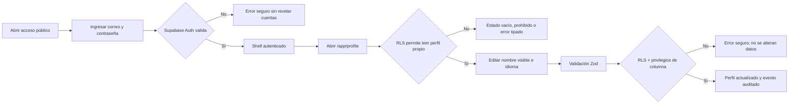

# Recorrido inicial

## Estados observables

- Acceso: envío, credenciales inválidas y sesión creada.
- Perfil: carga, error, ausente y éxito.
- Actualización: validación, envío, confirmación y fallo recuperable.
- Cierre de sesión: limpia el estado cliente y vuelve a `/login`.

La interfaz nunca promete alta pública, administración ni módulos futuros.
